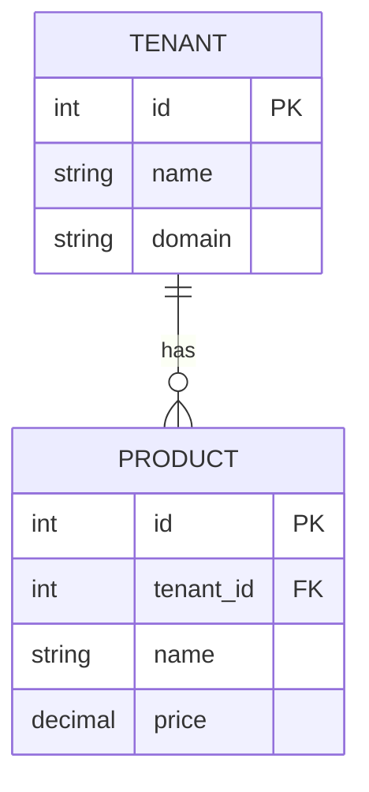
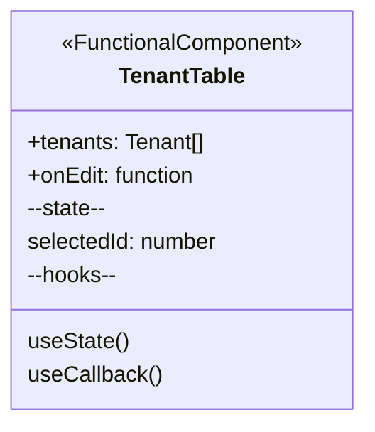
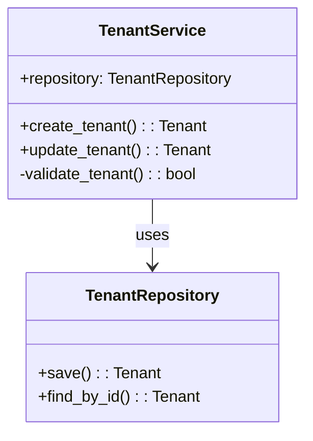

# Diagram Generators

High-confidence diagram generators using AST parsing and code analysis.

## Overview

This module provides diagram generators for various diagram types, all following a consistent interface and using AST (Abstract Syntax Tree) parsing where possible to ensure high accuracy.

## Available Generators

### 1. ER Diagram Generator (`er_diagram.py`)
**Status:** ✅ Fully Implemented  
**Confidence Target:** 90-95%  
**Supported Sources:**
- SQLAlchemy models (Python)
- SQL CREATE statements
- Alembic migrations

**Example Usage:**
```python
from diagrams.er_diagram import ERDiagramGenerator

generator = ERDiagramGenerator()
result = generator.generate(
    source_files=['models/tenant.py', 'models/product.py'],
    options={
        'include_migrations': True,
        'show_indexes': True,
        'show_foreign_keys': True
    }
)

print(result.mermaid_code)
print(f"Confidence: {result.confidence_score:.2%}")
```

**Example Output:**


### 2. Class/Component Diagram Generator (`class_diagram.py`)
**Status:** ✅ Fully Implemented  
**Confidence Target:** 85-90%  
**Supported Sources:**
- Python classes (OOP)
- TypeScript classes and interfaces
- React functional components with hooks

**Example Usage:**
```python
from diagrams.class_diagram import ClassDiagramGenerator

generator = ClassDiagramGenerator()
result = generator.generate(
    source_files=['components/TenantTable.tsx', 'services/TenantService.py'],
    options={
        'show_private': False,
        'show_relationships': True,
        'react_components': True
    }
)

print(result.mermaid_code)
```

**Example Output (React Component):**


**Example Output (Python Class):**


### 3. Flowchart Generator (`flowchart.py`)
**Status:** 🚧 Placeholder  
**Confidence Target:** 75-85%  
**Planned Features:**
- Function control flow
- Decision trees
- Loop detection

### 4. Sequence Diagram Generator (`sequence_diagram.py`)
**Status:** 🚧 Placeholder  
**Confidence Target:** 70-80%  
**Planned Features:**
- Method call traces
- API interaction flows
- Message sequences

### 5. User Journey Generator (`user_journey.py`)
**Status:** 🚧 Placeholder  
**Confidence Target:** 60-70%  
**Planned Features:**
- User flow documentation
- Feature interactions
- Journey maps

### 6. C4 Diagram Generator (`c4_diagram.py`)
**Status:** 🚧 Placeholder  
**Confidence Target:** 65-75%  
**Planned Features:**
- System Context diagrams
- Container diagrams
- Component diagrams

### 7. Layered Architecture Generator (`layered_architecture.py`)
**Status:** 🚧 Placeholder  
**Confidence Target:** 70-80%  
**Planned Features:**
- N-tier architecture
- Hexagonal architecture
- Clean architecture

## Architecture

All generators extend `BaseGenerator` from `core/base_generator.py` and follow this structure:

```python
class MyDiagramGenerator(BaseGenerator):
    @property
    def diagram_type(self) -> str:
        return "my_diagram_type"
    
    @property
    def supported_extensions(self) -> List[str]:
        return ['.py', '.ts', '.sql']
    
    def generate(self, source_files: List[str], options: Dict) -> DiagramOutput:
        # 1. Analyze files using self.analyze_files()
        # 2. Parse code using appropriate parsers
        # 3. Build diagram structure
        # 4. Calculate confidence using self.calculate_confidence()
        # 5. Generate Mermaid syntax
        # 6. Return DiagramOutput
        pass
```

## Confidence Scoring

Confidence scores are calculated based on:
- **Parser Type:** AST parsing (95%) > Regex parsing (70%) > Heuristics (50%)
- **Code Coverage:** Percentage of files successfully parsed
- **Relationship Accuracy:** Quality of detected relationships

## Common Options

### ER Diagram Options
- `include_migrations` (bool): Process Alembic migration files
- `show_indexes` (bool): Show index constraints
- `show_foreign_keys` (bool): Show FK constraints explicitly

### Class Diagram Options
- `show_private` (bool): Show private methods/properties
- `show_relationships` (bool): Show inheritance/composition
- `react_components` (bool): Parse React components

## Mermaid Syntax Reference

### ER Diagram Cardinality
```
||--o{ : one to zero or more
||--|{ : one to one or more
}o--o{ : zero or more to zero or more
}|--|{ : one or more to one or more
||--|| : one to one
}o--|| : zero or more to one
```

### Class Diagram Relationships
```
<|--   : Inheritance
*--    : Composition
o--    : Aggregation
-->    : Association
<|..   : Realization (interface)
..>    : Dependency
```

### UML Visibility
```
+  : public
-  : private
#  : protected
~  : package/internal
```

## Testing

Run the example usage:
```bash
cd .aicodepath/generators/diagrams
python example_usage.py
```

## Integration with AICodePath

These generators are integrated into AICodePath via the visual memory system:
- `hooks/visual-memory-generator.js` - Generates diagrams during workflow
- `hooks/visual-memory-loader.js` - Loads and displays diagrams

## Development

To add a new generator:

1. Create new file: `my_diagram.py`
2. Extend `BaseGenerator`
3. Implement required methods
4. Add to `__init__.py`
5. Add tests
6. Update this README

## Dependencies

- Python 3.8+
- pydantic (for data validation)
- AST parsers (built-in for Python)
- Optional: tree-sitter for advanced parsing

## License

Part of AICodePath v2.0 tooling.
