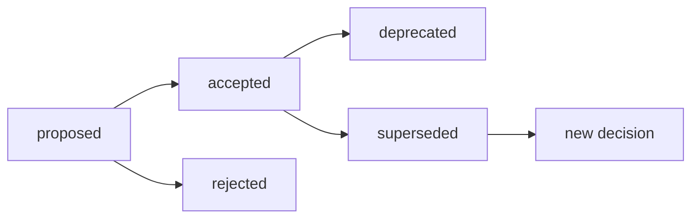

# Decision Logger

A comprehensive library for managing Architectural Decision Records (ADRs) in the AICodePath knowledge base.

## Overview

The Decision Logger provides a structured way to document, track, and query architectural and design decisions throughout the software development lifecycle. It integrates with the AICodePath SQLite database and supports the full decision lifecycle from proposal through acceptance, rejection, or supersession.

## Table of Contents

- [Installation](#installation)
- [Quick Start](#quick-start)
- [CLI Usage](#cli-usage)
- [Programmatic API](#programmatic-api)
- [Decision Lifecycle](#decision-lifecycle)
- [Database Schema](#database-schema)
- [Best Practices](#best-practices)
- [Examples](#examples)
- [Integration](#integration)

## Installation

The Decision Logger is part of the AICodePath `.aicodepath/lib/` directory. It requires:

- **better-sqlite3**: SQLite database driver
- **path-resolver.js**: AICodePath path resolution utilities

```bash
# Ensure dependencies are installed (from project root)
npm install better-sqlite3
```

## Quick Start

### CLI Usage

```bash
# Create a new decision
node .aicodepath/lib/decision-logger.js log "Use PostgreSQL for primary database"

# Update decision status
node .aicodepath/lib/decision-logger.js update 1 accepted

# List all decisions
node .aicodepath/lib/decision-logger.js list

# Show decision details
node .aicodepath/lib/decision-logger.js show 1

# Search decisions
node .aicodepath/lib/decision-logger.js search "database"

# View statistics
node .aicodepath/lib/decision-logger.js stats
```

### Programmatic Usage

```javascript
const DecisionLogger = require('./.aicodepath/lib/decision-logger');

const logger = new DecisionLogger();

// Log a decision
const id = logger.logDecision(
  'Use PostgreSQL for primary database',
  'Need a robust relational database with ACID compliance and JSON support',
  'We will use PostgreSQL 15 as our primary database',
  ['MySQL 8', 'MongoDB', 'SQLite'],
  'Provides excellent JSON support, proven scalability, and strong community',
  'accepted',
  {
    category: 'technology',
    scope: 'project',
    impact: 'high',
    decidedBy: 'architecture-team'
  }
);

console.log(`Decision logged with ID: ${id}`);
logger.close();
```

## CLI Usage

### Commands

#### `log <title>`

Create a new decision record.

```bash
node decision-logger.js log "Adopt microservices architecture"
```

**Note**: For full decision details (context, alternatives, consequences), use the programmatic API.

#### `update <id> <status>`

Update the status of an existing decision.

```bash
node decision-logger.js update 5 accepted
```

**Valid Statuses**:
- `proposed` - Decision is under consideration
- `accepted` - Decision has been approved and is active
- `rejected` - Decision was considered but not adopted
- `superseded` - Decision has been replaced by a newer decision
- `deprecated` - Decision is no longer recommended but may still be in use

#### `list [filter]`

List decisions with optional filtering.

```bash
# List all decisions
node decision-logger.js list

# Filter by status
node decision-logger.js list status=accepted

# Filter by category
node decision-logger.js list category=architecture

# Filter by impact
node decision-logger.js list impact=high
```

#### `show <id>`

Display full details of a specific decision.

```bash
node decision-logger.js show 5
```

Output includes:
- ID, title, and status
- Category, scope, and impact
- Full decision text
- Rationale
- Alternatives considered
- Consequences
- Timestamp and author
- Related artifact ID (if linked)
- Superseding decision (if applicable)

#### `search <term>`

Full-text search across decision titles, decisions, and rationale.

```bash
node decision-logger.js search "authentication"
```

Uses SQLite FTS5 for fast, ranked search results.

#### `stats`

Display decision statistics.

```bash
node decision-logger.js stats
```

Shows counts by status: total, proposed, accepted, rejected, superseded, deprecated.

#### `link <decision-id> <artifact-id>`

Link a decision to a related artifact in the knowledge base.

```bash
node decision-logger.js link 5 42
```

#### `supersede <old-id> <new-id>`

Mark an old decision as superseded by a new one.

```bash
node decision-logger.js supersede 3 5
```

This automatically:
- Sets the old decision's status to `superseded`
- Records the new decision ID in the `superseded_by` field

## Programmatic API

### Constructor

```javascript
const logger = new DecisionLogger(projectPath);
```

**Parameters**:
- `projectPath` (optional): Path to project root. If omitted, auto-detects using `path-resolver.js`.

### Methods

#### `logDecision(title, context, decision, alternatives, consequences, status, options)`

Create a new decision record.

```javascript
const id = logger.logDecision(
  'Adopt React for frontend',                           // title
  'Need modern UI framework with component reusability', // context (rationale)
  'Use React 18 with TypeScript for all frontend code',  // decision
  ['Vue.js', 'Angular', 'Svelte'],                      // alternatives
  'Requires team training; large ecosystem',             // consequences
  'accepted',                                            // status
  {
    category: 'technology',    // Optional metadata
    scope: 'project',
    impact: 'high',
    artifactId: 42,
    decidedBy: 'frontend-team'
  }
);
```

**Parameters**:
- `title` (string, required): Brief decision title
- `context` (string, required): Background and rationale
- `decision` (string, required): The actual decision
- `alternatives` (array or string, optional): Alternative options considered
- `consequences` (string, optional): Expected consequences
- `status` (string, optional): Decision status (default: `'proposed'`)
- `options` (object, optional):
  - `category`: 'architecture', 'technology', 'design', 'process'
  - `scope`: 'project', 'unit', 'component'
  - `impact`: 'high', 'medium', 'low'
  - `artifactId`: Link to related artifact
  - `decidedBy`: Decision maker identifier

**Returns**: Decision ID (number)

#### `updateDecisionStatus(id, status)`

Update the status of a decision.

```javascript
logger.updateDecisionStatus(5, 'accepted');
```

**Parameters**:
- `id` (number, required): Decision ID
- `status` (string, required): New status

**Valid statuses**: `'proposed'`, `'accepted'`, `'rejected'`, `'superseded'`, `'deprecated'`

#### `getDecisions(filter, limit)`

Query decisions with filtering.

```javascript
const decisions = logger.getDecisions(
  { status: 'accepted', category: 'architecture' },
  50
);
```

**Parameters**:
- `filter` (object, optional): Filter criteria
  - `status`: Filter by status
  - `category`: Filter by category
  - `scope`: Filter by scope
  - `impact`: Filter by impact
  - `artifactId`: Filter by linked artifact
- `limit` (number, optional): Maximum results (default: 50)

**Returns**: Array of decision objects

#### `getDecisionById(id)`

Retrieve a single decision by ID.

```javascript
const decision = logger.getDecisionById(5);
```

**Returns**: Decision object or `null`

#### `linkDecisionToArtifact(decisionId, artifactId)`

Link a decision to an artifact.

```javascript
logger.linkDecisionToArtifact(5, 42);
```

**Parameters**:
- `decisionId` (number): Decision ID
- `artifactId` (number): Artifact ID from `artifacts` table

#### `supersede(oldDecisionId, newDecisionId)`

Mark a decision as superseded.

```javascript
logger.supersede(3, 5); // Decision 3 is now superseded by decision 5
```

**Parameters**:
- `oldDecisionId` (number): ID of decision being superseded
- `newDecisionId` (number): ID of superseding decision

**Effect**:
- Sets old decision status to `'superseded'`
- Records `newDecisionId` in `superseded_by` field

#### `searchDecisions(searchTerm, limit)`

Full-text search for decisions.

```javascript
const results = logger.searchDecisions('authentication', 20);
```

**Parameters**:
- `searchTerm` (string): Search query
- `limit` (number, optional): Maximum results (default: 20)

**Returns**: Array of matching decisions, ranked by relevance

Uses SQLite FTS5 for searching across:
- Decision titles
- Decision text
- Rationale

#### `getStatistics()`

Get decision statistics.

```javascript
const stats = logger.getStatistics();
console.log(stats);
// {
//   total: 25,
//   proposed: 5,
//   accepted: 15,
//   rejected: 3,
//   superseded: 2,
//   deprecated: 0
// }
```

**Returns**: Object with counts by status

#### `formatDecision(decision)`

Format a decision object for display.

```javascript
const decision = logger.getDecisionById(5);
console.log(logger.formatDecision(decision));
```

**Returns**: Formatted multi-line string suitable for console output

#### `close()`

Close the database connection.

```javascript
logger.close();
```

**Important**: Always close the connection when done to release database locks.

## Decision Lifecycle

### Typical Flow

```
proposed → accepted
         → rejected
         → superseded
         → deprecated
```

### Status Transitions



### Status Definitions

| Status | Meaning | Use Case |
|--------|---------|----------|
| **proposed** | Under consideration | Initial state when decision is first documented |
| **accepted** | Approved and active | Decision has been reviewed and adopted |
| **rejected** | Considered but not adopted | Alternative was evaluated but not chosen |
| **superseded** | Replaced by newer decision | Technology or approach has evolved |
| **deprecated** | No longer recommended | Still in use but not for new code |

## Database Schema

The Decision Logger uses the `decisions` table in the AICodePath database:

```sql
CREATE TABLE decisions (
    id INTEGER PRIMARY KEY AUTOINCREMENT,
    artifact_id INTEGER,          -- Related artifact (optional)

    -- Decision details
    title TEXT NOT NULL,
    decision TEXT NOT NULL,
    rationale TEXT,
    alternatives JSON,            -- Array of alternative options considered
    consequences TEXT,

    -- Classification
    category TEXT,                -- 'architecture', 'technology', 'design', 'process'
    scope TEXT,                   -- 'project', 'unit', 'component'
    impact TEXT,                  -- 'high', 'medium', 'low'

    -- Tracking
    status TEXT DEFAULT 'accepted',
    decided_by TEXT,
    decided_at TEXT DEFAULT (datetime('now')),
    superseded_by INTEGER,

    FOREIGN KEY (artifact_id) REFERENCES artifacts(id),
    FOREIGN KEY (superseded_by) REFERENCES decisions(id)
);
```

### Full-Text Search

The `decisions_fts` virtual table provides FTS5 search capabilities:

```sql
CREATE VIRTUAL TABLE decisions_fts USING fts5(
    title,
    decision,
    rationale,
    content=decisions,
    content_rowid=id
);
```

## Best Practices

### 1. Document Early

Record decisions when they're made, not after the fact. Context is freshest when the decision is being considered.

```javascript
// Good: Document during planning
const id = logger.logDecision(
  'Use Redis for session storage',
  'Sessions need to be shared across multiple app servers',
  'Implement session storage using Redis with 30-day TTL',
  ['PostgreSQL sessions', 'JWT-only (stateless)', 'Memcached'],
  'Adds Redis dependency; requires failover strategy',
  'proposed'
);
```

### 2. Include Alternatives

Always document what alternatives were considered and why they were rejected.

```javascript
logger.logDecision(
  'Adopt monorepo structure',
  'Managing multiple related services with shared code',
  'Use Nx monorepo with npm workspaces',
  [
    'Separate repos with npm packages',
    'Git submodules',
    'Manual code copying'
  ],
  'Easier code sharing; requires CI/CD adjustments',
  'accepted'
);
```

### 3. Update Status Lifecycle

Move decisions through their lifecycle as the project evolves.

```javascript
// Initial proposal
const id = logger.logDecision(title, context, decision, alts, cons, 'proposed');

// After review
logger.updateDecisionStatus(id, 'accepted');

// Later, when technology changes
const newId = logger.logDecision(newTitle, newContext, ...);
logger.supersede(id, newId);
```

### 4. Use Appropriate Categories

Categorize decisions for easier filtering and reporting.

**Categories**:
- `architecture`: High-level system design (microservices, layering)
- `technology`: Technology stack choices (frameworks, databases)
- `design`: Detailed design patterns (repository pattern, CQRS)
- `process`: Development process decisions (branching, testing)

### 5. Link to Artifacts

Connect decisions to related design documents and code.

```javascript
// Create design artifact
const artifactId = createArtifact('auth-design', ...);

// Link decision
const decisionId = logger.logDecision('Use JWT authentication', ...);
logger.linkDecisionToArtifact(decisionId, artifactId);
```

### 6. Use Impact Levels

Assign impact levels to help prioritize technical debt and migrations.

```javascript
logger.logDecision(
  'Migrate from REST to GraphQL',
  'Need more flexible API querying',
  'Implement GraphQL alongside REST, migrate incrementally',
  ['Keep REST only', 'Full cutover to GraphQL'],
  'Requires client changes; double maintenance period',
  'accepted',
  { impact: 'high' }  // High-impact decision
);
```

## Examples

### Example 1: Technology Selection

```javascript
const logger = new DecisionLogger();

const id = logger.logDecision(
  'Use TypeScript for backend services',
  'Need better type safety and IDE support for large codebase',
  'All new backend services will be written in TypeScript',
  [
    'Continue with JavaScript',
    'Migrate to Go',
    'Use Java'
  ],
  'Team needs TypeScript training; build time increases slightly',
  'accepted',
  {
    category: 'technology',
    scope: 'project',
    impact: 'high',
    decidedBy: 'architecture-team'
  }
);

console.log(`Decision logged: #${id}`);
logger.close();
```

### Example 2: Architecture Pattern

```javascript
const logger = new DecisionLogger();

const id = logger.logDecision(
  'Implement CQRS pattern for order processing',
  'Complex business rules and high read/write ratio on orders',
  'Separate read and write models for order domain using CQRS',
  [
    'Traditional CRUD with caching',
    'Event sourcing with full replay',
    'Read replicas only'
  ],
  'Increased complexity; better scalability and performance',
  'proposed',
  {
    category: 'architecture',
    scope: 'unit',
    impact: 'medium',
    decidedBy: 'senior-architect'
  }
);

// After review meeting
logger.updateDecisionStatus(id, 'accepted');
logger.close();
```

### Example 3: Superseding a Decision

```javascript
const logger = new DecisionLogger();

// Original decision
const oldId = logger.logDecision(
  'Use MongoDB for user data',
  'Flexible schema for user profiles',
  'Store user data in MongoDB',
  ['PostgreSQL', 'MySQL'],
  'Schema flexibility; eventual consistency',
  'accepted',
  { category: 'technology', impact: 'high' }
);

// Later, a new decision is made
const newId = logger.logDecision(
  'Migrate user data to PostgreSQL',
  'Need stronger consistency and relational queries',
  'Migrate user data from MongoDB to PostgreSQL with JSONB columns',
  ['Keep MongoDB', 'Use hybrid approach'],
  'Migration effort; better consistency and query capabilities',
  'accepted',
  { category: 'technology', impact: 'high' }
);

// Mark old decision as superseded
logger.supersede(oldId, newId);

console.log(`Decision #${oldId} superseded by #${newId}`);
logger.close();
```

### Example 4: Querying Decisions

```javascript
const logger = new DecisionLogger();

// Get all accepted architectural decisions
const archDecisions = logger.getDecisions({
  status: 'accepted',
  category: 'architecture'
});

console.log(`Found ${archDecisions.length} architectural decisions:\n`);
archDecisions.forEach(d => {
  console.log(`#${d.id}: ${d.title}`);
  console.log(`  Impact: ${d.impact}`);
  console.log(`  Decided: ${d.decided_at}\n`);
});

// Search for database-related decisions
const dbDecisions = logger.searchDecisions('database');
console.log(`Found ${dbDecisions.length} database-related decisions`);

logger.close();
```

### Example 5: Decision Review Report

```javascript
const logger = new DecisionLogger();

// Generate a report of all active decisions
const stats = logger.getStatistics();
console.log('=== Decision Review Report ===\n');
console.log(`Total Decisions: ${stats.total}`);
console.log(`Active (Accepted): ${stats.accepted}`);
console.log(`Under Review (Proposed): ${stats.proposed}`);
console.log(`Superseded: ${stats.superseded}`);
console.log(`Deprecated: ${stats.deprecated}\n`);

// List high-impact decisions
const highImpact = logger.getDecisions({ impact: 'high' }, 100);
console.log('=== High-Impact Decisions ===\n');
highImpact.forEach(d => {
  console.log(logger.formatDecision(d));
  console.log('\n---\n');
});

logger.close();
```

## Integration

### Integration with AICodePath Workflows

The Decision Logger integrates seamlessly with AICodePath workflows:

#### During Inception Phase

```javascript
// When creating requirements or plans
const requirementId = createRequirement(...);
const decisionId = logger.logDecision(
  'Use microservices architecture',
  'Scalability requirements exceed monolith capabilities',
  'Decompose into domain-driven microservices',
  [...],
  'Operational complexity; better scalability',
  'proposed'
);
logger.linkDecisionToArtifact(decisionId, requirementId);
```

#### During Construction Phase

```javascript
// When creating design artifacts
const designId = createDesignArtifact('api-design', ...);
const decisionId = logger.logDecision(
  'Use GraphQL for public API',
  'Clients need flexible data fetching',
  'Expose GraphQL endpoint at /graphql',
  ['REST', 'gRPC'],
  'Learning curve; better client experience',
  'accepted',
  { category: 'design', scope: 'unit' }
);
logger.linkDecisionToArtifact(decisionId, designId);
```

#### Audit Trail Integration

The `audit_log` view in the database includes decisions:

```sql
-- Query audit log
SELECT * FROM audit_log WHERE decision_type = 'architecture';
```

The `audit_log` view maps:
- `decision` → `action`
- `rationale` → `rationale`
- `category` → `decision_type`
- `impact` → `impact_level`

### Integration with Agent System

Agents can log decisions during autonomous execution:

```javascript
// In an agent script
const logger = new DecisionLogger();

const decisionId = logger.logDecision(
  'Auto-generate database indexes',
  'Query performance analysis shows missing indexes',
  'Create composite index on (user_id, created_at)',
  ['Single-column indexes', 'No index'],
  'Improved query performance; slight write overhead',
  'proposed',
  {
    category: 'design',
    scope: 'component',
    impact: 'low',
    decidedBy: 'database-designer-agent'
  }
);

// Agent can mark as accepted after validation
logger.updateDecisionStatus(decisionId, 'accepted');
logger.close();
```

### Integration with GICL Loop

Use decision status as part of quality gates:

```javascript
// Check that critical decisions have been documented
const criticalDecisions = logger.getDecisions({ impact: 'high' });

if (criticalDecisions.some(d => d.status === 'proposed')) {
  console.warn('Warning: High-impact decisions still in proposed state');
  // Trigger review agent
}
```

## Troubleshooting

### Database Not Found

**Error**: `Error: ENOENT: no such file or directory, open '.../aicodepath.db'`

**Solution**: Ensure the AICodePath database is initialized:

```bash
node .aicodepath/scripts/init-knowledge-base.sh
```

### Invalid Status

**Error**: `Invalid status: xyz. Must be one of: proposed, accepted, rejected, superseded, deprecated`

**Solution**: Use one of the five valid status values.

### FTS Search Not Working

If full-text search returns no results, the FTS table may be out of sync.

**Solution**: Rebuild the FTS index (advanced):

```javascript
const logger = new DecisionLogger();
logger.db.prepare('INSERT INTO decisions_fts(decisions_fts) VALUES ("rebuild")').run();
logger.close();
```

## Performance Notes

- **WAL Mode**: The database uses Write-Ahead Logging for better concurrency
- **Indexes**: All common query patterns are indexed (status, category, artifact_id)
- **FTS5**: Full-text search is fast and ranked
- **Connection Pooling**: For high-throughput scenarios, consider connection pooling

## Future Enhancements

Potential future additions:

- **Decision Templates**: Pre-defined decision formats for common scenarios
- **Markdown Export**: Export decisions as ADR markdown files
- **Decision Graph**: Visualize decision dependencies and supersession chains
- **Change Notifications**: WebSocket events when decisions are updated
- **Approval Workflow**: Multi-stakeholder approval tracking

## License

Part of AICodePath - see main project LICENSE.

## Support

For issues or questions:
- Check `aicodepath-docs/audit.md` for decision history
- Review database schema: `.aicodepath/db/schema.sql`
- Consult kb-writer.js for similar patterns

---

**Version**: 1.0.0
**Last Updated**: 2026-02-02
**Maintainer**: AICodePath Team
