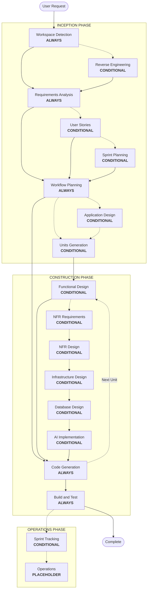

# AICodePath Adaptive Workflow Overview

**Purpose**: Technical reference for Claude and developers to understand complete workflow structure.

## The Three-Phase Lifecycle:
- **INCEPTION PHASE**: Planning and architecture (Workspace Detection + conditional phases + Workflow Planning)
- **CONSTRUCTION PHASE**: Design, implementation, build and test (per-unit design + Code Planning/Generation + Build & Test)
- **OPERATIONS PHASE**: Sprint tracking and placeholder for future deployment/monitoring workflows

## The Adaptive Workflow:
- **Workspace Detection** (always) -> **Reverse Engineering** (brownfield only) -> **Requirements Analysis** (always, adaptive depth) -> **Conditional Phases** (as needed) -> **Workflow Planning** (always) -> **Code Generation** (always, per-unit) -> **Build and Test** (always)

## How It Works:
- **AI analyzes** your request, workspace, and complexity to determine which stages are needed
- **These stages always execute**: Workspace Detection, Requirements Analysis (adaptive depth), Workflow Planning, Code Generation (per-unit), Build and Test
- **All other stages are conditional**: Reverse Engineering, User Stories, Sprint Planning, Application Design, Units Generation, per-unit design stages (Functional Design, NFR Requirements, NFR Design, Infrastructure Design, Database Design, AI Implementation)
- **No fixed sequences**: Stages execute in the order that makes sense for your specific task

## Your Team's Role:
- **Answer questions** in dedicated question files using [Answer]: tags with letter choices (A, B, C, D, E)
- **Option E available**: Choose "Other" and describe your custom response if provided options don't match
- **Work as a team** to review and approve each phase before proceeding
- **Collectively decide** on architectural approach when needed
- **Important**: This is a team effort - involve relevant stakeholders for each phase

## AICodePath Three-Phase Workflow:

**Stage Descriptions:**

**INCEPTION PHASE** - Planning and Architecture
- Workspace Detection: Analyze workspace state and project type (ALWAYS)
- Reverse Engineering: Analyze existing codebase (CONDITIONAL - Brownfield only)
- Requirements Analysis: Gather and validate requirements (ALWAYS - Adaptive depth)
- User Stories: Create user stories and personas (CONDITIONAL)
- Sprint Planning: Plan sprints, estimate story points, set goals (CONDITIONAL)
- Workflow Planning: Create execution plan (ALWAYS)
- Application Design: High-level component identification and service layer design (CONDITIONAL)
- Units Generation: Decompose into units of work (CONDITIONAL)

**CONSTRUCTION PHASE** - Design, Implementation, Build and Test
- Functional Design: Detailed business logic design per unit (CONDITIONAL, per-unit)
- NFR Requirements: Determine NFRs and select tech stack (CONDITIONAL, per-unit)
- NFR Design: Incorporate NFR patterns and logical components (CONDITIONAL, per-unit)
- Infrastructure Design: Map to actual infrastructure services (CONDITIONAL, per-unit)
- Database Design: Schema design, migrations, audit logging, cost analysis (CONDITIONAL, per-unit)
- AI Implementation: Model selection, prompt engineering, RAG, agents, cost analysis (CONDITIONAL, per-unit)
- Code Generation: Generate code with Part 1 - Planning, Part 2 - Generation (ALWAYS, per-unit)
- Build and Test: Build all units and execute comprehensive testing (ALWAYS)

**OPERATIONS PHASE** - Sprint Tracking & Deployment
- Sprint Tracking: Velocity metrics, burndown charts, retrospectives (CONDITIONAL)
- Operations: Placeholder for future deployment and monitoring workflows (PLACEHOLDER)

**Key Principles:**
- Phases execute only when they add value
- Each phase independently evaluated
- INCEPTION focuses on "what" and "why"
- CONSTRUCTION focuses on "how" plus "build and test"
- OPERATIONS focuses on sprint tracking and deployment
- Simple changes may skip conditional INCEPTION stages
- Complex changes get full INCEPTION and CONSTRUCTION treatment
