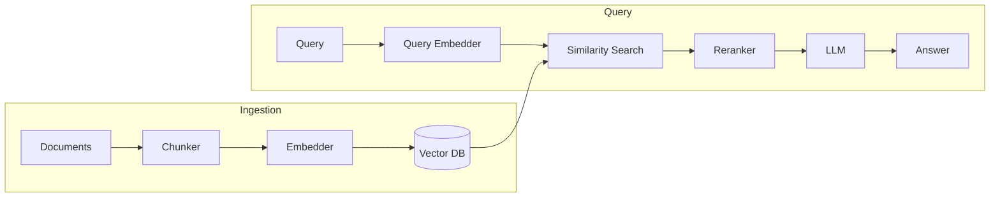
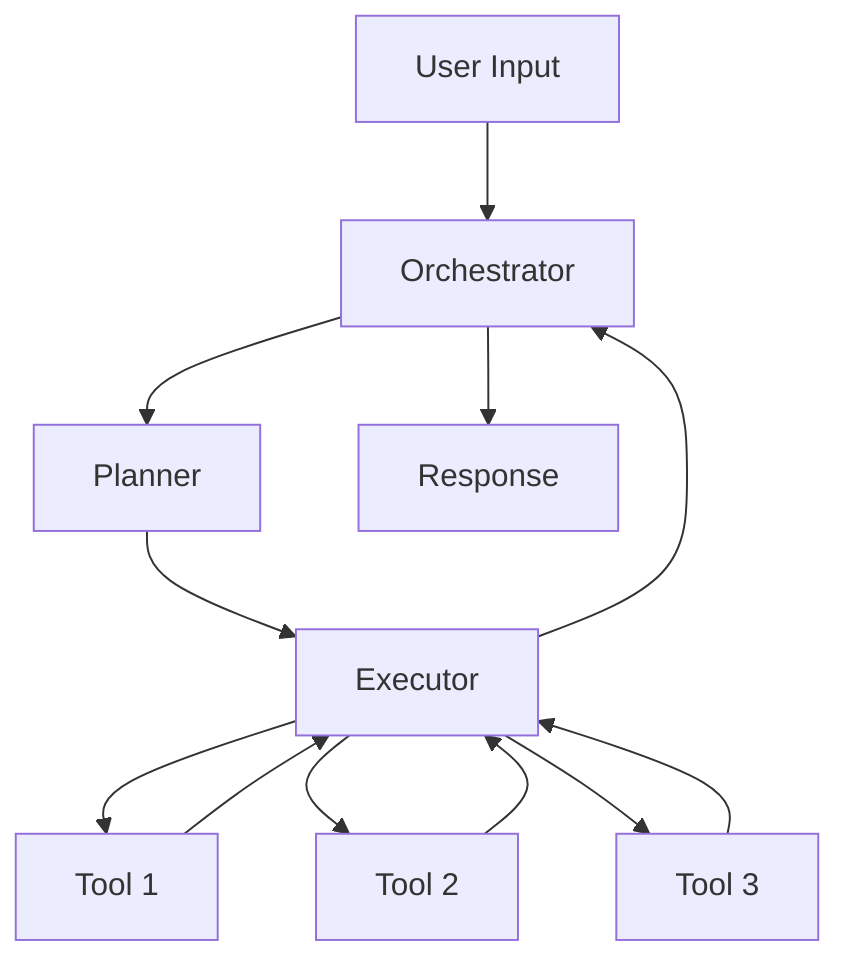

# AI Implementation Design (Per-Unit)

**Purpose**: Design AI/ML components with model selection, cost analysis, and implementation patterns

**Execute IF**:
- AI/ML components required
- LLM integration needed
- RAG implementation planned
- Agent architecture design needed
- Embeddings/vector search required

**Skip IF**:
- No AI components
- AI implementation already defined

## Prerequisites
- Functional Design complete (AI use cases identified)
- NFR Requirements complete (latency/performance needs known)

---

## Step 1: Load Context

### 1.1 Load Prior Artifacts
- Load business-logic-model.md for AI use cases
- Load nfr-requirements.md for latency/cost constraints
- Load requirements.md for AI requirements

### 1.2 Gather AI Requirements

Create `aicodepath-docs/construction/{unit-name}/ai-implementation/ai-questions.md`:

```markdown
# AI Implementation Questions

## Question 1
What type of AI capability is needed?

A) Text Generation - Chatbots, content creation, summarization
B) Classification/Analysis - Sentiment, categorization, extraction
C) Code Generation - Code completion, generation, review
D) RAG (Retrieval-Augmented Generation) - Q&A over documents
E) Multi-Agent - Autonomous task execution
F) Other (please describe after [Answer]: tag below)

[Answer]:

## Question 2
What is the acceptable latency for AI responses?

A) Real-time (< 500ms) - Autocomplete, inline suggestions
B) Fast (500ms - 2s) - Chat responses, quick analysis
C) Standard (2s - 10s) - Document processing, complex queries
D) Batch (> 10s) - Background processing, reports
E) Other (please describe after [Answer]: tag below)

[Answer]:

## Question 3
What is the monthly budget for AI API costs?

A) Minimal (< $100/month)
B) Small ($100 - $500/month)
C) Medium ($500 - $2,000/month)
D) Large ($2,000 - $10,000/month)
E) Enterprise (> $10,000/month)
F) Other (please describe after [Answer]: tag below)

[Answer]:

## Question 4
What data privacy requirements exist?

A) Public data only - No sensitive information
B) Internal data - Company data, not customer PII
C) Customer data - PII with consent, encrypted
D) Regulated data - HIPAA/GDPR/PCI compliance required
E) Air-gapped - No external API calls allowed
F) Other (please describe after [Answer]: tag below)

[Answer]:

## Question 5
What is the expected usage volume?

A) Low (< 1,000 requests/day)
B) Medium (1,000 - 10,000 requests/day)
C) High (10,000 - 100,000 requests/day)
D) Very High (> 100,000 requests/day)
E) Other (please describe after [Answer]: tag below)

[Answer]:

## Question 6
Are you open to using open-source models?

A) Prefer cloud APIs (OpenAI, Anthropic, Google)
B) Prefer open-source (Llama, Mistral) - Self-hosted
C) Hybrid - Use both depending on use case
D) Must use open-source - Data cannot leave premises
E) Other (please describe after [Answer]: tag below)

[Answer]:
```

---

## Step 2: Model Selection with Cost Analysis

Create `aicodepath-docs/construction/{unit-name}/ai-implementation/model-selection.md`:

```markdown
# Model Selection: [Unit Name]

## Use Case Analysis

| Use Case | Input Type | Output Type | Latency Need | Volume |
|----------|------------|-------------|--------------|--------|
| [Use case 1] | [Text/Code/etc.] | [Text/JSON/etc.] | [Fast/Standard] | [X/day] |
| [Use case 2] | [Text/Code/etc.] | [Text/JSON/etc.] | [Fast/Standard] | [X/day] |

## Model Comparison

### Large Language Models

| Model | Provider | Context | Cost (Input) | Cost (Output) | Latency | Best For |
|-------|----------|---------|--------------|---------------|---------|----------|
| Claude 3.5 Sonnet | Anthropic | 200K | $3/M tokens | $15/M tokens | Fast | Reasoning, code |
| Claude 3 Haiku | Anthropic | 200K | $0.25/M | $1.25/M | Very Fast | Simple tasks |
| GPT-4 Turbo | OpenAI | 128K | $10/M tokens | $30/M tokens | Medium | Complex reasoning |
| GPT-3.5 Turbo | OpenAI | 16K | $0.5/M tokens | $1.5/M tokens | Fast | Simple tasks |
| Llama 3 70B | Meta | 8K | Self-hosted | Self-hosted | Variable | Privacy-sensitive |
| Mistral Large | Mistral | 32K | $8/M tokens | $24/M tokens | Medium | European hosting |

### Embedding Models

| Model | Provider | Dimensions | Cost | Best For |
|-------|----------|------------|------|----------|
| text-embedding-3-small | OpenAI | 1536 | $0.02/M tokens | General purpose |
| text-embedding-3-large | OpenAI | 3072 | $0.13/M tokens | High accuracy |
| Cohere Embed | Cohere | 1024 | $0.10/M tokens | Multilingual |
| all-MiniLM-L6-v2 | HuggingFace | 384 | Free (self-hosted) | Cost-sensitive |

## Recommended Selection

### Primary Model
- **Model**: [Model name]
- **Provider**: [Provider]
- **Rationale**: [Why selected]
- **Use Cases**: [Which use cases]

### Secondary Model (Cost Optimization)
- **Model**: [Cheaper model]
- **Provider**: [Provider]
- **Rationale**: [For simpler tasks to reduce cost]
- **Use Cases**: [Which use cases]

### Embedding Model
- **Model**: [Model name]
- **Provider**: [Provider]
- **Rationale**: [Why selected]

## Fallback Strategy
1. **Primary fails**: Route to [secondary model]
2. **Secondary fails**: Return [cached response/error]
3. **Rate limited**: Queue with [exponential backoff]

## Model Configuration

```yaml
models:
  primary:
    provider: anthropic
    model: claude-3-5-sonnet-20241022
    max_tokens: 4096
    temperature: 0.7

  secondary:
    provider: anthropic
    model: claude-3-haiku-20240307
    max_tokens: 2048
    temperature: 0.5

  embedding:
    provider: openai
    model: text-embedding-3-small
    dimensions: 1536
```
```

> **Opus 4.7 exception:** `temperature` has no runtime effect in Opus 4.7 interactive sessions — reasoning depth is controlled by `effortLevel` (low/medium/high/xhigh). The `temperature` field above is retained for non-interactive/SDK paths and older model targets.

---

## Step 3: Cost Analysis

Create `aicodepath-docs/construction/{unit-name}/ai-implementation/cost-analysis.md`:

```markdown
# AI Cost Analysis: [Unit Name]

## Usage Projections

### Request Volume
| Use Case | Requests/Day | Avg Input Tokens | Avg Output Tokens |
|----------|--------------|------------------|-------------------|
| [Use case 1] | [X] | [X] | [X] |
| [Use case 2] | [X] | [X] | [X] |
| **Total** | **[X]** | | |

### Token Volume (Monthly)
| Component | Tokens/Request | Requests/Month | Total Tokens |
|-----------|----------------|----------------|--------------|
| Input (prompts) | [X] | [X] | [X]M |
| Output (responses) | [X] | [X] | [X]M |
| Embeddings | [X] | [X] | [X]M |

## Cost Calculation

### LLM Costs (Monthly)
| Model | Input Tokens | Input Cost | Output Tokens | Output Cost | Total |
|-------|--------------|------------|---------------|-------------|-------|
| [Primary] | [X]M | $[X] | [X]M | $[X] | $[X] |
| [Secondary] | [X]M | $[X] | [X]M | $[X] | $[X] |
| **Total LLM** | | | | | **$[X]** |

### Embedding Costs (Monthly)
| Model | Tokens | Cost |
|-------|--------|------|
| [Embedding model] | [X]M | $[X] |

### Vector Database Costs (if RAG)
| Service | Storage | Queries | Monthly Cost |
|---------|---------|---------|--------------|
| [Pinecone/Weaviate/etc.] | [X] GB | [X]K | $[X] |

### Total AI Costs

| Component | Monthly | Annual |
|-----------|---------|--------|
| LLM API | $[X] | $[X] |
| Embeddings | $[X] | $[X] |
| Vector DB | $[X] | $[X] |
| **Total** | **$[X]** | **$[X]** |

## Cost Optimization Strategies

### 1. Model Tiering
Route simple requests to cheaper models:
- Simple classification: Use Haiku ($0.25/M vs $3/M) - **Save 92%**
- Complex reasoning: Use Sonnet

### 2. Caching
Cache common responses:
- Cache hit rate target: [X]%
- Estimated savings: $[X]/month

### 3. Prompt Optimization
Reduce token usage:
- Shorter system prompts: Save [X] tokens/request
- Response format constraints: Save [X] tokens/response
- Estimated savings: $[X]/month

### 4. Batch Processing
For non-real-time use cases:
- Use batch API (if available): [X]% discount
- Estimated savings: $[X]/month

## Budget Monitoring

### Alerts
- **Warning**: [X]% of monthly budget ($[X])
- **Critical**: [X]% of monthly budget ($[X])
- **Hard Limit**: Stop at $[X] to prevent overrun

### Monitoring Metrics
- Daily token usage by model
- Cost per use case
- Cache hit rate
- Average tokens per request
```

---

## Step 4: Create Prompt Templates

Create `aicodepath-docs/construction/{unit-name}/ai-implementation/prompt-templates/` directory:

```markdown
# Prompt Template: [Use Case Name]

## Template ID
`[use-case-id]-v1`

## Purpose
[What this prompt accomplishes]

## System Prompt
```
You are a [role description].

Your task is to [task description].

Guidelines:
- [Guideline 1]
- [Guideline 2]
- [Guideline 3]

Output Format:
[Expected format - JSON schema, markdown, etc.]
```

## User Prompt Template
```
[Context section with placeholders]

{{context}}

[Task section]

{{user_input}}

[Output instructions]
```

## Variables
| Variable | Type | Required | Description |
|----------|------|----------|-------------|
| context | string | Yes | Background information |
| user_input | string | Yes | User's request |

## Example

### Input
```json
{
  "context": "Customer order #12345 placed 3 days ago",
  "user_input": "Where is my order?"
}
```

### Expected Output
```json
{
  "intent": "order_status",
  "order_id": "12345",
  "response": "I can see your order #12345..."
}
```

## Testing
- [ ] Tested with [X] examples
- [ ] Edge cases covered
- [ ] Output format validated

## Version History
| Version | Date | Changes |
|---------|------|---------|
| v1 | [Date] | Initial version |
```

---

## Step 5: RAG Architecture (if applicable)

Create `aicodepath-docs/construction/{unit-name}/ai-implementation/rag-architecture.md`:

```markdown
# RAG Architecture: [Unit Name]

## Overview
[Description of what the RAG system does]

## Architecture Diagram


## Document Processing

### Chunking Strategy
- **Method**: [Fixed size/Semantic/Recursive]
- **Chunk Size**: [X] tokens
- **Overlap**: [X] tokens
- **Rationale**: [Why this approach]

### Metadata Extraction
| Field | Source | Purpose |
|-------|--------|---------|
| source | Document path | Attribution |
| date | Document metadata | Freshness |
| section | Heading extraction | Context |

## Embedding Configuration
- **Model**: [Embedding model]
- **Dimensions**: [X]
- **Batch Size**: [X] documents

## Vector Store

### Configuration
- **Service**: [Pinecone/Weaviate/Chroma/etc.]
- **Index Type**: [HNSW/IVF/etc.]
- **Metric**: [Cosine/Euclidean/Dot]

### Schema
```json
{
  "id": "string",
  "embedding": "float[1536]",
  "text": "string",
  "metadata": {
    "source": "string",
    "chunk_index": "int",
    "created_at": "timestamp"
  }
}
```

## Retrieval Configuration
- **Top K**: [X] chunks
- **Similarity Threshold**: [X]
- **Reranking**: [Yes/No - model if yes]

## Query Pipeline

### Hybrid Search (if used)
- **Semantic Weight**: [X]%
- **Keyword Weight**: [X]%

### Context Assembly
```
[System context]
---
Retrieved Context:
{retrieved_chunks}
---
User Query: {query}
```

## Performance Targets
| Metric | Target | Measurement |
|--------|--------|-------------|
| Retrieval Latency | < [X]ms | p95 |
| Answer Relevance | > [X]% | Human eval |
| Faithfulness | > [X]% | No hallucination |
```

---

## Step 6: Agent Design (if applicable)

Create `aicodepath-docs/construction/{unit-name}/ai-implementation/agent-design.md`:

```markdown
# Agent Design: [Unit Name]

## Agent Overview
[Description of what the agent does]

## Agent Architecture


## Agent Configuration

### Model
- **Planning Model**: [Model for planning]
- **Execution Model**: [Model for tool calls]
- **Rationale**: [Why these models]

### Tools

| Tool | Purpose | Input | Output |
|------|---------|-------|--------|
| [Tool 1] | [Purpose] | [Schema] | [Schema] |
| [Tool 2] | [Purpose] | [Schema] | [Schema] |

### Tool Definitions
```json
{
  "name": "search_database",
  "description": "Search the database for records matching criteria",
  "parameters": {
    "type": "object",
    "properties": {
      "query": {"type": "string"},
      "limit": {"type": "integer", "default": 10}
    },
    "required": ["query"]
  }
}
```

## State Management
- **State Store**: [In-memory/Redis/Database]
- **Session Duration**: [Duration]
- **State Schema**: [Schema]

## Guardrails

### Input Validation
- Max input length: [X] characters
- Blocked patterns: [List]

### Output Validation
- Response format check
- Harmful content filter
- PII detection

### Execution Limits
- Max tool calls per turn: [X]
- Max conversation turns: [X]
- Timeout: [X] seconds

## Error Handling
| Error Type | Handling | User Message |
|------------|----------|--------------|
| Tool failure | Retry 3x, then graceful degradation | "I couldn't complete that action..." |
| Rate limit | Queue with backoff | "Please wait a moment..." |
| Timeout | Cancel and summarize progress | "That took too long, here's what I found..." |
```

---

## Step 7: Update Progress

- Update aicodepath-state.md

## Step 8: Present Completion Message

```markdown
# AI Implementation Design Complete: [Unit Name]

AI implementation has designed:
- **Primary Model**: [Model] - [Use cases]
- **Secondary Model**: [Model] - [Use cases]
- **RAG System**: [Yes/No]
- **Agent Architecture**: [Yes/No]

**Cost Summary**:
- Monthly Estimate: $[X]
- Annual Estimate: $[X]

**Prompt Templates**: [X] templates created

> **REVIEW REQUIRED:**
> Please examine the AI implementation at: `aicodepath-docs/construction/{unit-name}/ai-implementation/`

> **WHAT'S NEXT?**
>
> **You may:**
>
> **Request Changes** - Ask for modifications to AI implementation
> **Continue to Next Stage** - Proceed to **Code Generation**
```

## Step 9: Wait for Explicit Approval
- User must choose between "Request Changes" or "Continue to Next Stage"
- Log user's response in audit.md
