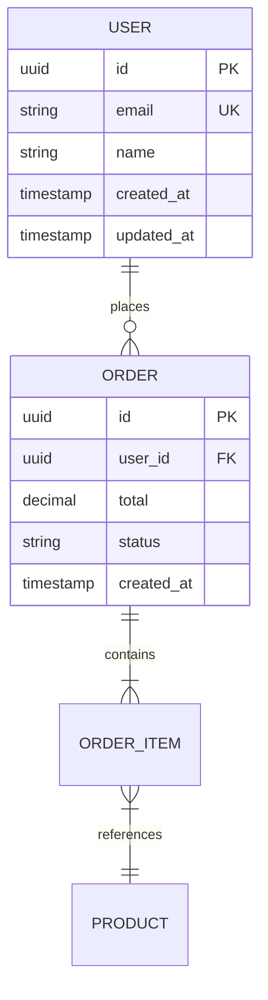

# Database Design (Per-Unit)

**Purpose**: Design database schema, migrations, audit logging, and perform cost analysis

**Execute IF**:
- New database schema required
- Data model changes needed
- Database migrations required
- Audit logging needed
- Performance optimization for data layer

**Skip IF**:
- No database changes
- Database already defined and unchanged

## Prerequisites
- Functional Design complete (domain entities defined)
- NFR Requirements complete (data volume/performance needs known)

---

## Step 1: Load Context

### 1.1 Load Prior Artifacts
- Load domain-entities.md for entity definitions
- Load business-rules.md for data constraints
- Load nfr-requirements.md for performance/storage needs
- Load existing schema (if brownfield)

### 1.2 Gather Database Requirements

Create `aicodepath-docs/construction/{unit-name}/database-design/database-questions.md`:

```markdown
# Database Design Questions

## Question 1
What type of database is preferred?

A) Relational (PostgreSQL, MySQL) - ACID compliance, complex queries (Recommended for most cases)
B) NoSQL Document (MongoDB, DynamoDB) - Flexible schema, horizontal scaling
C) NoSQL Key-Value (Redis) - Fast reads, caching, sessions
D) Graph Database (Neo4j) - Complex relationships, network data
E) Other (please describe after [Answer]: tag below)

[Answer]:

## Question 2
What is the expected data volume?

A) Small (< 1GB, < 100K records)
B) Medium (1-50GB, 100K-10M records)
C) Large (50GB-1TB, 10M-1B records)
D) Very Large (> 1TB, > 1B records)
E) Other (please describe after [Answer]: tag below)

[Answer]:

## Question 3
What is the expected growth rate?

A) Minimal (< 10% per year)
B) Moderate (10-50% per year)
C) High (50-200% per year)
D) Very High (> 200% per year)
E) Other (please describe after [Answer]: tag below)

[Answer]:

## Question 4
Is audit logging required?

A) Full audit (all changes tracked with user, timestamp, before/after values)
B) Partial audit (key entities only)
C) Minimal audit (created/updated timestamps only)
D) No audit required
E) Other (please describe after [Answer]: tag below)

[Answer]:

## Question 5
What are the compliance requirements?

A) GDPR (data privacy, right to deletion)
B) HIPAA (healthcare data protection)
C) SOC 2 (security controls)
D) PCI DSS (payment card data)
E) No specific compliance / Other (please describe)

[Answer]:

## Question 6
What is the read/write ratio?

A) Read-heavy (90% reads, 10% writes)
B) Balanced (60% reads, 40% writes)
C) Write-heavy (40% reads, 60% writes)
D) Very write-heavy (< 30% reads, 70% writes)
E) Other (please describe after [Answer]: tag below)

[Answer]:
```

---

## Step 1.3: Database Design Best Practices

Before creating the schema, consider these critical best practices:

### 1. Use Multiple Logical Schemas (Not Just Public)

**❌ DO NOT USE:**
- Single `public` schema for all tables
- Mixing different business domains in one schema

**✅ DO USE:**
- Logical schemas organized by business domain
- Clear separation of concerns

**Example - Wrong Approach:**
```sql
-- ❌ Everything in public schema
CREATE TABLE public.users (...);
CREATE TABLE public.orders (...);
CREATE TABLE public.products (...);
CREATE TABLE public.invoices (...);
CREATE TABLE public.audit_logs (...);
```

**Example - Correct Approach:**
```sql
-- ✅ Organized by domain
CREATE SCHEMA auth;
CREATE SCHEMA orders;
CREATE SCHEMA inventory;
CREATE SCHEMA billing;
CREATE SCHEMA audit;

CREATE TABLE auth.users (...);
CREATE TABLE auth.roles (...);

CREATE TABLE orders.orders (...);
CREATE TABLE orders.order_items (...);

CREATE TABLE inventory.products (...);
CREATE TABLE inventory.stock (...);

CREATE TABLE billing.invoices (...);
CREATE TABLE billing.payments (...);

CREATE TABLE audit.audit_logs (...);
```

**Benefits:**
- Clear domain boundaries
- Better access control (grant permissions per schema)
- Easier to understand and maintain
- Supports future microservices migration
- Reduces naming conflicts

### 2. Never Use SA/Admin Database Accounts

**❌ DO NOT USE:**
- SA (System Administrator) accounts
- Root, postgres, admin, dba accounts for applications
- Shared admin credentials

**✅ DO USE:**
- Dedicated application service accounts
- Principle of least privilege
- Separate accounts per environment

**Example - Wrong Approach:**
```javascript
// ❌ Using admin account
const connection = {
  user: 'postgres',  // Admin account!
  password: 'admin123',
  host: 'localhost',
  database: 'myapp'
};
```

**Example - Correct Approach:**
```sql
-- ✅ Create dedicated service accounts
-- Read-only account for reporting
CREATE USER app_readonly WITH PASSWORD 'secure_password';
GRANT CONNECT ON DATABASE myapp TO app_readonly;
GRANT USAGE ON SCHEMA orders, inventory TO app_readonly;
GRANT SELECT ON ALL TABLES IN SCHEMA orders, inventory TO app_readonly;

-- Read-write account for application
CREATE USER app_readwrite WITH PASSWORD 'secure_password';
GRANT CONNECT ON DATABASE myapp TO app_readwrite;
GRANT USAGE ON SCHEMA orders, inventory TO app_readwrite;
GRANT SELECT, INSERT, UPDATE ON ALL TABLES IN SCHEMA orders, inventory TO app_readwrite;
GRANT DELETE ON orders.orders, orders.order_items TO app_readwrite;

-- No DELETE on critical tables like inventory!
```

```javascript
// ✅ Using service account
const connection = {
  user: 'app_readwrite',  // Dedicated service account
  password: process.env.DB_PASSWORD,
  host: 'localhost',
  database: 'myapp'
};
```

**Benefits:**
- Enhanced security (limited damage from compromised credentials)
- Audit trail (know which application made changes)
- Granular permissions
- Prevents accidental destructive operations

### 3. Use Lookup Tables Instead of Constraints

**❌ DO NOT USE:**
- CHECK constraints with IN lists
- ENUM types
- Hard-coded value constraints

**✅ DO USE:**
- Lookup tables prefixed with `lkp_`
- Foreign key references
- Maintainable reference data

**Example - Wrong Approach:**
```sql
-- ❌ Using CHECK constraint
CREATE TABLE orders (
    id SERIAL PRIMARY KEY,
    status VARCHAR(20) CHECK (status IN ('pending', 'confirmed', 'shipped', 'delivered', 'cancelled')),
    priority VARCHAR(10) CHECK (priority IN ('low', 'medium', 'high', 'urgent'))
);

-- Problem: Adding new status requires schema change!
```

**Example - Correct Approach:**
```sql
-- ✅ Using lookup tables with lkp_ prefix
CREATE TABLE lkp_order_status (
    id SERIAL PRIMARY KEY,
    status_code VARCHAR(20) UNIQUE NOT NULL,
    status_name VARCHAR(50) NOT NULL,
    description TEXT,
    display_order INT,
    is_active BOOLEAN DEFAULT true,
    created_at TIMESTAMP DEFAULT CURRENT_TIMESTAMP
);

CREATE TABLE lkp_priority (
    id SERIAL PRIMARY KEY,
    priority_code VARCHAR(10) UNIQUE NOT NULL,
    priority_name VARCHAR(50) NOT NULL,
    severity_level INT,  -- 1=urgent, 2=high, 3=medium, 4=low
    is_active BOOLEAN DEFAULT true
);

CREATE TABLE orders (
    id SERIAL PRIMARY KEY,
    status_id INT REFERENCES lkp_order_status(id),
    priority_id INT REFERENCES lkp_priority(id),
    created_at TIMESTAMP DEFAULT CURRENT_TIMESTAMP
);

-- Insert reference data
INSERT INTO lkp_order_status (status_code, status_name, display_order) VALUES
    ('pending', 'Pending', 1),
    ('confirmed', 'Confirmed', 2),
    ('shipped', 'Shipped', 3),
    ('delivered', 'Delivered', 4),
    ('cancelled', 'Cancelled', 5);

INSERT INTO lkp_priority (priority_code, priority_name, severity_level) VALUES
    ('urgent', 'Urgent', 1),
    ('high', 'High', 2),
    ('medium', 'Medium', 3),
    ('low', 'Low', 4);
```

**Benefits:**
- Add new values without schema changes
- Support metadata (descriptions, display order, active flags)
- Historical tracking (can soft-delete obsolete values)
- Consistent referential integrity
- Query performance through indexing

### 4. Don't Use Triggers

**❌ DO NOT USE:**
- Database triggers for business logic
- Triggers for data validation
- Triggers for cascading operations
- Triggers for external API calls

**✅ DO USE:**
- Application layer logic
- ORM cascades and hooks
- Event-driven architecture
- Service layer validation

**Example - Wrong Approach:**
```sql
-- ❌ Using trigger for business logic
CREATE OR REPLACE FUNCTION update_inventory_on_order()
RETURNS TRIGGER AS $$
BEGIN
    UPDATE inventory.products
    SET stock_quantity = stock_quantity - NEW.quantity
    WHERE product_id = NEW.product_id;

    -- Even worse: calling external API!
    PERFORM pg_notify('order_channel', NEW.order_id::text);

    RETURN NEW;
END;
$$ LANGUAGE plpgsql;

CREATE TRIGGER order_inventory_trigger
AFTER INSERT ON orders.order_items
FOR EACH ROW EXECUTE FUNCTION update_inventory_on_order();

-- Problems:
-- - Hidden business logic in database
-- - Hard to test and debug
-- - No transaction control from application
-- - Difficult to version control and deploy
```

**Example - Correct Approach:**
```typescript
// ✅ Implement logic in application layer
class OrderService {
  async createOrder(orderData: OrderDTO): Promise<Order> {
    return await this.db.transaction(async (trx) => {
      // 1. Create order
      const order = await trx.orders.insert(orderData);

      // 2. Create order items
      for (const item of orderData.items) {
        await trx.order_items.insert({
          order_id: order.id,
          product_id: item.product_id,
          quantity: item.quantity
        });

        // 3. Update inventory (explicit, visible, testable)
        await this.inventoryService.decrementStock(
          item.product_id,
          item.quantity,
          { transaction: trx }
        );
      }

      // 4. Publish event (decoupled, observable)
      await this.eventBus.publish('order.created', {
        orderId: order.id,
        customerId: order.customer_id
      });

      return order;
    });
  }
}
```

**Benefits:**
- Explicit, visible business logic
- Easy to test and debug
- Version controlled with application code
- Supports complex error handling
- Can be monitored and logged
- Easier to refactor and maintain

### 5. Use Polymorphic Design for Shared Entities

**❌ DO NOT USE:**
- Entity-specific contact tables (customer_contacts, vendor_contacts)
- Entity-specific address tables (customer_addresses, vendor_addresses)
- Duplicated structure for common entities

**✅ DO USE:**
- Shared polymorphic tables (contacts, addresses)
- Bridge/junction tables to link entities
- Reusable structures

**Example - Wrong Approach:**
```sql
-- ❌ Duplicating contact structure for each entity
CREATE TABLE customer_contacts (
    id SERIAL PRIMARY KEY,
    customer_id INT REFERENCES customers(id),
    contact_name VARCHAR(100),
    email VARCHAR(100),
    phone VARCHAR(20),
    contact_type VARCHAR(20)
);

CREATE TABLE vendor_contacts (
    id SERIAL PRIMARY KEY,
    vendor_id INT REFERENCES vendors(id),
    contact_name VARCHAR(100),
    email VARCHAR(100),
    phone VARCHAR(20),
    contact_type VARCHAR(20)
);

CREATE TABLE employee_contacts (
    id SERIAL PRIMARY KEY,
    employee_id INT REFERENCES employees(id),
    contact_name VARCHAR(100),
    email VARCHAR(100),
    phone VARCHAR(20),
    contact_type VARCHAR(20)
);

-- Problems:
-- - Code duplication (3x same structure)
-- - Hard to query across all contacts
-- - Difficult to maintain consistency
-- - More tables to manage
```

**Example - Correct Approach:**
```sql
-- ✅ Polymorphic design with shared tables and bridges

-- 1. Create shared contact table
CREATE TABLE contacts (
    id SERIAL PRIMARY KEY,
    contact_name VARCHAR(100) NOT NULL,
    email VARCHAR(100),
    phone VARCHAR(20),
    mobile VARCHAR(20),
    fax VARCHAR(20),
    position VARCHAR(100),
    department VARCHAR(100),
    notes TEXT,
    is_primary BOOLEAN DEFAULT false,
    is_active BOOLEAN DEFAULT true,
    created_at TIMESTAMP DEFAULT CURRENT_TIMESTAMP,
    updated_at TIMESTAMP DEFAULT CURRENT_TIMESTAMP
);

-- 2. Create lookup for contact types
CREATE TABLE lkp_contact_type (
    id SERIAL PRIMARY KEY,
    type_code VARCHAR(20) UNIQUE NOT NULL,
    type_name VARCHAR(50) NOT NULL,
    description TEXT
);

INSERT INTO lkp_contact_type (type_code, type_name) VALUES
    ('billing', 'Billing Contact'),
    ('technical', 'Technical Contact'),
    ('primary', 'Primary Contact'),
    ('emergency', 'Emergency Contact');

-- 3. Create bridge table for customer contacts
CREATE TABLE customer_contacts (
    customer_id INT REFERENCES customers(id) ON DELETE CASCADE,
    contact_id INT REFERENCES contacts(id) ON DELETE CASCADE,
    contact_type_id INT REFERENCES lkp_contact_type(id),
    relationship VARCHAR(100),  -- e.g., "Account Manager"
    created_at TIMESTAMP DEFAULT CURRENT_TIMESTAMP,
    PRIMARY KEY (customer_id, contact_id)
);

-- 4. Create bridge table for vendor contacts
CREATE TABLE vendor_contacts (
    vendor_id INT REFERENCES vendors(id) ON DELETE CASCADE,
    contact_id INT REFERENCES contacts(id) ON DELETE CASCADE,
    contact_type_id INT REFERENCES lkp_contact_type(id),
    relationship VARCHAR(100),
    created_at TIMESTAMP DEFAULT CURRENT_TIMESTAMP,
    PRIMARY KEY (vendor_id, contact_id)
);

-- 5. Create bridge table for employee emergency contacts
CREATE TABLE employee_contacts (
    employee_id INT REFERENCES employees(id) ON DELETE CASCADE,
    contact_id INT REFERENCES contacts(id) ON DELETE CASCADE,
    contact_type_id INT REFERENCES lkp_contact_type(id),
    relationship VARCHAR(100),  -- e.g., "Spouse", "Parent"
    created_at TIMESTAMP DEFAULT CURRENT_TIMESTAMP,
    PRIMARY KEY (employee_id, contact_id)
);

-- Same pattern for addresses
CREATE TABLE addresses (
    id SERIAL PRIMARY KEY,
    address_line1 VARCHAR(200) NOT NULL,
    address_line2 VARCHAR(200),
    city VARCHAR(100) NOT NULL,
    state VARCHAR(50),
    postal_code VARCHAR(20),
    country VARCHAR(50) NOT NULL,
    is_primary BOOLEAN DEFAULT false,
    is_active BOOLEAN DEFAULT true,
    created_at TIMESTAMP DEFAULT CURRENT_TIMESTAMP
);

CREATE TABLE customer_addresses (
    customer_id INT REFERENCES customers(id) ON DELETE CASCADE,
    address_id INT REFERENCES addresses(id) ON DELETE CASCADE,
    address_type_id INT REFERENCES lkp_address_type(id),  -- billing, shipping, etc.
    PRIMARY KEY (customer_id, address_id)
);

-- Usage examples:
-- Get all contacts for a customer
SELECT c.*, ct.type_name, cc.relationship
FROM contacts c
JOIN customer_contacts cc ON c.id = cc.contact_id
JOIN lkp_contact_type ct ON cc.contact_type_id = ct.id
WHERE cc.customer_id = 123;

-- Find all entities associated with a contact
SELECT 'customer' as entity_type, customer_id as entity_id
FROM customer_contacts WHERE contact_id = 456
UNION ALL
SELECT 'vendor', vendor_id
FROM vendor_contacts WHERE contact_id = 456;

-- Get billing contacts across all customers
SELECT c.*, cu.customer_name
FROM contacts c
JOIN customer_contacts cc ON c.id = cc.contact_id
JOIN customers cu ON cc.customer_id = cu.id
JOIN lkp_contact_type ct ON cc.contact_type_id = ct.id
WHERE ct.type_code = 'billing';
```

**Benefits:**
- Single source of truth for contacts/addresses
- Easy to query across all entities
- Reusable structure
- Reduced database size
- Easier to maintain and update
- Supports many-to-many (one contact for multiple customers)
- Can track contact history centrally

### 6. Avoid Arrays/Lists as Constraints

**❌ DO NOT USE:**
- ENUM types for values that may change
- Array columns for storing multiple values
- Comma-separated values in VARCHAR columns
- JSON arrays for relational data

**✅ DO USE:**
- Lookup tables for enumerated values
- Junction tables for many-to-many relationships
- Normalized table structures

**Example - Wrong Approach:**
```sql
-- ❌ Avoid this
CREATE TABLE orders (
    id UUID PRIMARY KEY,
    status VARCHAR(20) CHECK (status IN ('pending', 'confirmed', 'shipped', 'delivered')),
    tags TEXT[]  -- Array of tags
);
```

**Example - Correct Approach:**
```sql
-- ✅ Use lookup tables instead
-- ✅ Use lookup tables instead with SERIAL IDs

CREATE TABLE order_status_lookup (
    id SERIAL PRIMARY KEY,
    status_code VARCHAR(20) UNIQUE NOT NULL,
    status_name VARCHAR(50) NOT NULL,
    display_order INT,
    is_active BOOLEAN DEFAULT true,
    created_at TIMESTAMP DEFAULT CURRENT_TIMESTAMP
);

CREATE TABLE orders (
    id SERIAL PRIMARY KEY,
    status_id INT REFERENCES order_status_lookup(id),
    created_at TIMESTAMP DEFAULT CURRENT_TIMESTAMP
);

-- For many-to-many relationships
CREATE TABLE tags_lookup (
    id SERIAL PRIMARY KEY,
    tag_name VARCHAR(50) UNIQUE NOT NULL,
    is_active BOOLEAN DEFAULT true
);

CREATE TABLE order_tags (
    order_id INT REFERENCES orders(id) ON DELETE CASCADE,
    tag_id INT REFERENCES tags_lookup(id) ON DELETE CASCADE,
    PRIMARY KEY (order_id, tag_id),
    created_at TIMESTAMP DEFAULT CURRENT_TIMESTAMP
);
```

**Benefits of Lookup Tables:**
- Easy to add/modify/delete values without schema changes
- Maintain referential integrity
- Support additional metadata (display order, descriptions, active status)
- Enable proper indexing and query optimization
- Allow historical tracking of value changes

### Schema Organization Strategy

The schema organization approach depends on system complexity and whether it's new or existing.

#### For New Systems (Greenfield)

**Simple Systems (1-10 tables):**
- Use single schema (public or app-specific)
- Keep all tables in one namespace

**Medium Systems (10-50 tables):**
- Use multiple schemas by domain
- Example structure:
  - `core` - Users, authentication, system settings
  - `business` - Primary business entities
  - `audit` - Audit logs, change tracking
  - `reporting` - Materialized views, analytics

**Complex Systems (50+ tables):**
- Use multiple schemas by bounded context
- Example structure:
  - `identity` - Authentication, authorization, users
  - `customers` - Customer management
  - `orders` - Order processing
  - `inventory` - Product and stock management
  - `payments` - Payment processing
  - `notifications` - Notification system
  - `audit` - Cross-domain audit trails
  - `reporting` - Business intelligence, analytics

#### For Existing Systems (Brownfield)

**Assess Current State:**
- Analyze existing schema organization
- Identify pain points and bottlenecks
- Evaluate migration complexity

**Incremental Schema Separation:**
- Create new schemas for new modules
- Gradually migrate related tables
- Maintain backward compatibility during transition
- Use database views for legacy compatibility

**Migration Strategy:**
```sql
-- Example: Separating audit functionality
-- Step 1: Create new schema
CREATE SCHEMA audit;

-- Step 2: Create tables in new schema
CREATE TABLE audit.audit_log (...);

-- Step 3: Create view in old location for compatibility
CREATE VIEW public.audit_log AS SELECT * FROM audit.audit_log;

-- Step 4: Migrate application code gradually
-- Step 5: Remove compatibility view when migration complete
```

#### Schema Organization Questions

During database design, ask these questions to determine schema organization:

```markdown
## Question X
How complex is the database structure?

A) Simple (< 10 tables) - Single schema recommended
B) Medium (10-50 tables) - Domain-based schemas recommended
C) Complex (50+ tables) - Bounded context schemas recommended
D) Very Complex (100+ tables) - Microservices with separate databases recommended
E) Other (please describe after [Answer]: tag below)

[Answer]:

## Question X+1
Is this a new system or existing system?

A) New system (Greenfield) - Design optimal schema structure from start
B) Existing system (Brownfield) - Plan incremental migration strategy
C) Hybrid (New modules in existing system) - New schemas for new modules

[Answer]:
```

---

## Step 1.4: Existing Schema Investigation (MANDATORY)

Before creating any new database object (table, view, function, trigger, column), investigate existing objects.

### 1.4.1 Schema Investigation Checklist

Create `aicodepath-docs/construction/{unit-name}/database-design/schema-investigation.md`:

```markdown
# Schema Investigation: [Unit Name]

## Investigation Results

| Object Type | Check | Existing Objects Found | Action |
|-------------|-------|------------------------|--------|
| **Tables** | Can existing table be extended? | [list] | Add columns vs. new table |
| **Views** | Does view already provide needed data? | [list] | Reuse vs. create new |
| **Functions** | Is similar function already implemented? | [list] | Extend vs. duplicate |
| **Triggers** | Would existing trigger handle this? | [list] | Modify vs. add new |
| **Indexes** | Does existing index cover query pattern? | [list] | Composite vs. new |

## Justification for New Objects

For EACH new object planned:
- [ ] Searched for existing similar objects
- [ ] Documented why existing objects cannot be reused
- [ ] Listed similar patterns found
- [ ] Justified new object creation
```

### 1.4.2 Investigation Queries

```sql
-- Find similar tables by name pattern
SELECT table_name FROM information_schema.tables
WHERE table_schema = 'public' AND table_name LIKE '%[pattern]%';

-- Find tables with similar columns
SELECT table_name, column_name FROM information_schema.columns
WHERE table_schema = 'public' AND column_name LIKE '%[column_pattern]%';

-- List existing functions
SELECT routine_name, routine_type FROM information_schema.routines
WHERE routine_schema = 'public';

-- List existing views
SELECT table_name FROM information_schema.views
WHERE table_schema = 'public';

-- List existing indexes
SELECT indexname, tablename FROM pg_indexes
WHERE schemaname = 'public';
```

### 1.4.3 Document Findings

Record all findings in the schema-investigation.md file before proceeding to schema design.

---

## Step 2: Create Schema Design

Create `aicodepath-docs/construction/{unit-name}/database-design/schema-design.md`:

```markdown
# Database Schema Design: [Unit Name]

## Database Type
- **Type**: [PostgreSQL/MySQL/MongoDB/etc.]
- **Version**: [Version]
- **Hosting**: [RDS/Cloud SQL/Self-managed]

## Schema Overview

### Entity-Relationship Diagram


## Table Definitions

### [Table Name]
```sql
CREATE TABLE [table_name] (
    id UUID PRIMARY KEY DEFAULT gen_random_uuid(),
    [column] [type] [constraints],
    created_at TIMESTAMP NOT NULL DEFAULT CURRENT_TIMESTAMP,
    updated_at TIMESTAMP NOT NULL DEFAULT CURRENT_TIMESTAMP,
    created_by UUID REFERENCES users(id),
    updated_by UUID REFERENCES users(id)
);
```

**Columns**:
| Column | Type | Nullable | Default | Description |
|--------|------|----------|---------|-------------|
| id | UUID | No | gen_random_uuid() | Primary key |
| [column] | [type] | [Yes/No] | [default] | [description] |

**Constraints**:
- PRIMARY KEY: id
- UNIQUE: [columns]
- FOREIGN KEY: [column] REFERENCES [table]([column])
- CHECK: [constraint]

**Indexes** (defined in index-strategy.md)

### [Repeat for each table]

## Relationships

| Parent | Child | Type | Cascade |
|--------|-------|------|---------|
| users | orders | 1:N | SET NULL |
| orders | order_items | 1:N | CASCADE |

## Normalization Analysis
- **Current Form**: [1NF/2NF/3NF/BCNF]
- **Denormalization Decisions**: [If any, with rationale]

## Data Types Rationale
| Type Choice | Rationale |
|-------------|-----------|
| UUID for IDs | Distributed generation, security |
| TIMESTAMP WITH TZ | Timezone-aware, international users |
| DECIMAL for money | Precise financial calculations |
```

---

## Step 2.5: Persist Schema Context for Claude

After creating the schema design, write the ER diagram and table definitions
to `.claude/rules/schema-context.md` so Claude Code automatically loads it
when editing data-layer files. This prevents schema hallucination during
code generation.

**Actions**:
1. Read the schema-design.md just created
2. Extract ER diagrams (mermaid) and table definitions (SQL)
3. Write to `{projectRoot}/.claude/rules/schema-context.md` with path-specific YAML frontmatter

The `schema-context-hook.js` PreToolUse hook also performs this dynamically,
but persisting here provides an immediate fallback for the current session.

**Verification**:
- Confirm `.claude/rules/schema-context.md` exists and contains table definitions
- Confirm it has YAML frontmatter targeting repository/model/entity paths

---

## Step 3: Create Index Strategy

Create `aicodepath-docs/construction/{unit-name}/database-design/index-strategy.md`:

```markdown
# Index Strategy: [Unit Name]

## Index Inventory

### Primary Indexes
| Table | Column(s) | Type | Purpose |
|-------|-----------|------|---------|
| users | id | B-tree | Primary key |
| orders | id | B-tree | Primary key |

### Secondary Indexes
| Table | Column(s) | Type | Purpose |
|-------|-----------|------|---------|
| users | email | B-tree Unique | Login lookup |
| orders | user_id | B-tree | User's orders |
| orders | created_at | B-tree | Date queries |
| orders | (user_id, status) | Composite | Filter by user and status |

### Full-Text Indexes (if applicable)
| Table | Column(s) | Purpose |
|-------|-----------|---------|
| products | name, description | Search functionality |

## Index Definitions

```sql
-- Users indexes
CREATE UNIQUE INDEX idx_users_email ON users(email);
CREATE INDEX idx_users_created_at ON users(created_at);

-- Orders indexes
CREATE INDEX idx_orders_user_id ON orders(user_id);
CREATE INDEX idx_orders_status ON orders(status);
CREATE INDEX idx_orders_user_status ON orders(user_id, status);
CREATE INDEX idx_orders_created_at ON orders(created_at DESC);
```

## Query Patterns Supported
| Query Pattern | Index Used | Performance |
|---------------|------------|-------------|
| Find user by email | idx_users_email | Index seek O(log n) |
| Get user's orders | idx_orders_user_id | Index seek O(log n) |
| Filter orders by status | idx_orders_status | Index seek O(log n) |

## Index Maintenance
- **Rebuild Frequency**: [Weekly/Monthly/As needed]
- **Monitoring**: [How to monitor index usage]
- **Cleanup**: [Unused index removal strategy]

## Performance Projections
| Operation | Without Index | With Index | Improvement |
|-----------|---------------|------------|-------------|
| User lookup | Full scan | Index seek | ~1000x |
| Order history | Full scan | Index seek | ~500x |
```

---

## Step 4: Create Migration Plan

Create `aicodepath-docs/construction/{unit-name}/database-design/migrations/` directory with:

```markdown
# Migration Strategy

## Migration Approach
- **Tool**: [Flyway/Liquibase/Prisma/Alembic/etc.]
- **Versioning**: [Timestamp/Sequential]
- **Rollback Strategy**: [Approach]

## Migration Files

### V001__initial_schema.sql
```sql
-- Initial schema creation
CREATE TABLE users (
    ...
);

CREATE TABLE orders (
    ...
);
```

### V002__add_audit_columns.sql
```sql
-- Add audit columns
ALTER TABLE users ADD COLUMN created_by UUID;
ALTER TABLE orders ADD COLUMN created_by UUID;
```

## Deployment Process
1. Backup database
2. Run migrations in transaction
3. Verify schema changes
4. Run data migrations (if any)
5. Verify data integrity
6. Update application

## Rollback Procedures
| Migration | Rollback Command | Notes |
|-----------|------------------|-------|
| V001 | V001_rollback.sql | Drops all tables |
| V002 | V002_rollback.sql | Removes audit columns |
```

---

## Step 5: Create Audit Logging Design

Create `aicodepath-docs/construction/{unit-name}/database-design/audit-logging.md`:

```markdown
# Audit Logging Design: [Unit Name]

## Audit Requirements
- **Level**: [Full/Partial/Minimal]
- **Compliance**: [GDPR/HIPAA/SOC2/None]
- **Retention**: [Duration]

## Audit Strategy

### Option A: Audit Table Pattern
```sql
CREATE TABLE audit_log (
    id UUID PRIMARY KEY DEFAULT gen_random_uuid(),
    table_name VARCHAR(100) NOT NULL,
    record_id UUID NOT NULL,
    action VARCHAR(10) NOT NULL, -- INSERT, UPDATE, DELETE
    old_values JSONB,
    new_values JSONB,
    changed_by UUID REFERENCES users(id),
    changed_at TIMESTAMP NOT NULL DEFAULT CURRENT_TIMESTAMP,
    ip_address INET,
    user_agent TEXT,
    correlation_id UUID -- For request tracing
);

CREATE INDEX idx_audit_table_record ON audit_log(table_name, record_id);
CREATE INDEX idx_audit_changed_at ON audit_log(changed_at);
CREATE INDEX idx_audit_changed_by ON audit_log(changed_by);
```

### Option B: Temporal Tables (if supported)
```sql
CREATE TABLE orders (
    id UUID PRIMARY KEY,
    ...
    valid_from TIMESTAMP NOT NULL,
    valid_to TIMESTAMP NOT NULL DEFAULT '9999-12-31'
) WITH (system_versioning = ON);
```

## Audit Triggers

```sql
CREATE OR REPLACE FUNCTION audit_trigger_func()
RETURNS TRIGGER AS $$
BEGIN
    IF TG_OP = 'INSERT' THEN
        INSERT INTO audit_log (table_name, record_id, action, new_values, changed_by)
        VALUES (TG_TABLE_NAME, NEW.id, 'INSERT', row_to_json(NEW), current_setting('app.current_user_id')::uuid);
    ELSIF TG_OP = 'UPDATE' THEN
        INSERT INTO audit_log (table_name, record_id, action, old_values, new_values, changed_by)
        VALUES (TG_TABLE_NAME, NEW.id, 'UPDATE', row_to_json(OLD), row_to_json(NEW), current_setting('app.current_user_id')::uuid);
    ELSIF TG_OP = 'DELETE' THEN
        INSERT INTO audit_log (table_name, record_id, action, old_values, changed_by)
        VALUES (TG_TABLE_NAME, OLD.id, 'DELETE', row_to_json(OLD), current_setting('app.current_user_id')::uuid);
    END IF;
    RETURN NEW;
END;
$$ LANGUAGE plpgsql;

CREATE TRIGGER audit_orders
AFTER INSERT OR UPDATE OR DELETE ON orders
FOR EACH ROW EXECUTE FUNCTION audit_trigger_func();
```

## Audited Tables
| Table | Audit Level | Retention |
|-------|-------------|-----------|
| users | Full | 7 years |
| orders | Full | 7 years |
| products | Minimal | 1 year |

## Audit Queries

### View record history
```sql
SELECT * FROM audit_log
WHERE table_name = 'orders' AND record_id = [id]
ORDER BY changed_at DESC;
```

### Who changed what today
```sql
SELECT * FROM audit_log
WHERE changed_at >= CURRENT_DATE
ORDER BY changed_at DESC;
```

## Compliance Features
- **Data Retention**: Automatic purging after [X] years
- **Data Export**: GDPR data export capability
- **Data Deletion**: Soft delete with audit preservation
```

---

## Step 6: Create Cost Analysis

Create `aicodepath-docs/construction/{unit-name}/database-design/cost-analysis.md`:

```markdown
# Database Cost Analysis: [Unit Name]

## Storage Cost Estimation

### Current State
| Table | Row Count | Avg Row Size | Total Size |
|-------|-----------|--------------|------------|
| users | [X] | [X] KB | [X] GB |
| orders | [X] | [X] KB | [X] GB |
| audit_log | [X] | [X] KB | [X] GB |
| **Total** | | | **[X] GB** |

### Growth Projection
| Period | Users | Orders | Audit | Total | Cost/Month |
|--------|-------|--------|-------|-------|------------|
| Now | [X] GB | [X] GB | [X] GB | [X] GB | $[X] |
| 6 months | [X] GB | [X] GB | [X] GB | [X] GB | $[X] |
| 1 year | [X] GB | [X] GB | [X] GB | [X] GB | $[X] |
| 2 years | [X] GB | [X] GB | [X] GB | [X] GB | $[X] |

## Compute Cost Estimation

### Instance Sizing
| Tier | Instance | vCPU | RAM | Storage | Monthly Cost |
|------|----------|------|-----|---------|--------------|
| Dev | db.t3.micro | 2 | 1GB | 20GB | $[X] |
| Staging | db.t3.small | 2 | 2GB | 50GB | $[X] |
| Production | db.r5.large | 2 | 16GB | 100GB | $[X] |

### High Availability
| Feature | Cost Impact |
|---------|-------------|
| Multi-AZ | +100% of instance cost |
| Read Replicas | +[X]% per replica |
| Automated Backups | +[X]% of storage |

## Total Cost Summary

### Monthly Costs
| Environment | Compute | Storage | Backup | HA | Total |
|-------------|---------|---------|--------|----|----|
| Development | $[X] | $[X] | $[X] | - | $[X] |
| Staging | $[X] | $[X] | $[X] | - | $[X] |
| Production | $[X] | $[X] | $[X] | $[X] | $[X] |
| **Total** | | | | | **$[X]** |

### Annual Cost Projection
| Year | Base | Growth | Total |
|------|------|--------|-------|
| Year 1 | $[X] | $[X] | $[X] |
| Year 2 | $[X] | $[X] | $[X] |
| Year 3 | $[X] | $[X] | $[X] |

## Cost Optimization Recommendations

### Immediate Savings
1. **Reserved Instances**: Save [X]% with 1-year commitment
2. **Right-sizing**: Current instance may be over-provisioned
3. **Storage Tiering**: Move cold data to cheaper storage

### Future Optimizations
1. **Archive Strategy**: Move audit logs > [X] years to archive
2. **Partitioning**: Partition large tables by date
3. **Connection Pooling**: Reduce connection overhead

## Budget Alerts
- **Warning**: Alert at [X]% of monthly budget
- **Critical**: Alert at [X]% of monthly budget
```

---

## Step 7: Update Progress

- Mark all steps complete in database-design-plan.md
- Update aicodepath-state.md

## Step 8: Present Completion Message

```markdown
# Database Design Complete: [Unit Name]

Database design has defined:
- **Tables**: [X] tables
- **Indexes**: [X] indexes
- **Migrations**: [X] migration files
- **Audit Coverage**: [Full/Partial/Minimal]

**Cost Summary**:
- Monthly (Production): $[X]
- Annual (Year 1): $[X]

> **REVIEW REQUIRED:**
> Please examine the database design at: `aicodepath-docs/construction/{unit-name}/database-design/`

> **WHAT'S NEXT?**
>
> **You may:**
>
> **Request Changes** - Ask for modifications to database design
> **Continue to Next Stage** - Proceed to **[AI Implementation/Code Generation]**
```

## Step 9: Wait for Explicit Approval
- User must choose between "Request Changes" or "Continue to Next Stage"
- Log user's response in audit.md
