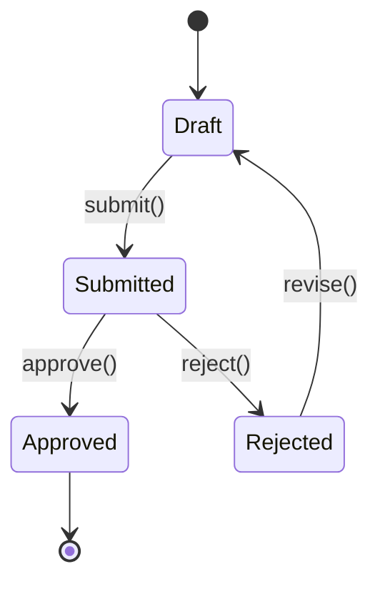

# Functional Design (Per-Unit)

**Purpose**: Create detailed, technology-agnostic business logic design for each unit

**Execute IF**:
- New data models or schemas
- Complex business logic
- Business rules need detailed design

**Skip IF**:
- Simple logic changes
- No new business logic

## Prerequisites
- Units Generation must be complete (or single unit identified)
- Requirements and Application Design artifacts available

## Step 1: Load Context

### 1.1 Load Prior Artifacts
- Load unit-of-work.md for current unit
- Load component-methods.md for business rules
- Load requirements.md for requirements traceability
- Load stories.md for acceptance criteria

### 1.2 Identify Current Unit
- Unit ID: [From unit-of-work.md]
- Unit Name: [From unit-of-work.md]
- Components: [Components in this unit]

## Step 2: Create Functional Design Plan

Create `aicodepath-docs/construction/plans/{unit-name}-functional-design-plan.md`:

```markdown
# Functional Design Plan: [Unit Name]

## Unit Context
- **Unit ID**: [ID]
- **Unit Name**: [Name]
- **Stories Covered**: [Story IDs]

## Design Steps
- [ ] Define domain entities
- [ ] Document business rules
- [ ] Create business logic model
- [ ] Define validation rules
- [ ] Document error scenarios
- [ ] Create state diagrams (if applicable)
- [ ] Verify against acceptance criteria
```

## Step 3: Define Domain Entities

Create `aicodepath-docs/construction/{unit-name}/functional-design/domain-entities.md`:

```markdown
# Domain Entities: [Unit Name]

## Entity Inventory

| Entity | Description | Lifecycle |
|--------|-------------|-----------|
| [Entity] | [Description] | [Created/Updated/Deleted by] |

## Entity Definitions

### [Entity Name]
- **Description**: [What this entity represents]
- **Attributes**:
  | Attribute | Type | Required | Description |
  |-----------|------|----------|-------------|
  | id | UUID | Yes | Unique identifier |
  | [attr] | [type] | [Yes/No] | [Description] |

- **Relationships**:
  | Related Entity | Relationship | Description |
  |----------------|--------------|-------------|
  | [Entity] | [1:1/1:N/N:M] | [Description] |

- **Invariants**:
  - [Invariant 1: condition that must always be true]
  - [Invariant 2]

- **Lifecycle States** (if applicable):
  - [State 1] -> [State 2] (via [action])

## Entity Diagram
[Mermaid class diagram]
```

## Step 3.5: Data Format Convention Reminder (MANDATORY)

Before proceeding with business rules, verify data format conventions are understood.

### Critical Convention: Database ↔ Application Boundary

| Layer | Naming Convention | Examples |
|-------|------------------|----------|
| **Database** | snake_case | user_id, created_at, order_status |
| **API Response** | camelCase | userId, createdAt, orderStatus |
| **TypeScript/JS** | camelCase | userId, createdAt, orderStatus |
| **Python** | snake_case | user_id, created_at, order_status |

### Transformation Layer Required

When mapping database entities to API responses:

```typescript
// Entity from database (snake_case)
interface DbUser {
  user_id: string;
  first_name: string;
  created_at: Date;
}

// API response (camelCase)
interface ApiUser {
  userId: string;
  firstName: string;
  createdAt: string;
}

// Mapper function
function toApiUser(db: DbUser): ApiUser {
  return {
    userId: db.user_id,
    firstName: db.first_name,
    createdAt: db.created_at.toISOString(),
  };
}
```

### ORM Configuration

Configure ORM to handle transformation:

```typescript
// Prisma - use @@map for table names
model User {
  userId    String @id @map("user_id")
  firstName String @map("first_name")
  @@map("users")
}

// TypeORM - use naming strategy
connectionOptions.namingStrategy = new SnakeNamingStrategy();
```

### Checklist Before Proceeding

- [ ] Confirmed database uses snake_case
- [ ] Confirmed API returns camelCase (for JS/TS frontends)
- [ ] Mapper/transformation layer designed
- [ ] ORM naming strategy configured (if using ORM)

---

## Step 4: Document Business Rules

Create `aicodepath-docs/construction/{unit-name}/functional-design/business-rules.md`:

```markdown
# Business Rules: [Unit Name]

## Rule Inventory

| Rule ID | Category | Description | Priority |
|---------|----------|-------------|----------|
| BR-001 | Validation | [Description] | High |
| BR-002 | Calculation | [Description] | Medium |

## Rule Definitions

### BR-001: [Rule Name]
- **Category**: [Validation/Calculation/Authorization/Workflow]
- **Description**: [Detailed description]
- **Applies To**: [Entities/Operations]
- **Condition**: [When this rule applies]
- **Action**: [What happens when rule is triggered]
- **Exception Handling**: [What happens on violation]
- **Examples**:
  - Input: [Example input]
  - Expected: [Expected outcome]
- **Story Reference**: [Related user stories]

### BR-002: [Rule Name]
[Repeat structure]

## Rule Dependencies
| Rule | Depends On | Reason |
|------|------------|--------|
| BR-002 | BR-001 | [Why dependency exists] |
```

## Step 5: Create Business Logic Model

Create `aicodepath-docs/construction/{unit-name}/functional-design/business-logic-model.md`:

```markdown
# Business Logic Model: [Unit Name]

## Operations

### [Operation Name]
- **Purpose**: [What this operation does]
- **Trigger**: [What initiates this operation]
- **Input**:
  | Parameter | Type | Required | Validation |
  |-----------|------|----------|------------|
  | [param] | [type] | [Yes/No] | [Rules] |

- **Processing Steps**:
  1. [Step 1 description]
  2. [Step 2 description]
  3. [Step 3 description]

- **Business Rules Applied**: [BR-001, BR-002]
- **Output**: [What is returned/produced]
- **Side Effects**: [State changes, notifications, etc.]
- **Error Scenarios**:
  | Condition | Error | Recovery |
  |-----------|-------|----------|
  | [Condition] | [Error type] | [How to handle] |

## Operation Flow Diagrams
[Mermaid sequence or activity diagrams]

## State Machines (if applicable)

### [Entity] State Machine


## Acceptance Criteria Mapping
| Story | Criteria | Covered By |
|-------|----------|------------|
| S001 | [Criteria] | [Operation/Rule] |
```

## Step 6: Update Progress

- Mark steps complete in functional-design-plan.md
- Update aicodepath-state.md

## Step 7: Present Completion Message

```markdown
# Functional Design Complete: [Unit Name]

Functional design has defined:
- **Entities**: [X] domain entities
- **Business Rules**: [X] rules documented
- **Operations**: [X] operations defined
- **Error Scenarios**: [X] error cases covered

Key Design Elements:
- [Element 1]
- [Element 2]

> **REVIEW REQUIRED:**
> Please examine the functional design at: `aicodepath-docs/construction/{unit-name}/functional-design/`

> **WHAT'S NEXT?**
>
> **You may:**
>
> **Request Changes** - Ask for modifications to the functional design
> **Continue to Next Stage** - Proceed to **[NFR Requirements/Database Design/Code Generation]**
```

## Step 8: Wait for Explicit Approval
- User must choose between "Request Changes" or "Continue to Next Stage"
- Log user's response in audit.md
