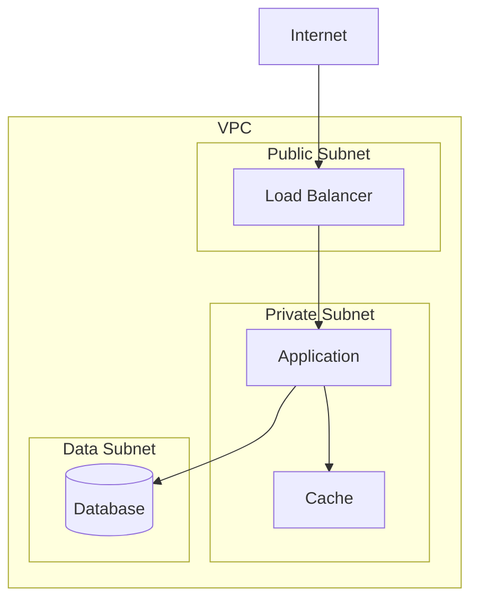

# Infrastructure Design (Per-Unit)

**Purpose**: Map to actual infrastructure services and define deployment architecture

**Execute IF**:
- Infrastructure services need mapping
- Deployment architecture required
- Cloud resources need specification

**Skip IF**:
- No infrastructure changes
- Infrastructure already defined

## Prerequisites
- NFR Design complete (or skipped)
- Tech stack decisions made

## Step 1: Load Context

### 1.1 Load Prior Artifacts
- Load nfr-design artifacts
- Load tech-stack-decisions.md
- Load existing infrastructure (if brownfield)

### 1.2 Identify Infrastructure Needs
- Compute resources
- Storage resources
- Networking
- Security
- Monitoring

## Step 2: Create Infrastructure Design

Create `aicodepath-docs/construction/{unit-name}/infrastructure-design/infrastructure-design.md`:

```markdown
# Infrastructure Design: [Unit Name]

## Infrastructure Overview

### Target Environment
- **Cloud Provider**: [AWS/GCP/Azure/On-prem]
- **Region**: [Primary region]
- **Multi-Region**: [Yes/No]

### Compute Resources

#### Application Servers
- **Type**: [Lambda/ECS/EC2/Kubernetes]
- **Sizing**: [Memory/CPU/Instances]
- **Auto-scaling**:
  - Min: [Count]
  - Max: [Count]
  - Trigger: [Metric/Threshold]

#### Background Workers (if applicable)
- **Type**: [Same/Different from app servers]
- **Queue Integration**: [SQS/RabbitMQ/etc.]
- **Scaling**: [Configuration]

### Storage Resources

#### Database
- **Service**: [RDS/DynamoDB/etc.]
- **Instance Type**: [Size]
- **Storage**: [Size/Type]
- **Backup**: [Strategy]
- **Multi-AZ**: [Yes/No]

#### Cache
- **Service**: [ElastiCache/etc.]
- **Instance Type**: [Size]
- **Cluster Mode**: [Yes/No]

#### Object Storage
- **Service**: [S3/etc.]
- **Bucket Configuration**: [Details]
- **Lifecycle Rules**: [If any]

### Networking

#### VPC Configuration
- **CIDR**: [Range]
- **Subnets**: [Public/Private configuration]
- **Availability Zones**: [Count]

#### Load Balancer
- **Type**: [ALB/NLB/etc.]
- **Listeners**: [Ports/Protocols]
- **Health Checks**: [Configuration]

#### Security Groups
| Name | Inbound | Outbound | Purpose |
|------|---------|----------|---------|
| [SG] | [Rules] | [Rules] | [Purpose] |

### Security

#### IAM Roles
| Role | Purpose | Permissions |
|------|---------|-------------|
| [Role] | [Purpose] | [Key permissions] |

#### Secrets Management
- **Service**: [Secrets Manager/Parameter Store]
- **Secrets**: [List of secrets needed]

### Monitoring & Logging

#### CloudWatch/Monitoring
- **Dashboards**: [Key dashboards]
- **Alarms**: [Critical alarms]

#### Logging
- **Service**: [CloudWatch Logs/etc.]
- **Retention**: [Duration]
- **Log Groups**: [Configuration]

## Infrastructure Diagram

```

## Step 3: Create Deployment Architecture

Create `aicodepath-docs/construction/{unit-name}/infrastructure-design/deployment-architecture.md`:

```markdown
# Deployment Architecture: [Unit Name]

## Deployment Strategy
- **Strategy**: [Blue-Green/Rolling/Canary]
- **Rollback Plan**: [Approach]

## CI/CD Pipeline

### Build Stage
- **Tool**: [GitHub Actions/Jenkins/etc.]
- **Steps**:
  1. [Step 1]
  2. [Step 2]
  3. [Step 3]

### Test Stage
- **Unit Tests**: [Configuration]
- **Integration Tests**: [Configuration]
- **Security Scans**: [Tools used]

### Deploy Stage
- **Tool**: [CDK/Terraform/CloudFormation]
- **Environments**: [Dev/Staging/Prod]
- **Approval Gates**: [Where required]

## Environment Configuration

### Environment Variables
| Variable | Purpose | Source |
|----------|---------|--------|
| [VAR] | [Purpose] | [Secrets Manager/Config] |

### Feature Flags (if applicable)
| Flag | Purpose | Default |
|------|---------|---------|
| [Flag] | [Purpose] | [On/Off] |

## Cost Estimation

### Monthly Cost Breakdown
| Resource | Count | Unit Cost | Monthly Cost |
|----------|-------|-----------|--------------|
| [Resource] | [X] | [$X] | [$X] |
| **Total** | | | **[$X]** |

### Cost Optimization Notes
- [Optimization opportunity 1]
- [Optimization opportunity 2]
```

## Step 4: Update Progress

- Update aicodepath-state.md
- Log design decisions in audit.md

## Step 5: Present Completion Message

```markdown
# Infrastructure Design Complete: [Unit Name]

Infrastructure design has defined:
- **Compute**: [Summary]
- **Storage**: [Summary]
- **Networking**: [Summary]
- **Estimated Cost**: [$X/month]

> **REVIEW REQUIRED:**
> Please examine the infrastructure design at: `aicodepath-docs/construction/{unit-name}/infrastructure-design/`

> **WHAT'S NEXT?**
>
> **You may:**
>
> **Request Changes** - Ask for modifications to infrastructure design
> **Continue to Next Stage** - Proceed to **[Database Design/AI Implementation/Code Generation]**
```

## Step 6: Wait for Explicit Approval
- User must choose between "Request Changes" or "Continue to Next Stage"
- Log user's response in audit.md
