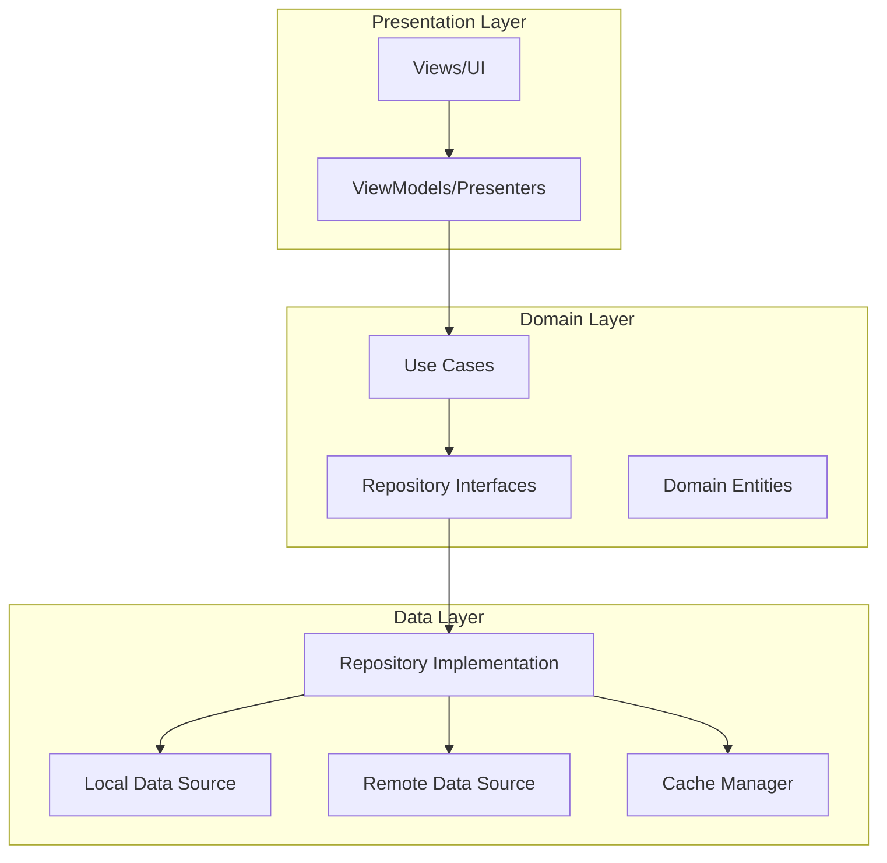
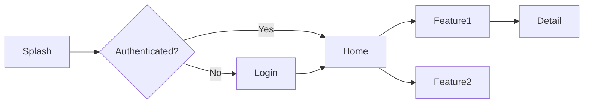

# Mobile Design (Per-Unit)

**Purpose**: Design mobile application architecture, platform selection, and mobile-specific patterns

**Execute IF**:
- Mobile application is required (iOS, Android, PWA, or hybrid)
- Mobile-specific features needed (offline, push notifications, etc.)
- Cross-platform strategy needs definition
- Mobile architecture patterns required

**Skip IF**:
- No mobile application needed
- Web-only solution
- Mobile already defined and unchanged

## Prerequisites
- Functional Design complete (business logic defined)
- NFR Requirements complete (performance/UX needs known)
- Target audience and platform requirements identified

---

## Step 1: Load Context

### 1.1 Load Prior Artifacts
- Load functional-design artifacts
- Load nfr-requirements.md
- Load requirements.md for user needs
- Load user-stories.md for mobile use cases

### 1.2 Gather Mobile Requirements

Create `aicodepath-docs/construction/{unit-name}/mobile-design/mobile-questions.md`:

```markdown
# Mobile Design Questions

## Question 1
What mobile platform(s) are required?

A) Native iOS only - Best performance, iOS-specific features
B) Native Android only - Best performance, Android-specific features
C) Both Native (iOS + Android) - Maximum performance, platform-specific experiences
D) Progressive Web App (PWA) - Web-based, works on all platforms, installable
E) Hybrid Framework (React Native, Flutter, Ionic) - Code sharing, faster development
F) Multiple approaches (e.g., PWA + Native) - Please describe

[Answer]:

## Question 2
What is the primary driver for mobile app?

A) User demand - Users expect mobile app
B) Product requirement - Core functionality needs mobile
C) Competitive parity - Competitors have mobile apps
D) Offline functionality - App must work offline
E) Push notifications - Real-time engagement required
F) Device features - Camera, GPS, sensors needed
G) Other (please describe after [Answer]: tag below)

[Answer]:

## Question 3
What is the target audience for the mobile app?

A) General consumers - Wide age range, varying tech literacy
B) Tech-savvy users - Early adopters, high tech literacy
C) Enterprise users - Business professionals, specific workflows
D) Specific demographic - Age/region/industry specific
E) Other (please describe after [Answer]: tag below)

[Answer]:

## Question 4
What offline capabilities are required?

A) Full offline mode - Complete functionality without internet
B) Partial offline - Core features work offline, sync when online
C) Offline viewing - Read-only access to cached data
D) No offline support - Internet connection always required
E) Other (please describe after [Answer]: tag below)

[Answer]:

## Question 5
Are push notifications required?

A) Critical - Essential for app functionality
B) Important - Enhances user engagement
C) Nice to have - Optional feature
D) Not required - No push notifications needed
E) Other (please describe after [Answer]: tag below)

[Answer]:

## Question 6
What device features/sensors are needed?

A) Camera - Photo/video capture, QR scanning
B) Location/GPS - Maps, geofencing, location tracking
C) Biometrics - Fingerprint, Face ID authentication
D) Bluetooth - Device connectivity
E) NFC - Contactless payments, access control
F) Accelerometer/Gyroscope - Motion detection
G) None - Standard mobile features only
H) Other (please describe)

[Answer]:

## Question 7
What is the infrastructure/backend stack?

A) Cloud-native (AWS, Azure, GCP) - Scalable cloud services
B) On-premise servers - Internal infrastructure
C) Hybrid cloud - Mix of cloud and on-premise
D) Serverless - AWS Lambda, Azure Functions
E) BaaS (Backend-as-a-Service) - Firebase, Supabase
F) Other (please describe after [Answer]: tag below)

[Answer]:
```

---

## Step 2: Create Platform Strategy

Create `aicodepath-docs/construction/{unit-name}/mobile-design/platform-strategy.md`:

```markdown
# Mobile Platform Strategy: [Unit Name]

## Platform Selection

### Chosen Approach
- **Platform**: [Native iOS/Native Android/Both/PWA/Hybrid]
- **Framework**: [Swift/Kotlin/React Native/Flutter/PWA/Ionic]
- **Minimum OS Version**:
  - iOS: [version] and above
  - Android: [API level] and above
- **Development Approach**: [Single team/Separate teams/Cross-platform]

### Platform Rationale

| Factor | Weight | Decision |
|--------|--------|----------|
| Performance requirements | [High/Medium/Low] | [How it influenced choice] |
| Development speed | [High/Medium/Low] | [How it influenced choice] |
| Code reuse | [High/Medium/Low] | [How it influenced choice] |
| Platform-specific features | [High/Medium/Low] | [How it influenced choice] |
| Team expertise | [High/Medium/Low] | [How it influenced choice] |
| Budget constraints | [High/Medium/Low] | [How it influenced choice] |
| Maintenance | [High/Medium/Low] | [How it influenced choice] |

## Native iOS Strategy (if applicable)

### Technical Stack
- **Language**: Swift [version]
- **UI Framework**: SwiftUI / UIKit
- **Architecture**: MVVM / MVI / Clean Architecture
- **Dependency Management**: Swift Package Manager / CocoaPods
- **Minimum iOS Version**: [version]

### iOS-Specific Features
- Face ID / Touch ID authentication
- Apple Pay integration
- HealthKit integration
- ARKit for augmented reality
- [Other iOS-specific features]

## Native Android Strategy (if applicable)

### Technical Stack
- **Language**: Kotlin [version]
- **UI Framework**: Jetpack Compose / XML Views
- **Architecture**: MVVM / MVI / Clean Architecture
- **Dependency Management**: Gradle
- **Minimum SDK**: [API level]

### Android-Specific Features
- Google Pay integration
- Google Maps integration
- Firebase Cloud Messaging
- [Other Android-specific features]

## Progressive Web App (PWA) Strategy (if applicable)

### Technical Stack
- **Framework**: [React/Vue/Angular/Vanilla]
- **Service Worker**: [Workbox/Custom]
- **Manifest**: Web App Manifest configured
- **Offline Strategy**: [Cache-first/Network-first/Stale-while-revalidate]

### PWA Capabilities
- Installable on home screen
- Offline functionality via Service Workers
- Push notifications (Android/Desktop)
- Background sync
- App-like experience

### PWA Limitations
- Limited iOS support for some features
- No access to all native device features
- Browser dependency

## Hybrid Framework Strategy (if applicable)

### React Native
- **Version**: [version]
- **Navigation**: React Navigation
- **State Management**: Redux / MobX / Context API
- **Native Modules**: [List required native modules]

### Flutter
- **Version**: [version]
- **State Management**: Provider / Riverpod / BLoC
- **Platform Channels**: [List required platform integrations]

### Ionic
- **Version**: [version]
- **Framework**: Angular / React / Vue
- **Capacitor**: [Version]
- **Native Plugins**: [List required plugins]

## Code Sharing Strategy

### Shared Components
- Business logic layer
- API client
- Data models
- Utilities and helpers
- Authentication logic

### Platform-Specific Components
- UI/UX (platform design guidelines)
- Navigation patterns
- Platform-specific integrations
- Performance optimizations

### Code Sharing Ratio
- **Shared Code**: [X]%
- **Platform-Specific Code**: [Y]%
```

---

## Step 3: Create Mobile Architecture

Create `aicodepath-docs/construction/{unit-name}/mobile-design/mobile-architecture.md`:

```markdown
# Mobile Architecture: [Unit Name]

## Architecture Pattern

### Chosen Pattern
- **Architecture**: [MVVM/MVI/Clean Architecture/VIPER]
- **Rationale**: [Why this pattern was chosen]

### Architecture Diagram



## Layer Responsibilities

### Presentation Layer
- **Views**: Display UI, handle user interactions
- **ViewModels/Presenters**: Presentation logic, state management
- **UI State**: Screen states, loading/error/success handling

### Domain Layer
- **Use Cases**: Business logic encapsulation
- **Domain Entities**: Core business models
- **Repository Interfaces**: Data access contracts

### Data Layer
- **Repository Implementation**: Data source orchestration
- **Local Data Source**: SQLite/Realm/Core Data
- **Remote Data Source**: API calls
- **Cache Manager**: Memory and disk caching

## Navigation Architecture

### Navigation Pattern
- **iOS**: UINavigationController / SwiftUI Navigation
- **Android**: Jetpack Navigation / Navigation Component
- **React Native**: React Navigation
- **Flutter**: Navigator 2.0 / go_router

### Navigation Flow


## State Management

### State Management Approach
- **iOS**: Combine / SwiftUI @State
- **Android**: StateFlow / LiveData / Compose State
- **React Native**: Redux / MobX / Context + Hooks
- **Flutter**: Provider / Riverpod / BLoC

### State Flow
- Unidirectional data flow
- Immutable state updates
- Centralized state management
- Reactive UI updates

## Dependency Injection

### DI Framework
- **iOS**: Manual DI / Swinject
- **Android**: Hilt / Koin
- **React Native**: Context API / InversifyJS
- **Flutter**: get_it / provider

### Dependency Graph
```markdown
- App Module
  - Network Module (API client, interceptors)
  - Database Module (local storage)
  - Repository Module (data repositories)
  - Use Case Module (business logic)
  - ViewModel Module (presentation logic)
```
```

---

## Step 4: Create Offline Strategy

Create `aicodepath-docs/construction/{unit-name}/mobile-design/offline-strategy.md`:

```markdown
# Offline Strategy: [Unit Name]

## Offline Requirements
- **Mode**: [Full offline/Partial offline/Offline viewing/None]
- **Sync Strategy**: [When and how data synchronizes]

## Local Storage

### Storage Technology
- **iOS**: Core Data / Realm / SQLite
- **Android**: Room / SQLite / Realm
- **React Native**: SQLite / Realm / AsyncStorage / MMKV
- **Flutter**: Hive / SQLite / Drift
- **PWA**: IndexedDB / Cache API

### Storage Schema
```sql
-- Example local database schema
CREATE TABLE cached_items (
    id TEXT PRIMARY KEY,
    data TEXT NOT NULL,
    synced BOOLEAN DEFAULT 0,
    last_modified TIMESTAMP,
    created_at TIMESTAMP
);

CREATE TABLE sync_queue (
    id TEXT PRIMARY KEY,
    operation TEXT, -- INSERT, UPDATE, DELETE
    table_name TEXT,
    record_id TEXT,
    payload TEXT,
    created_at TIMESTAMP
);
```

### Storage Limits
- **Maximum Cache Size**: [X] MB
- **Cache Expiration**: [Duration]
- **Cleanup Strategy**: [LRU/FIFO/Manual]

## Data Synchronization

### Sync Patterns

#### Offline-First Pattern
1. Write to local database immediately
2. Queue sync operation
3. Sync when network available
4. Handle conflicts

#### Online-First Pattern
1. Attempt remote write first
2. Cache locally on success
3. Fall back to local-only on failure
4. Retry when network restored

### Conflict Resolution
| Conflict Type | Resolution Strategy |
|---------------|---------------------|
| Local vs Remote update | [Last-write-wins/Manual resolution/Timestamp-based] |
| Deleted on server | [Remove local/Keep local/Prompt user] |
| Created offline, exists remotely | [Merge/Replace/Conflict marker] |

### Sync Queue Management
- **Retry Policy**: Exponential backoff
- **Max Retries**: [X] attempts
- **Failure Handling**: [Store for manual resolution]
- **Batch Sync**: Group operations for efficiency

## Network State Handling

### Network Detection
```markdown
- Monitor network connectivity changes
- Detect network type (WiFi/Cellular/None)
- Measure connection quality
- Throttle sync on poor connections
```

### User Experience
- **Offline Indicator**: Banner/Icon showing offline mode
- **Sync Status**: Progress indicator during synchronization
- **Error Messages**: Clear messaging for sync failures
- **Manual Sync**: User-triggered synchronization option
```

---

## Step 5: Create Push Notification Design

Create `aicodepath-docs/construction/{unit-name}/mobile-design/push-notifications.md`:

```markdown
# Push Notification Design: [Unit Name]

## Notification Requirements
- **Priority**: [Critical/Important/Nice-to-have/Not required]
- **Notification Types**: [List types of notifications needed]

## Push Service Selection

### iOS Push Notifications
- **Service**: Apple Push Notification Service (APNs)
- **Certificate**: [Production/Development]
- **Authentication**: Token-based / Certificate-based

### Android Push Notifications
- **Service**: Firebase Cloud Messaging (FCM)
- **Configuration**: google-services.json

### Cross-Platform
- **Service**: Firebase Cloud Messaging (iOS + Android)
- **Web Push**: Service Workers + Push API (PWA)

## Notification Types

| Type | Title | Body | Action | Priority |
|------|-------|------|--------|----------|
| [Type] | [Template] | [Template] | [Deep link] | [High/Normal/Low] |

## Notification Handling

### Foreground (App Active)
- Display in-app notification banner
- Update UI immediately
- Play subtle sound/haptic

### Background (App Inactive)
- System notification tray
- Badge count update
- Wake app for data sync

### Killed (App Terminated)
- System notification only
- Launch app on tap
- Process notification on app launch

## Deep Linking

### Deep Link Structure
```
myapp://[module]/[screen]?[params]

Examples:
myapp://orders/detail?orderId=123
myapp://chat/conversation?userId=456
```

### Deep Link Routing
```markdown
1. App launches from notification
2. Parse deep link URL
3. Navigate to appropriate screen
4. Pass parameters to screen
5. Handle authentication if required
```

## Notification Permissions

### Permission Strategy
- **Timing**: [On first launch/After key action/When feature needed]
- **Prompt**: Clear explanation of notification value
- **Fallback**: Alternative communication if denied

### Permission States
- **Authorized**: Full notification support
- **Denied**: Explain importance, offer settings link
- **Not Determined**: Show permission prompt
- **Provisional** (iOS): Silent notifications, request upgrade
```

---

## Step 6: Create Mobile Performance Design

Create `aicodepath-docs/construction/{unit-name}/mobile-design/performance-design.md`:

```markdown
# Mobile Performance Design: [Unit Name]

## Performance Targets

| Metric | Target | Rationale |
|--------|--------|-----------|
| App Launch Time | < [X] seconds | First impression |
| Screen Load Time | < [X] seconds | User engagement |
| API Response | < [X] ms | Perceived speed |
| Frame Rate | 60 FPS | Smooth animations |
| Memory Usage | < [X] MB | Device constraints |
| Battery Impact | [Low/Medium] | User satisfaction |
| App Size | < [X] MB | Download barrier |

## Optimization Strategies

### Image Optimization
- **Format**: WebP / HEIC for photos, SVG for icons
- **Compression**: [Quality level]
- **Lazy Loading**: Load images on demand
- **Caching**: Cache images locally
- **CDN**: Serve images from CDN
- **Responsive**: Multiple resolutions for different screens

### API Optimization
- **Request Batching**: Combine multiple requests
- **Pagination**: Load data in chunks
- **Caching**: Cache API responses
- **Compression**: GZIP/Brotli compression
- **GraphQL**: Request only needed fields (if applicable)

### List/Grid Performance
- **Virtualization**: Render only visible items
- **Recycling**: Reuse list item views
- **Pagination**: Infinite scroll with loading
- **Placeholder**: Show loading skeletons

### Code Optimization
- **Code Splitting**: Load code on demand
- **Tree Shaking**: Remove unused code
- **Minification**: Compress JavaScript/CSS
- **Lazy Loading**: Defer non-critical components

### Memory Management
- **Image Memory**: Release unused images
- **Cache Limits**: Enforce cache size limits
- **Memory Leaks**: Prevent retain cycles
- **Background Cleanup**: Release resources when backgrounded

## Monitoring and Metrics

### Performance Monitoring Tools
- **iOS**: Xcode Instruments
- **Android**: Android Profiler
- **React Native**: Flipper, React Native Performance
- **Flutter**: DevTools, Performance Overlay
- **Crashlytics**: Firebase Performance Monitoring

### Key Metrics to Track
- App start time
- Screen transition time
- API call duration
- Memory consumption
- CPU usage
- Battery drain
- Network usage
- Crash-free rate
```

---

## Step 7: Platform-Specific Guidelines

Create `aicodepath-docs/construction/{unit-name}/mobile-design/platform-guidelines.md`:

```markdown
# Platform-Specific Guidelines: [Unit Name]

## iOS Human Interface Guidelines

### Design Principles
- **Clarity**: UI helps people understand content
- **Deference**: Content takes priority over UI
- **Depth**: Layers create hierarchy and understanding

### Navigation Patterns
- **Tab Bar**: 3-5 top-level sections
- **Navigation Bar**: Hierarchical navigation
- **Modal**: Focused tasks requiring completion/dismissal

### UI Components
- Use native iOS components (UIKit/SwiftUI)
- Follow iOS spacing and sizing guidelines
- Adopt SF Symbols for icons
- Support Dynamic Type for accessibility

### App Store Requirements
- App icons (all required sizes)
- Launch screens
- Privacy policy
- App Store screenshots and description

## Android Material Design

### Design Principles
- **Material**: Inspired by physical materials
- **Bold**: Intentional use of color and imagery
- **Motion**: Meaningful and appropriate

### Navigation Patterns
- **Bottom Navigation**: 3-5 top-level destinations
- **Navigation Drawer**: Extended navigation
- **Top App Bar**: Context and actions

### UI Components
- Use Material Design components
- Follow Material spacing (8dp grid)
- Material color system
- Material icons

### Play Store Requirements
- App icons (all required sizes)
- Feature graphic
- Privacy policy
- Play Store screenshots and description

## Cross-Platform Consistency

### Shared Elements
- Brand colors and typography
- Core user flows
- Business logic
- Content and messaging

### Platform-Specific Elements
- Navigation patterns (tabs vs bottom nav)
- System fonts
- Icon styles
- Gesture patterns (swipe back on iOS)
- Share/action patterns

### Consistency vs Native Feel
- Prioritize native platform patterns over uniformity
- Adapt flows to platform conventions
- Use platform-specific UI components
- Follow platform accessibility guidelines
```

---

## Step 8: Update Progress

- Mark all steps complete in mobile-design-plan.md
- Update aicodepath-state.md

## Step 9: Present Completion Message

```markdown
# Mobile Design Complete: [Unit Name]

Mobile design has defined:
- **Platform**: [Platform strategy]
- **Architecture**: [Architecture pattern]
- **Offline Support**: [Offline capability]
- **Push Notifications**: [Yes/No with service]
- **Performance Targets**: [Key metrics]

**Key Decisions**:
- [Decision 1]
- [Decision 2]
- [Decision 3]

> **REVIEW REQUIRED:**
> Please examine the mobile design at: `aicodepath-docs/construction/{unit-name}/mobile-design/`

> **WHAT'S NEXT?**
>
> **You may:**
>
> **Request Changes** - Ask for modifications to mobile design
> **Continue to Next Stage** - Proceed to **[Mobile UX Design/Code Generation]**
```

## Step 10: Wait for Explicit Approval
- User must choose between "Request Changes" or "Continue to Next Stage"
- Log user's response in audit.md
