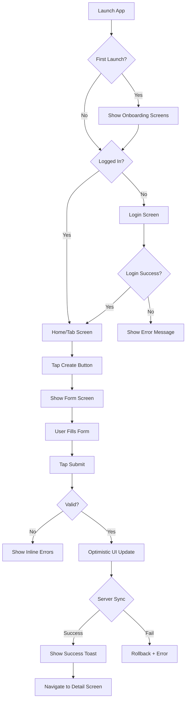

# Mobile UI/UX Design (Per-Unit)

**Purpose**: Design mobile user interface structure, components, and mobile-specific user experience patterns

**Execute IF**:
- Mobile application UI required
- Mobile user interface patterns needed
- Mobile-specific UX design required
- Screen designs and flows needed for mobile app

**Skip IF**:
- No mobile UI needed
- Mobile design already defined and unchanged
- Mobile Design stage was skipped

## Prerequisites
- Mobile Design complete (platform and architecture defined)
- Functional Design complete (user flows understood)
- User stories available (user needs identified)

---

## Step 1: Load Context

### 1.1 Load Prior Artifacts
- Load mobile-design artifacts (platform, architecture)
- Load functional-design artifacts
- Load user-stories.md for mobile user journeys
- Load nfr-requirements.md for UX constraints

### 1.2 Gather Mobile UI/UX Requirements

Create `aicodepath-docs/construction/{unit-name}/mobile-ux-design/mobile-ux-questions.md`:

```markdown
# Mobile UI/UX Design Questions

## Question 1
What is the primary mobile UI complexity?

A) Simple - Basic screens, simple navigation, CRUD operations
B) Moderate - Multiple features, tab navigation, standard patterns
C) Complex - Rich media, real-time features, advanced interactions
D) Very Complex - Custom gestures, animations, complex state management
E) Other (please describe after [Answer]: tag below)

[Answer]:

## Question 2
What navigation pattern fits the app structure?

A) Tab-based - 3-5 main sections accessible via bottom tabs (Recommended for most apps)
B) Drawer/Menu - Side menu for multiple sections
C) Hierarchical - Deep navigation with back stack
D) Modal - Task-based flows with modals/sheets
E) Hybrid - Combination of patterns
F) Other (please describe after [Answer]: tag below)

[Answer]:

## Question 3
Are there platform-specific design preferences?

A) Platform-native - Follow iOS/Android guidelines strictly (Recommended)
B) Unified design - Same design across platforms with minor adaptations
C) Custom design - Brand-specific design that differs from platform norms
D) Adaptive - Different designs optimized for each platform
E) Other (please describe after [Answer]: tag below)

[Answer]:

## Question 4
What gesture interactions are needed?

A) Standard only - Tap, scroll, basic interactions
B) Enhanced - Swipe to delete, pull to refresh, long press
C) Advanced - Pinch to zoom, multi-touch, custom gestures
D) Minimal - Reduce gestures for accessibility
E) Other (please describe after [Answer]: tag below)

[Answer]:

## Question 5
What offline UX patterns are needed?

A) Offline indicator - Show connection status, block actions when offline
B) Optimistic UI - Allow actions, sync in background, show sync status
C) Full offline mode - Complete experience offline, seamless sync
D) No offline UX - Require connection, show error when offline
E) Other (please describe after [Answer]: tag below)

[Answer]:

## Question 6
Are there existing mobile design assets?

A) Complete design system - Figma/Sketch files with all components
B) Partial designs - Some screens or components designed
C) Brand guidelines only - Colors, fonts, logos
D) Start from scratch - No existing designs
E) Use standard design library - Material/iOS default components
F) Other (please describe after [Answer]: tag below)

[Answer]:
```

---

## Step 2: Create Mobile UI Structure

Create `aicodepath-docs/construction/{unit-name}/mobile-ux-design/mobile-ui-structure.md`:

```markdown
# Mobile UI Structure: [Unit Name]

## Navigation Architecture

### Navigation Pattern
- **Primary**: [Tab Bar/Drawer/Stack/Modal]
- **Secondary**: [Nested stacks/Modals/Sheets]

### iOS Navigation Structure
```
┌─────────────────────────┐
│   Navigation Bar        │  ← Back, Title, Actions
├─────────────────────────┤
│                         │
│    Screen Content       │
│                         │
│                         │
├─────────────────────────┤
│      Tab Bar (opt)      │  ← Main navigation (3-5 tabs)
└─────────────────────────┘
```

### Android Navigation Structure
```
┌─────────────────────────┐
│   Top App Bar           │  ← Menu/Back, Title, Actions
├─────────────────────────┤
│                         │
│    Screen Content       │
│                         │
│                         │
├─────────────────────────┤
│  Bottom Nav Bar (opt)   │  ← Main navigation (3-5 items)
└─────────────────────────┘
```

## Screen Types & Templates

### Template 1: List Screen
```
┌─────────────────────────┐
│ ← Title        [+] [⋮]  │  ← Header with actions
├─────────────────────────┤
│ [Search Bar]            │  ← Search (optional)
│ [Filter Chips]          │  ← Filters (optional)
├─────────────────────────┤
│ ┌─────────────────────┐ │
│ │   List Item 1       │ │  ← Scrollable list
│ │   List Item 2       │ │
│ │   List Item 3       │ │
│ │   ...               │ │
│ └─────────────────────┘ │
└─────────────────────────┘
```
**Used for**: [Users, Orders, Messages, etc.]

### Template 2: Detail Screen
```
┌─────────────────────────┐
│ ← Title        [Edit]   │  ← Header with back
├─────────────────────────┤
│ ┌─────────────────────┐ │
│ │   Header Section    │ │  ← Key info/image
│ │   (Image/Title)     │ │
│ └─────────────────────┘ │
│                         │
│  Section 1              │  ← Content sections
│  Details...             │
│                         │
│  Section 2              │
│  More details...        │
│                         │
├─────────────────────────┤
│    [Primary Action]     │  ← Bottom CTA (optional)
└─────────────────────────┘
```
**Used for**: [Profile, Order Detail, Product, etc.]

### Template 3: Form Screen
```
┌─────────────────────────┐
│ ← Title        [Save]   │  ← Header with save action
├─────────────────────────┤
│                         │
│  [Input Field 1]        │  ← Form fields
│  [Input Field 2]        │
│  [Dropdown]             │
│  [Date Picker]          │
│  [Toggle/Switch]        │
│                         │
│  [Error Messages]       │  ← Validation errors
│                         │
├─────────────────────────┤
│   [Cancel]  [Submit]    │  ← Bottom actions
└─────────────────────────┘
```
**Used for**: [Create Item, Edit Profile, Settings, etc.]

### Template 4: Tab-based Screen
```
┌─────────────────────────┐
│      Title      [⋮]     │  ← Header
├─────────────────────────┤
│ [Tab 1] [Tab 2] [Tab 3] │  ← Segmented control/Tabs
├─────────────────────────┤
│                         │
│    Tab Content          │  ← Swipeable content
│                         │
│                         │
└─────────────────────────┘
```
**Used for**: [Dashboard, Analytics, Settings, etc.]

### Template 5: Modal/Bottom Sheet
```
        ┌─────────────────┐
        │     ━━━━        │  ← Drag handle
        ├─────────────────┤
        │  Sheet Title    │  ← Title
        ├─────────────────┤
        │                 │
        │  Sheet Content  │  ← Content
        │                 │
        ├─────────────────┤
        │   [Cancel] [OK] │  ← Actions
        └─────────────────┘
```
**Used for**: [Quick actions, Confirmations, Filters, etc.]

## Screen Inventory

| Screen Name | Template Type | Tab/Stack | Priority | User Story |
|-------------|---------------|-----------|----------|------------|
| [Screen] | [Template] | [Navigation location] | [High/Med/Low] | [Story ID] |

## Safe Area & Spacing

### iOS Safe Areas
- Respect notch/Dynamic Island
- Avoid content behind home indicator
- Tab bar height: 49pt + safe area

### Android Safe Areas
- Status bar height consideration
- Navigation bar safe area
- Bottom nav height: 56dp

### Spacing Guidelines
```
Micro:  4dp/pt   - Icon padding, tight spacing
Small:  8dp/pt   - Element spacing
Medium: 16dp/pt  - Section spacing (default)
Large:  24dp/pt  - Major section spacing
XLarge: 32dp/pt  - Screen padding
```
```

---

## Step 3: Define Mobile Component Library

Create `aicodepath-docs/construction/{unit-name}/mobile-ux-design/mobile-components.md`:

```markdown
# Mobile Component Library: [Unit Name]

## Design System Choice
- **iOS**: [SwiftUI/UIKit native / Custom / Design System]
- **Android**: [Material Design 3 / Custom / Design System]
- **Cross-platform**: [Framework's component library / Custom]

## Shared/Uniform Components (Recommended for Reuse)

### Navigation Components

#### Tab Bar / Bottom Navigation
- **iOS**: UITabBar (native) - 3-5 tabs maximum
- **Android**: BottomNavigationView - 3-5 items maximum
- **Icons**: Filled when active, outline when inactive
- **Labels**: Always show or show on active only
- *Shared across*: Main navigation

#### Navigation Bar / Top App Bar
- **iOS**: UINavigationBar with standard back button
- **Android**: TopAppBar with hamburger/back button
- **Title**: Centered (iOS) or Left-aligned (Android)
- **Actions**: Right side, 1-3 action buttons
- *Shared across*: All screens

#### Search Bar
- **iOS**: UISearchBar in navigation bar
- **Android**: SearchView or expanded TopAppBar
- **Features**: Voice search, clear button, recent searches
- *Shared across*: List screens with search

### List Components

#### List Item / Cell
- **Structure**: Icon/Avatar + Title + Subtitle + Accessory
- **Variants**:
  - Basic: Title only
  - Subtitle: Title + description
  - Detail: Title + detail text on right
  - Custom: Image + multi-line content
- **Accessory**: Chevron, info icon, toggle, checkbox
- **Actions**: Swipe actions (iOS/Android)
- *Shared across*: All list screens

#### Card
- **Elevation**: 2dp (Android) / Shadow (iOS)
- **Corners**: 8-12dp rounded
- **Padding**: 16dp internal
- **Content**: Image (optional) + Title + Description + Actions
- *Shared across*: Feed, grid layouts

#### Section Header
- **Style**: Uppercase small text or regular bold
- **Background**: Distinct from list items
- **Sticky**: Optional sticky scroll behavior
- *Shared across*: Grouped lists

### Form Components

#### Text Input
- **iOS**: UITextField with rounded or underline style
- **Android**: Material TextField with outline or filled
- **States**: Default, Focus, Error, Disabled
- **Features**: Label, placeholder, helper text, error text, character count
- *Shared across*: All forms

#### Picker / Dropdown
- **iOS**: Native picker wheel or action sheet
- **Android**: Material dropdown or bottom sheet
- **Features**: Search in long lists, multi-select variant
- *Shared across*: All forms with selection

#### Date/Time Picker
- **iOS**: Native UIDatePicker (inline or sheet)
- **Android**: Material DatePicker/TimePicker
- **Variants**: Date, Time, Date+Time, Date Range
- *Shared across*: Forms with date input

#### Toggle / Switch
- **iOS**: UISwitch (native green or custom)
- **Android**: Material Switch
- **Usage**: On/off settings, feature toggles
- *Shared across*: Settings, forms

#### Segmented Control / Chip Group
- **iOS**: UISegmentedControl
- **Android**: Material Chip or TabRow
- **Usage**: 2-5 related options
- *Shared across*: Filters, view modes

### Button Components

#### Primary Button
- **Style**: Filled background, contrasting text
- **Usage**: Main call-to-action
- **States**: Default, Pressed, Disabled, Loading
- **Sizes**: Small (32dp), Medium (40dp), Large (48dp)
- *Shared across*: All screens

#### Secondary Button
- **Style**: Outline or text-only
- **Usage**: Alternative actions
- *Shared across*: Forms, dialogs

#### Floating Action Button (FAB)
- **iOS**: Custom (not native pattern)
- **Android**: Material FAB
- **Usage**: Primary screen action (Create, Add)
- **Position**: Bottom-right, above navigation
- *Shared across*: List screens with create action

#### Icon Button
- **Style**: Icon only, circular or square touch target
- **Min Size**: 44pt (iOS) / 48dp (Android)
- **Usage**: Toolbar actions, inline actions
- *Shared across*: Navigation bars, list items

### Feedback Components

#### Alert / Dialog
- **iOS**: UIAlertController
- **Android**: Material AlertDialog
- **Types**: Info, Warning, Confirmation, Error
- **Actions**: 1-3 buttons (Cancel, Destructive, Confirm)
- *Shared across*: All screens for confirmations

#### Bottom Sheet / Action Sheet
- **iOS**: Action sheet or custom modal
- **Android**: Material BottomSheet
- **Usage**: Options menu, quick actions, filters
- **Dismissal**: Swipe down, tap outside, cancel button
- *Shared across*: Context menus, filters

#### Toast / Snackbar
- **iOS**: Custom toast (not native)
- **Android**: Material Snackbar
- **Duration**: 2-4 seconds (short), 4-10 seconds (long)
- **Action**: Optional action button (Undo, Retry)
- *Shared across*: All screens for brief feedback

#### Loading Indicator
- **iOS**: UIActivityIndicator
- **Android**: Material CircularProgressIndicator
- **Variants**: Full-screen overlay, inline, button state
- *Shared across*: All async operations

#### Progress Bar
- **iOS**: UIProgressView
- **Android**: Material LinearProgressIndicator
- **Usage**: File upload, multi-step process
- **Type**: Determinate (known progress) or Indeterminate
- *Shared across*: Upload/download screens

#### Empty State
- **Content**: Icon/Image + Message + Action button
- **Variants**: No data, No search results, Error state
- *Shared across*: List screens, search results

### Media Components

#### Image View
- **Loading**: Show placeholder while loading
- **Error**: Show error state if load fails
- **Aspect Ratio**: Maintain aspect ratio, crop if needed
- **Tap**: Expand to full screen (optional)
- *Shared across*: Profiles, products, feeds

#### Avatar
- **Shapes**: Circle (people), Rounded square (brands)
- **Sizes**: Small (24dp), Medium (40dp), Large (64dp)
- **Fallback**: Initials or default icon
- *Shared across*: User profiles, lists

#### Badge
- **Position**: Top-right of icon/avatar
- **Content**: Number or dot indicator
- **Usage**: Notification count, unread count
- *Shared across*: Tab bar, profile icons

## Platform-Specific Adaptations

### iOS-Specific Components
- **UISegmentedControl**: For 2-5 related options
- **UIPageControl**: Page dots for carousels
- **UIRefreshControl**: Pull-to-refresh
- **Swipe Actions**: Context menu on swipe

### Android-Specific Components
- **Chip**: For filters, tags, selections
- **Floating Action Button**: Primary screen action
- **Material Elevation**: Card shadows
- **Ripple Effect**: Touch feedback

## Component Specifications

### Example: List Item Component

**Structure**:
```
[Icon/Avatar] [Title           ] [Accessory]
              [Subtitle         ]
```

**Variants**:
1. Basic: Title + Chevron
2. Subtitle: Title + Subtitle + Chevron
3. Value: Title + Value (right-aligned) + Chevron
4. Detail: Avatar + Title + Subtitle + Time/Badge

**Tap Behavior**: Navigate to detail screen

**Swipe Actions** (optional):
- Left swipe: Delete (red), Archive
- Right swipe: Mark as read, Star

### Example: Button Component

**Sizes**:
- Small: 32dp height, 12dp horizontal padding
- Medium: 44dp height, 16dp horizontal padding
- Large: 52dp height, 24dp horizontal padding

**States**:
- Default: Primary color background
- Pressed: Darker shade (iOS) / Ripple effect (Android)
- Disabled: 50% opacity, no interaction
- Loading: Show spinner, disable interaction

**Minimum Touch Target**: 44pt (iOS) / 48dp (Android)
```

---

## Step 4: Define Mobile User Flows

Create `aicodepath-docs/construction/{unit-name}/mobile-ux-design/mobile-user-flows.md`:

```markdown
# Mobile User Flows: [Unit Name]

## Flow 1: [Flow Name]

### User Story Reference
[Story ID]: [Story description]

### Mobile Flow Diagram


### Screen Flow

| Step | Screen | User Action | Transition | Next Screen |
|------|--------|-------------|------------|-------------|
| 1 | Splash | App launches | Fade in | Onboarding or Home |
| 2 | Onboarding | Swipe pages | Slide | Login or Home |
| 3 | Home | Tap + button | Present modal | Form Screen |
| 4 | Form | Fill fields → Tap Submit | - | Validation |
| 5 | Form | Validation passes | Dismiss modal | Home (updated) |
| 6 | Home | Toast appears | Auto-dismiss | - |
| 7 | Home | Tap created item | Push | Detail Screen |

### Gestures Used

| Gesture | Screen | Action |
|---------|--------|--------|
| Tap | Buttons, List Items | Primary action |
| Swipe Left/Right | List Items | Reveal actions (delete, archive) |
| Swipe Down | Top of screen | Pull-to-refresh |
| Swipe Right from Edge | Any screen | Back navigation (iOS) |
| Long Press | List Items | Show context menu |
| Swipe Up from Bottom | - | Dismiss bottom sheet |

### Error Scenarios

| Error | Screen | UI Response | User Action |
|-------|--------|-------------|-------------|
| Network offline | Form | Show offline banner, queue action | Wait or retry manually |
| Validation error | Form | Shake field, show red error text below | Correct input |
| Server error | Form | Show error dialog with retry option | Retry or cancel |
| Auth expired | Any | Show login screen, save state | Log in again |

### Success States

| Success | Screen | UI Response | Duration |
|---------|--------|-------------|----------|
| Item created | Home | Toast "Item created" + list updates | 3 seconds |
| Changes saved | Form | Toast "Saved" | 2 seconds |
| Action completed | Various | Haptic feedback + visual confirmation | Instant |

## Flow 2: [Flow Name]
[Repeat structure for each major mobile flow]

## Onboarding Flow (First Launch)

**Note**: For detailed onboarding design, see Step 7 below if `ux-feature-requirements.md` indicates onboarding is needed.

### Basic Onboarding Screens
1. **Welcome**: App value proposition
2. **Feature 1**: Key feature showcase
3. **Feature 2**: Second key feature
4. **Permissions**: Request critical permissions (notifications, location)
5. **Get Started**: CTA to login or sign up

### Skip Option
- "Skip" button available on all screens except permissions
- Progress dots showing position (optional)

## Deep Link Flows

### Deep Link from Notification
1. Tap notification → App launches/resumes
2. Parse notification payload
3. Navigate to target screen
4. If not authenticated → Show login → Resume navigation
5. If authenticated → Navigate directly

### Deep Link from Web/Email
1. Tap link → App launches (if installed) or App Store
2. Parse URL parameters
3. Navigate to content
4. Handle missing content gracefully
```

---

## Step 5: Define Mobile Accessibility

Create `aicodepath-docs/construction/{unit-name}/mobile-ux-design/mobile-accessibility.md`:

```markdown
# Mobile Accessibility: [Unit Name]

## Accessibility Standards
- **iOS**: VoiceOver support, Dynamic Type, accessibility labels
- **Android**: TalkBack support, font scaling, content descriptions
- **Target**: WCAG 2.1 Level AA adapted for mobile

## Screen Reader Support

### iOS VoiceOver
- **Accessibility Labels**: All interactive elements have clear labels
- **Accessibility Hints**: Provide action hints ("Double tap to open")
- **Accessibility Traits**: Button, Link, Header, etc.
- **Reading Order**: Logical left-to-right, top-to-bottom
- **Group Elements**: Group related content

### Android TalkBack
- **Content Descriptions**: All icons and images have descriptions
- **Clickable Announcements**: "Double tap to activate"
- **Headings**: Mark section headers as headings
- **Custom Actions**: Define custom TalkBack actions

### Best Practices
- Icon-only buttons must have labels
- Images need descriptive labels (or marked decorative)
- Form fields have associated labels
- Error messages read aloud clearly
- Loading states announced to screen reader

## Dynamic Type / Font Scaling

### Text Scaling
- **iOS**: Support Dynamic Type (up to XXXL)
- **Android**: Support font scaling (100%-200%)
- **Implementation**: Use scalable text (sp on Android, Dynamic Type on iOS)
- **Testing**: Test at largest text size

### Layout Adaptation
- Text containers expand to accommodate larger text
- Multi-line text support for all labels
- Truncation avoided or with ellipsis
- Scrollable content for overflow

## Touch Targets

### Minimum Sizes
- **iOS**: 44pt x 44pt minimum
- **Android**: 48dp x 48dp minimum
- **Recommended**: Larger for primary actions (56dp+)

### Spacing
- Minimum 8dp/pt between touch targets
- Adequate padding around interactive elements

## Color and Contrast

### Contrast Requirements
- **Text**: 4.5:1 for normal text, 3:1 for large text
- **Icons/Buttons**: 3:1 against background
- **Focus Indicators**: Visible and high contrast

### Color Independence
- Don't rely on color alone to convey information
- Use icons + color for status
- Example: Error = Red color + X icon + "Error" text

### Dark Mode Support
- **iOS**: Support both light and dark mode
- **Android**: Support both day and night themes
- **Colors**: Use semantic colors that adapt

## Motion and Animations

### Reduce Motion
- **iOS**: Respect prefers-reduced-motion
- **Android**: Honor remove animations setting
- **Fallback**: Crossfade instead of complex animations

### Animation Duration
- Keep animations short (200-300ms)
- Provide instant fallback for reduced motion

## Assistive Technologies

### Voice Control (iOS)
- All buttons have clear voice labels
- Support custom voice commands

### Switch Control
- Logical tab order for switch navigation
- Group elements appropriately

### Magnification
- Support pinch-to-zoom where appropriate (not in forms)
- Avoid fixed small font sizes

## Testing Checklist

- [ ] Test with VoiceOver (iOS) enabled
- [ ] Test with TalkBack (Android) enabled
- [ ] Test at maximum text size (XXXL / 200%)
- [ ] Test in dark mode
- [ ] Test with reduced motion enabled
- [ ] Verify all touch targets meet minimum size
- [ ] Check color contrast ratios
- [ ] Verify forms are accessible
- [ ] Test keyboard navigation (Android external keyboard)
```

---

## Step 6: Define Mobile Interaction Patterns

Create `aicodepath-docs/construction/{unit-name}/mobile-ux-design/mobile-interactions.md`:

```markdown
# Mobile Interaction Patterns: [Unit Name]

## Touch Gestures

### Standard Gestures
| Gesture | Usage | Screen(s) |
|---------|-------|-----------|
| Tap | Primary action, select | All |
| Double Tap | Like, zoom | Feed, images |
| Long Press | Context menu, reorder | Lists, grids |
| Swipe Left/Right | Navigate pages, reveal actions | Carousels, list items |
| Swipe Down | Pull-to-refresh | Lists, feeds |
| Pinch to Zoom | Zoom in/out | Images, maps |

### Platform-Specific Gestures
| Gesture | Platform | Usage |
|---------|----------|-------|
| Swipe from Left Edge | iOS | Back navigation |
| Swipe Up from Bottom | iOS | Home (system) |
| Swipe Down from Top | Both | Notifications (system) |

## Pull-to-Refresh

### Implementation
- **Trigger**: Swipe down from top of scrollable content
- **Indicator**: Spinner appears during loading
- **Feedback**: Haptic feedback on trigger (iOS)
- **Completion**: Indicator disappears, content updates

### When to Use
- List screens with server data
- Feeds and timelines
- Dashboards

## Swipe Actions (List Items)

### iOS Pattern
- **Swipe Left**: Reveal delete/archive actions
- **Swipe Right**: Mark as read, favorite
- **Full Swipe**: Quick action (delete)

### Android Pattern
- **Swipe**: Dismiss item (with undo snackbar)
- **Long Press**: Multi-select mode
- **Alternative**: Menu icon (⋮) for actions

## Loading States

### Initial Load
- **Full Screen**: Skeleton screen or spinner
- **Delay**: Show after 200-300ms to avoid flicker

### Content Load
- **List Items**: Skeleton cells
- **Images**: Gray placeholder → Fade in image
- **Progressive**: Load critical content first

### Pull-to-Refresh
- **Indicator**: Standard platform spinner
- **Optimistic**: Show new content immediately if predictable

### Pagination Load
- **Infinite Scroll**: Spinner at bottom of list
- **Load More Button**: Button at end of list
- **Threshold**: Trigger 2-3 items before end

## Error States

### Network Error
- **UI**: Error message with retry button
- **Icon**: No wifi/network icon
- **Action**: Tap to retry
- **Offline Mode**: Show cached content if available

### Server Error
- **UI**: Error dialog or inline message
- **Message**: "Something went wrong. Please try again."
- **Action**: Retry button
- **Fallback**: Return to previous screen

### Empty State
- **UI**: Icon + Message + Action
- **Message**: "No items yet" or "No results found"
- **Action**: "Add Item" or "Clear Filters"

### Form Validation Error
- **UI**: Inline error below field
- **Visual**: Red border on field, red error text
- **Timing**: Show after field blur or submit attempt
- **Scroll**: Auto-scroll to first error

## Modal Presentations

### Full Screen Modal (iOS) / Activity (Android)
- **Usage**: Complete task flow, form
- **Dismiss**: Cancel button, swipe down (iOS)
- **Navigation**: Own navigation stack

### Sheet / Bottom Sheet
- **Usage**: Options, filters, quick actions
- **Dismiss**: Swipe down, tap outside, cancel button
- **Height**: Half-screen or full-screen (expandable)

### Alert / Dialog
- **Usage**: Confirmations, important info
- **Dismiss**: Button tap only (modal)
- **Actions**: 1-3 buttons

## Haptic Feedback

### When to Use Haptics
| Action | Haptic Type | Platform |
|--------|-------------|----------|
| Button Tap | Light impact | iOS |
| Toggle Switch | Selection | iOS |
| Pull-to-Refresh Trigger | Medium impact | iOS |
| Error | Notification error | iOS |
| Success | Notification success | iOS |
| Long Press | Medium impact | iOS |

### Android Vibration
- Minimal use (more intrusive than iOS haptics)
- Use for notifications and critical feedback only

## Transitions and Animations

### Navigation Transitions
| Transition | Platform | Usage |
|------------|----------|-------|
| Push/Pop | iOS | Stack navigation |
| Slide Up/Down | iOS | Modal presentation |
| Slide Left/Right | Android | Tab/page change |
| Fade | Both | Tab content change |

### Micro-interactions
- Button press: Scale down slightly (95%)
- Card tap: Lift up (increase elevation)
- Toggle: Smooth slide animation
- Success: Checkmark animation

### Animation Durations
- **Fast**: 150-200ms (micro-interactions)
- **Standard**: 250-300ms (transitions)
- **Slow**: 400-500ms (emphasis)

### Reduced Motion
- Respect system settings
- Use crossfade instead of slide/scale

## Form Interactions

### Input Focus
- **Visual**: Highlight border, show keyboard
- **Scroll**: Auto-scroll field into view above keyboard
- **Toolbar**: Show keyboard toolbar with Next/Done (iOS)

### Input Validation
- **Real-time**: For password strength, character count
- **On Blur**: For most fields (email, phone)
- **On Submit**: Final validation before sending

### Auto-fill / Auto-complete
- **iOS**: Support QuickType suggestions
- **Android**: Support autofill framework
- **Custom**: Show suggestion dropdown

### Keyboard Management
- **Dismiss**: Tap outside, swipe down on keyboard (iOS), back button (Android)
- **Next/Previous**: Tab through fields
- **Done**: Submit form or dismiss keyboard

## Offline Interactions

### Optimistic UI
- **Pattern**: Update UI immediately, sync in background
- **Feedback**: Show "Syncing..." indicator
- **Rollback**: Revert if sync fails, show error

### Offline Queue
- **Pattern**: Queue actions when offline
- **Indicator**: Show sync pending badge/icon
- **Sync**: Auto-sync when connection restored

### Offline Indicator
- **Banner**: "No internet connection" at top
- **Persistent**: Stay until connection restored
- **Action**: Tap to retry connection check
```

---

## Step 7: Mobile Onboarding & Education Design (CONDITIONAL)

**Execute IF**: `aicodepath-docs/inception/requirements/ux-feature-requirements.md` indicates any of these features are needed:
- Full Onboarding Flow or Simple Welcome (not "No Onboarding")
- Interactive Product Tour or Contextual Tooltips (not "No Guided Tour")
- Any Coach Marks option (not "No Feature Hints")

**Skip IF**: All UX feature questions answered with "No" options or ux-feature-requirements.md doesn't exist.

### 7.1 Load UX Feature Requirements

- Read `aicodepath-docs/inception/requirements/ux-feature-requirements.md`
- Identify which features were selected for mobile

### 7.2 Design Mobile Onboarding Flow (if selected)

**Execute IF**: Onboarding answer is A, B, or D (not C "No Onboarding")

Create `aicodepath-docs/construction/{unit-name}/mobile-ux-design/onboarding-design.md`:

```markdown
# Mobile Onboarding Design: [Unit Name]

## Onboarding Strategy
- **Type**: [Full Flow / Simple Welcome / Conditional]
- **Trigger**: [First launch / After signup / App update]
- **Platform Differences**: [Same across platforms / Platform-specific variations]
- **Skip Option**: [Always visible / After first screen / Hidden]
- **Progress Indicator**: [Dots / Steps / Swipe hint / None]

## Onboarding Screens

### Screen Structure
```
┌─────────────────────────┐
│                         │
│    [Illustration/       │
│     Animation Area]     │
│                         │
├─────────────────────────┤
│   [Headline Text]       │
│   [Supporting Text]     │
├─────────────────────────┤
│   ● ○ ○ ○  [Progress]   │
│                         │
│   [Skip]    [Next/Done] │
└─────────────────────────┘
```

### Screen 1: Welcome
- **Headline**: [App name] - [Tagline]
- **Subtext**: [Value proposition in 1-2 sentences]
- **Visual**: [Hero illustration / Animation / Logo with motion]
- **iOS Specific**: [Any iOS-specific adjustments]
- **Android Specific**: [Any Android-specific adjustments]

### Screen 2: Feature Highlight - [Feature Name]
- **Headline**: [Feature benefit headline]
- **Subtext**: [Brief explanation]
- **Visual**: [Feature screenshot / Illustration / Icon animation]

### Screen 3: Feature Highlight - [Feature Name]
[Repeat as needed]

### Screen 4: Permissions (if needed)
- **Purpose**: Request critical permissions with context
- **Permissions Requested**:
  - Notifications: [Reason shown to user]
  - Location: [Reason shown to user]
  - Camera: [Reason shown to user]
- **iOS Approach**: Native permission dialogs with pre-prompt
- **Android Approach**: Request at first use or in onboarding

### Final Screen: Get Started
- **Headline**: [Ready to start / You're all set]
- **CTA Text**: [Get Started / Start Exploring / Continue]
- **Action**: [Go to main app / Go to login / Go to profile setup]

## Swipe Navigation
- **Direction**: Left-to-right swipe to advance
- **Gesture Feedback**: Page indicator updates, subtle parallax
- **Edge Behavior**: Bounce effect at first/last screen

## Platform-Specific Considerations

### iOS
- Respect Dynamic Island / Notch safe areas
- Use SF Symbols for icons where appropriate
- Follow iOS Human Interface Guidelines for spacing
- Support both light and dark mode

### Android
- Follow Material Design 3 guidelines
- Respect system navigation bar
- Use Material icons
- Support edge-to-edge display

## Completion Tracking
- **Storage**: UserDefaults (iOS) / SharedPreferences (Android)
- **Key**: `onboarding_completed_v{version}`
- **Cross-Device Sync**: [Via user profile API / Local only]

## Animation Guidelines
- **Transition**: [Slide / Fade / Custom]
- **Duration**: 300-400ms
- **Reduced Motion**: Respect accessibility settings
```

### 7.3 Design Mobile Product Tour (if selected)

**Execute IF**: Product Tour answer is A or B

Create `aicodepath-docs/construction/{unit-name}/mobile-ux-design/product-tour-design.md`:

```markdown
# Mobile Product Tour Design: [Unit Name]

## Tour Strategy
- **Approach**: [Sequential overlay / Contextual popups / Bottom sheet hints]
- **Trigger**: [First visit to screen / Manual from help / Feature-specific]

## Platform-Specific Implementation

### iOS Implementation
- **Style**: Coach marks with spotlight effect
- **Library Options**:
  - Native: Custom UIView overlays
  - Third-party: Instructions (https://github.com/ephread/Instructions)
- **Positioning**: Respect safe areas, Dynamic Island

### Android Implementation
- **Style**: Material Design spotlight / Bottom sheet
- **Library Options**:
  - Native: Custom View overlays
  - Third-party: TapTargetView, MaterialShowcaseView
- **Positioning**: Respect system bars, edge-to-edge

## Tour Stops

### Screen: [Screen Name]

| Stop | Element | Position | Message | Action |
|------|---------|----------|---------|--------|
| 1 | Tab Bar | Above | "Navigate between sections" | Tap anywhere |
| 2 | FAB | Left | "Create new items here" | Tap anywhere |
| 3 | Search | Below | "Find anything quickly" | Tap anywhere |

## Tour UI Components

### Spotlight Overlay
```
┌─────────────────────────┐
│▓▓▓▓▓▓▓▓▓▓▓▓▓▓▓▓▓▓▓▓▓▓▓▓│
│▓▓▓▓▓┌─────────┐▓▓▓▓▓▓▓▓│
│▓▓▓▓▓│ Element │▓▓▓▓▓▓▓▓│  <- Cutout around element
│▓▓▓▓▓└─────────┘▓▓▓▓▓▓▓▓│
│▓▓▓▓▓▓▓▓▓▓▓▓▓▓▓▓▓▓▓▓▓▓▓▓│
│  ┌─────────────────────┐ │
│  │ Tooltip message     │ │
│  │ [Got it]            │ │
│  └─────────────────────┘ │
└─────────────────────────┘
```

### Tooltip Style
- **Background**: White (light) / Dark gray (dark mode)
- **Corner Radius**: 12dp
- **Arrow**: Points to highlighted element
- **Padding**: 16dp
- **Max Width**: screen width - 32dp

### Navigation
- **Skip**: "Skip tour" text button
- **Next**: "Next" or arrow button
- **Complete**: "Got it" / "Done"
- **Progress**: "1 of 4" or dot indicators

## Haptic Feedback
- **On Spotlight**: Light impact (iOS) / None (Android)
- **On Dismiss**: Selection feedback (iOS)
```

### 7.4 Design Mobile Coach Marks (if selected)

**Execute IF**: Coach Marks answer is A, B, C, or D

Create `aicodepath-docs/construction/{unit-name}/mobile-ux-design/coach-marks-design.md`:

```markdown
# Mobile Coach Marks Design: [Unit Name]

## Coach Mark Strategy
- **Primary Style**: [Pulse dot / Tooltip on tap / Spotlight]
- **Trigger**: [First encounter / New feature / Always visible]
- **Dismissal**: [Tap mark / Tap element / Auto-dismiss]

## Platform-Specific Styles

### iOS Coach Marks
- Use subtle animation respecting reduced motion
- Position respecting safe areas
- Match system tooltip style where possible

### Android Coach Marks
- Follow Material Design guidelines
- Use elevation and shadows appropriately
- Support edge-to-edge displays

## Coach Mark Inventory

| ID | Screen | Element | Type | Message | Trigger |
|----|--------|---------|------|---------|---------|
| CM001 | Home | Create FAB | Pulse | "Tap to create" | Empty state |
| CM002 | List | Swipe Item | Tooltip | "Swipe for actions" | First list view |
| CM003 | Detail | Share | Badge | "New!" | Feature release |

## Visual Specifications

### Pulsing Indicator
- **Size**: 16pt circle
- **Color**: Primary color at 80% opacity
- **Animation**: Pulse scale 1.0 → 1.4 → 1.0 over 2s
- **Position**: Top-right of element with -4pt offset

### Tooltip
- **Max Width**: 240pt
- **Background**: System background + blur (iOS) / Surface color (Android)
- **Text Size**: 14sp body text
- **Corner Radius**: 8pt
- **Dismiss Button**: "Got it" or X icon

## State Management
- **iOS Storage**: UserDefaults with key `coach_mark_{id}_seen`
- **Android Storage**: SharedPreferences
- **Cloud Sync**: Optional via user profile API
```

### 7.5 Design Mobile Notification Patterns (if enhanced)

**Execute IF**: Notification answer indicates advanced patterns (D or E)

Create `aicodepath-docs/construction/{unit-name}/mobile-ux-design/notification-design.md`:

```markdown
# Mobile Notification Design: [Unit Name]

## In-App Notifications

### Toast/Snackbar
- **iOS**: Custom toast (not native pattern)
- **Android**: Material Snackbar
- **Position**: Bottom (above tab bar if present)
- **Duration**: 3-5 seconds
- **Action**: Optional action button (Undo, View)

### Toast Specifications
| Type | Icon | Color | Duration |
|------|------|-------|----------|
| Success | ✓ | Green | 3s |
| Error | ✗ | Red | 5s |
| Warning | ⚠ | Orange | 4s |
| Info | ℹ | Blue | 3s |

### Banner Notifications (In-App)
- **Position**: Top of screen, below navigation bar
- **Use For**: Important but non-blocking messages
- **Dismiss**: Swipe up or auto-dismiss after 5s
- **Tap Action**: Navigate to relevant content

## Push Notifications

### Notification Categories
| Category | Priority | Sound | Badge |
|----------|----------|-------|-------|
| Messages | High | Yes | Yes |
| Updates | Default | No | Yes |
| Marketing | Low | No | No |
| System | High | Yes | No |

### Rich Notifications
- **iOS**: Support for images, actions, interactive content
- **Android**: BigText, BigPicture, Inbox styles
- **Max Actions**: 3 buttons

### Deep Link Handling
- **Format**: `appscheme://path/to/content`
- **Fallback**: Open app to home if deep link fails
- **Attribution**: Track notification source for analytics

## Notification Center (if applicable)
- **Access Point**: Bell icon in header / Tab item
- **Badge Count**: Unread count on icon
- **Grouping**: By date (Today, Yesterday, Earlier)
- **Actions**: Mark read, Delete, Clear all
```

---

## Step 8: Update Progress

- Mark all steps complete in mobile-ux-design-plan.md
- Update aicodepath-state.md

## Step 9: Present Completion Message

```markdown
# Mobile UI/UX Design Complete: [Unit Name]

Mobile UI/UX design has defined:
- **Navigation Pattern**: [Tab Bar/Drawer/Stack/etc.]
- **Screen Templates**: [X] templates defined
- **Shared Components**: [X] reusable components
- **User Flows**: [X] mobile flows documented
- **Accessibility**: VoiceOver/TalkBack support, Dynamic Type
- **Gestures**: [Standard/Enhanced/Advanced]

**Key Design Decisions**:
- [Decision 1]
- [Decision 2]
- [Decision 3]

> **REVIEW REQUIRED:**
> Please examine the mobile UI/UX design at: `aicodepath-docs/construction/{unit-name}/mobile-ux-design/`

> **WHAT'S NEXT?**
>
> **You may:**
>
> **Request Changes** - Ask for modifications to mobile UI/UX design
> **Continue to Next Stage** - Proceed to **[Code Generation]**
```

## Step 9: Wait for Explicit Approval
- User must choose between "Request Changes" or "Continue to Next Stage"
- Log user's response in audit.md
