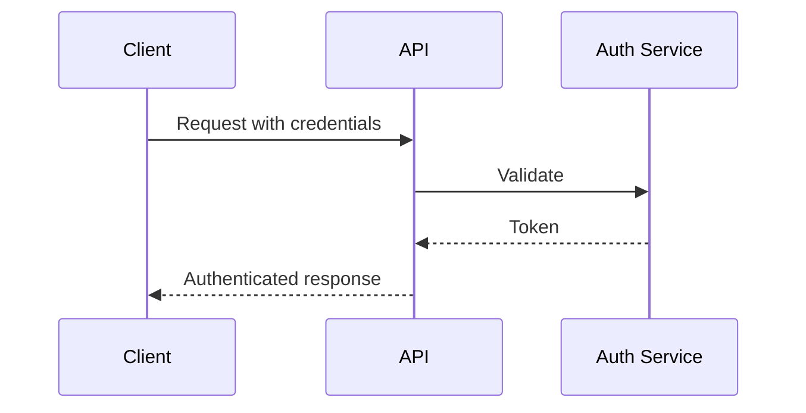
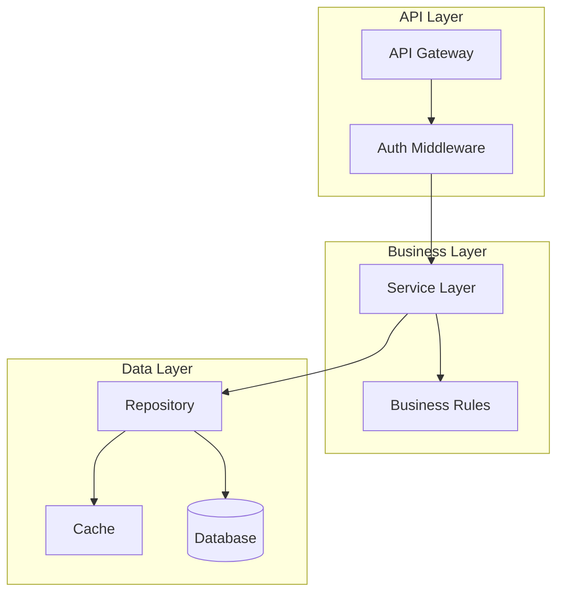

# NFR Design (Per-Unit)

**Purpose**: Incorporate NFR patterns and logical components into the design

**Execute IF**:
- NFR Requirements was executed
- NFR patterns need to be incorporated

**Skip IF**:
- No NFR requirements
- NFR Requirements Assessment was skipped

## Prerequisites
- NFR Requirements must be complete
- Tech stack decisions made

## Step 1: Load Context

### 1.1 Load Prior Artifacts
- Load nfr-requirements.md
- Load tech-stack-decisions.md
- Load functional design artifacts

### 1.2 Identify Patterns Needed
- Performance patterns
- Security patterns
- Scalability patterns
- Reliability patterns

## Step 2: Create NFR Design Patterns

Create `aicodepath-docs/construction/{unit-name}/nfr-design/nfr-design-patterns.md`:

```markdown
# NFR Design Patterns: [Unit Name]

## Performance Patterns

### Caching Strategy
- **Pattern**: [Cache-Aside/Read-Through/Write-Through]
- **Implementation**:
  - Cache: [Redis/Memcached/etc.]
  - TTL: [Duration]
  - Invalidation: [Strategy]
- **Data Cached**: [What data]
- **Expected Improvement**: [Metrics]

### Connection Pooling
- **Database Pool Size**: [Min/Max]
- **Connection Timeout**: [Duration]
- **Idle Timeout**: [Duration]

### Async Processing
- **Queue**: [Technology]
- **Workers**: [Count/Scaling]
- **Retry Policy**: [Strategy]

## Security Patterns

### Authentication Flow


### Authorization Implementation
- **Pattern**: [RBAC/ABAC]
- **Enforcement Point**: [Where checked]
- **Policy Storage**: [Where policies stored]

### Data Encryption
- **At Rest**: [Algorithm/Key management]
- **In Transit**: [TLS version]
- **Sensitive Fields**: [Field-level encryption]

## Scalability Patterns

### Horizontal Scaling
- **Load Balancer**: [Type/Algorithm]
- **Session Management**: [Stateless/Sticky/Distributed]
- **Auto-scaling Rules**: [Triggers]

### Database Scaling
- **Read Replicas**: [Yes/No]
- **Sharding**: [Strategy if applicable]
- **Connection Distribution**: [How managed]

## Reliability Patterns

### Circuit Breaker
- **Library**: [Implementation]
- **Thresholds**: [Failure count/percentage]
- **Timeout**: [Duration]
- **Fallback**: [Behavior]

### Retry Strategy
- **Max Retries**: [Count]
- **Backoff**: [Exponential/Linear]
- **Idempotency**: [How ensured]

### Health Checks
- **Liveness**: [Endpoint/Checks]
- **Readiness**: [Endpoint/Checks]
- **Frequency**: [Interval]

## Observability Patterns

### Structured Logging
- **Format**: [JSON/etc.]
- **Fields**: [Standard fields]
- **Correlation**: [Trace ID propagation]

### Metrics Collection
- **Metrics**: [List of metrics]
- **Collection**: [Push/Pull]
- **Storage**: [Where stored]

### Distributed Tracing
- **Library**: [OpenTelemetry/etc.]
- **Sampling**: [Rate/Strategy]
- **Visualization**: [Tool]
```

## Step 3: Create Logical Components

Create `aicodepath-docs/construction/{unit-name}/nfr-design/logical-components.md`:

```markdown
# Logical Components: [Unit Name]

## Component Diagram


## Component Descriptions

### API Layer
- **API Gateway**: [Responsibility]
- **Auth Middleware**: [Responsibility]
- **Rate Limiter**: [If applicable]

### Business Layer
- **Service Layer**: [Responsibility]
- **Business Rules Engine**: [Responsibility]
- **Validators**: [Responsibility]

### Data Layer
- **Repository**: [Responsibility]
- **Cache Manager**: [Responsibility]
- **Database Client**: [Responsibility]

### Cross-Cutting
- **Logger**: [Implementation]
- **Metrics Collector**: [Implementation]
- **Error Handler**: [Implementation]

## Integration Points
| Component | Integrates With | Protocol | Pattern |
|-----------|-----------------|----------|---------|
| [Comp] | [External] | [HTTP/gRPC] | [Sync/Async] |
```

## Step 4: Update Progress

- Update aicodepath-state.md
- Log design decisions in audit.md

## Step 5: Present Completion Message

```markdown
# NFR Design Complete: [Unit Name]

NFR design has incorporated:
- **Performance Patterns**: [List]
- **Security Patterns**: [List]
- **Reliability Patterns**: [List]
- **Logical Components**: [Count]

> **REVIEW REQUIRED:**
> Please examine the NFR design at: `aicodepath-docs/construction/{unit-name}/nfr-design/`

> **WHAT'S NEXT?**
>
> **You may:**
>
> **Request Changes** - Ask for modifications to NFR design
> **Continue to Next Stage** - Proceed to **[Infrastructure Design/Database Design/Code Generation]**
```

## Step 6: Wait for Explicit Approval
- User must choose between "Request Changes" or "Continue to Next Stage"
- Log user's response in audit.md
