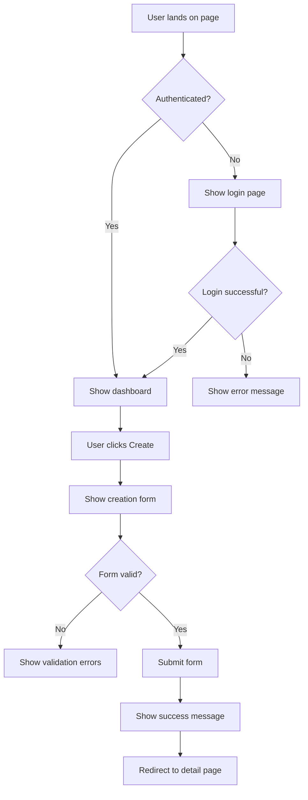
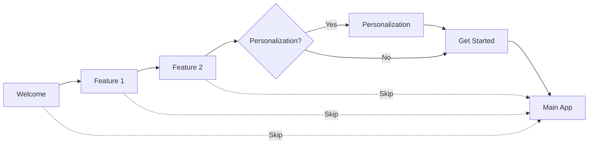
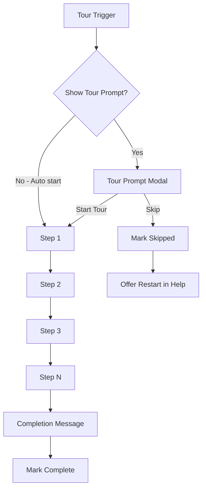

# Web UI/UX Design (Per-Unit)

**Purpose**: Design web user interface structure, components, and user experience patterns

**Execute IF**:
- Web user interface required
- Frontend application needed
- User-facing web pages required
- Admin dashboard or portal needed
- Use the frontend-design skill to create a modern, professional UI.

**Skip IF**:
- API-only backend service
- No web UI needed
- UI already defined and unchanged

## Prerequisites
- Functional Design complete (user flows understood)
- NFR Requirements complete (accessibility, responsiveness needs known)
- User stories available (user needs identified)
- frontend-design skill/plugin should be installed 
---

## Step 1: Load Context

### 1.1 Load Prior Artifacts
- Load functional-design artifacts
- Load user-stories.md for user journeys
- Load nfr-requirements.md for UX constraints
- Load requirements.md for feature needs

### 1.2 Gather Web UI/UX Requirements

Create `aicodepath-docs/construction/{unit-name}/web-ux-design/ux-questions.md`:

```markdown
# Web UI/UX Design Questions

## Question 1
What type of web application is needed?

A) Single Page Application (SPA) - React, Vue, Angular (Recommended for dynamic apps)
B) Multi-Page Application (MPA) - Server-rendered, traditional navigation
C) Static Site - Pre-rendered HTML, minimal interactivity
D) Hybrid - Mix of SPA and server-rendered pages (Next.js, Nuxt)
E) Progressive Web App (PWA) - Installable, offline-capable web app
F) Other (please describe after [Answer]: tag below)

[Answer]:

## Question 2
What is the primary user interface complexity?

A) Simple - Basic forms, tables, CRUD operations
B) Moderate - Multiple views, data visualization, workflows
C) Complex - Rich interactions, real-time updates, dashboards
D) Very Complex - Advanced visualizations, collaborative editing, heavy client-side logic
E) Other (please describe after [Answer]: tag below)

[Answer]:

## Question 3
What responsive design approach is required?

A) Mobile-first responsive - Design for mobile, scale up to desktop
B) Desktop-first responsive - Design for desktop, adapt to mobile
C) Adaptive - Different layouts for mobile/tablet/desktop
D) Desktop-only - No mobile support needed
E) Mobile-only - No desktop version needed
F) Other (please describe after [Answer]: tag below)

[Answer]:

## Question 4
Are there existing design systems or brand guidelines?

A) Existing design system - Use company design system
B) Brand guidelines only - Colors, fonts, logos defined
C) Design from scratch - No existing guidelines
D) Use popular design system - Material UI, Bootstrap, Tailwind, Ant Design
E) Other (please describe after [Answer]: tag below)

[Answer]:

## Question 5
What accessibility level is required?

A) WCAG 2.1 Level AAA - Highest accessibility standard
B) WCAG 2.1 Level AA - Standard compliance (Recommended)
C) WCAG 2.1 Level A - Basic accessibility
D) Best effort - Implement accessibility where feasible
E) Not required - No specific accessibility requirements
F) Other (please describe after [Answer]: tag below)

[Answer]:

## Question 6
What are the supported browsers?

A) Modern browsers only - Chrome, Firefox, Safari, Edge (latest 2 versions)
B) Extended support - Include 1-2 years old browsers
C) Legacy support - IE11 or older browsers
D) Specific browsers - Target specific browser/version
E) Other (please describe after [Answer]: tag below)

[Answer]:

## Question 7
What internationalization (i18n) support is needed?

A) Multi-language required - Support multiple languages
B) Single language - One language only
C) Prepared for i18n - Single language now, i18n-ready structure
D) Right-to-left (RTL) support - Arabic, Hebrew languages
E) Other (please describe after [Answer]: tag below)

[Answer]:
```

---

## Step 2: Create UI Structure

Create `aicodepath-docs/construction/{unit-name}/web-ux-design/ui-structure.md`:

```markdown
# UI Structure: [Unit Name]

## Application Layout

### Overall Layout Structure

```
┌─────────────────────────────────────────────┐
│              Header/Navigation              │
├─────────┬───────────────────────────────────┤
│         │                                   │
│ Sidebar │        Main Content Area          │
│  (opt)  │                                   │
│         │                                   │
├─────────┴───────────────────────────────────┤
│                  Footer                     │
└─────────────────────────────────────────────┘
```

### Layout Components

#### Header
- **Purpose**: Navigation, branding, global actions
- **Elements**:
  - Logo/Brand
  - Primary navigation menu
  - User account menu
  - Search (if applicable)
  - Notifications (if applicable)
  - Global CTAs

#### Sidebar (if applicable)
- **Purpose**: Secondary navigation, contextual actions
- **Collapsible**: Yes/No
- **Responsive**: [Hidden on mobile/Drawer on mobile]

#### Main Content Area
- **Purpose**: Primary content and user interactions
- **Max Width**: [Container width] or full-width
- **Padding**: [Spacing values]

#### Footer
- **Purpose**: Secondary links, legal, contact
- **Elements**:
  - Links (About, Contact, Terms, Privacy)
  - Copyright notice
  - Social media links (if applicable)

## Page Templates

### Template 1: List/Table View
```
┌───────────────────────────────────────┐
│  Page Title           [+ Add Button]  │
├───────────────────────────────────────┤
│  [Filters] [Search]      [Sort]       │
├───────────────────────────────────────┤
│  ┌─────────────────────────────────┐  │
│  │     Data Table / Card Grid      │  │
│  │     (List of items)             │  │
│  └─────────────────────────────────┘  │
├───────────────────────────────────────┤
│         [Pagination]                  │
└───────────────────────────────────────┘
```
**Used for**: [User list, order list, etc.]

### Template 2: Detail View
```
┌───────────────────────────────────────┐
│  [← Back]  Item Title    [Edit] [Del] │
├───────────────────────────────────────┤
│  ┌─────────────────┐                  │
│  │  Main Info Card │  Related Data    │
│  │  (Key details)  │  (Tabs/Sections) │
│  └─────────────────┘                  │
├───────────────────────────────────────┤
│  Activity Log / Timeline              │
└───────────────────────────────────────┘
```
**Used for**: [User profile, order details, etc.]

### Template 3: Form View
```
┌───────────────────────────────────────┐
│  [← Back]  Form Title                 │
├───────────────────────────────────────┤
│  ┌─────────────────────────────────┐  │
│  │  Section 1                      │  │
│  │  [Form Fields]                  │  │
│  ├─────────────────────────────────┤  │
│  │  Section 2                      │  │
│  │  [Form Fields]                  │  │
│  └─────────────────────────────────┘  │
├───────────────────────────────────────┤
│           [Cancel]  [Save/Submit]     │
└───────────────────────────────────────┘
```
**Used for**: [Create user, edit order, settings, etc.]

### Template 4: Dashboard
```
┌───────────────────────────────────────┐
│  Dashboard Title     [Date Range]     │
├─────────────┬─────────────┬───────────┤
│  KPI Card 1 │ KPI Card 2  │ KPI Card 3│
├─────────────┴─────────────┴───────────┤
│  ┌─────────────────────────────────┐  │
│  │   Chart/Graph (Main metric)     │  │
│  └─────────────────────────────────┘  │
├─────────────┬─────────────────────────┤
│  Recent     │  Notifications/Alerts   │
│  Activity   │                         │
└─────────────┴─────────────────────────┘
```
**Used for**: [Admin dashboard, analytics, etc.]

## Screen Inventory

| Screen Name | Template | Priority | User Story |
|-------------|----------|----------|------------|
| [Screen] | [Template type] | [High/Med/Low] | [Story ID] |

## Responsive Breakpoints

| Breakpoint | Width | Layout Changes |
|------------|-------|----------------|
| Mobile | < 640px | Single column, hamburger menu, stacked cards |
| Tablet | 640px - 1024px | 2-column grid, collapsible sidebar |
| Desktop | 1024px - 1440px | Full layout, expanded sidebar |
| Wide | > 1440px | Max-width container or expanded content |
```

---

## Step 3: Define Component Library

Create `aicodepath-docs/construction/{unit-name}/web-ux-design/component-library.md`:

```markdown
# Component Library: [Unit Name]

## Design System Choice
- **System**: [Material UI / Bootstrap / Tailwind / Ant Design / Custom / Company Design System]
- **Version**: [Version number]
- **Customization**: [Minimal / Moderate / Extensive]

## Shared/Uniform Components

### Core Components (Recommended for Reuse)

#### Navigation Components
- **Header/Navbar**
  - Responsive navigation
  - Mobile menu (hamburger)
  - User menu dropdown
  - *Shared across*: All pages

- **Breadcrumbs**
  - Hierarchical navigation
  - *Shared across*: Detail and nested pages

- **Tabs**
  - Section navigation within pages
  - *Shared across*: Detail views, settings

#### Data Display Components
- **Table/DataGrid**
  - Sortable columns
  - Filterable data
  - Pagination
  - Row selection
  - *Shared across*: All list views

- **Card**
  - Content container
  - Consistent spacing and shadows
  - *Shared across*: Dashboards, grids

- **Badge/Tag**
  - Status indicators
  - Categories/labels
  - *Shared across*: Lists, details

#### Form Components
- **Input Fields**
  - Text, number, email, password
  - Consistent styling and validation
  - *Shared across*: All forms

- **Select/Dropdown**
  - Single and multi-select
  - Searchable options
  - *Shared across*: All forms

- **Date Picker**
  - Date and time selection
  - Range selection
  - *Shared across*: Forms, filters

- **Button**
  - Primary, secondary, tertiary variants
  - Loading states
  - Icon buttons
  - *Shared across*: All pages

- **Form Validation**
  - Inline error messages
  - Success states
  - *Shared across*: All forms

#### Feedback Components
- **Modal/Dialog**
  - Confirmation dialogs
  - Form modals
  - *Shared across*: All pages

- **Toast/Notification**
  - Success, error, warning, info
  - Auto-dismiss
  - *Shared across*: All pages

- **Loading Spinner**
  - Page loading
  - Component loading
  - *Shared across*: All async operations

- **Empty State**
  - No data placeholder
  - Call-to-action
  - *Shared across*: Lists, searches

- **Error Boundary**
  - Error fallback UI
  - *Shared across*: All pages

#### Layout Components
- **Container**
  - Max-width wrapper
  - Responsive padding
  - *Shared across*: All pages

- **Grid/Flexbox**
  - Responsive layouts
  - Consistent spacing
  - *Shared across*: All pages

- **Section/Panel**
  - Content grouping
  - Collapsible sections
  - *Shared across*: Forms, details

## Component Specifications

### Example: Button Component

**Variants**:
- Primary: Main actions (Save, Submit, Create)
- Secondary: Alternative actions (Cancel, Reset)
- Tertiary/Text: Low-emphasis actions (Learn more, Skip)
- Danger: Destructive actions (Delete, Remove)

**States**:
- Default
- Hover
- Active/Pressed
- Disabled
- Loading

**Sizes**:
- Small: 32px height
- Medium: 40px height (default)
- Large: 48px height

**Properties**:
- Label (text)
- Icon (optional, left or right)
- Full-width (boolean)
- Disabled (boolean)
- Loading (boolean)

### Example: Form Input Component

**Types**:
- Text, Email, Password, Number, Tel, URL

**States**:
- Default
- Focus
- Error
- Disabled
- Success (optional)

**Properties**:
- Label (required)
- Placeholder (optional)
- Helper text (optional)
- Error message (conditional)
- Required indicator
- Icon (optional)

## Component Naming Convention
- Use consistent naming: [ComponentName][Variant]
- Examples: ButtonPrimary, InputText, CardDashboard

## Theming

### Color Palette
```
Primary: #[hex] - Main brand color, CTAs
Secondary: #[hex] - Secondary brand color
Success: #[hex] - Success states, confirmations
Warning: #[hex] - Warnings, cautions
Error: #[hex] - Errors, destructive actions
Info: #[hex] - Informational messages
Neutral: #[hex] - Text, borders, backgrounds
```

### Typography
```
Font Family: [Font name]
Heading 1: [Size/Weight] - Page titles
Heading 2: [Size/Weight] - Section titles
Heading 3: [Size/Weight] - Subsection titles
Body: [Size/Weight] - Normal text
Small: [Size/Weight] - Helper text, captions
```

### Spacing Scale
```
xs: 4px
sm: 8px
md: 16px
lg: 24px
xl: 32px
2xl: 48px
```
```

---

## Step 4: Define User Flows

Create `aicodepath-docs/construction/{unit-name}/web-ux-design/user-flows.md`:

```markdown
# User Flows: [Unit Name]

## Flow 1: [Flow Name]

### User Story Reference
[Story ID]: [Story description]

### Flow Diagram


### Flow Steps

| Step | Screen | Action | Validation | Next Step |
|------|--------|--------|------------|-----------|
| 1 | Landing | Load page | Check auth token | Login or Dashboard |
| 2 | Dashboard | Click "Create" | - | Show form |
| 3 | Form | Fill fields | - | - |
| 4 | Form | Click "Submit" | Validate fields | Submit or show errors |
| 5 | Form | Submit data | Server validation | Success or error |
| 6 | Success | Show message | - | Redirect |

### Error Scenarios

| Error | Screen | Message | Action |
|-------|--------|---------|--------|
| Not authenticated | Any | "Please log in" | Redirect to login |
| Validation error | Form | Field-specific errors | Highlight fields, show messages |
| Server error | Form | "Unable to save. Please try again." | Keep form data, allow retry |
| Network error | Form | "Connection lost. Please check your internet." | Queue for retry |

### Success Criteria
- User completes flow in < [X] steps
- Error messages are clear and actionable
- User can recover from errors without losing data

## Flow 2: [Flow Name]
[Repeat structure for each major flow]

## Post-Mutation Navigation Strategy (MANDATORY)

### Navigation Pattern Selection

When user creates/updates data and needs to see results, choose navigation strategy:

### Option A: Hybrid Approach (RECOMMENDED)

Best UX with zero perceived delay:

```typescript
// 1. Pass created data via router state
navigate(`/entity/${id}`, { state: { entity: createdData, isOptimistic: true } });

// 2. Show immediate success toast
toast.success('Created successfully!');

// 3. Detail page uses passed data immediately
const { state } = useLocation();
const initialData = state?.entity;

// 4. Background refetch ensures freshness
const { data } = useQuery({
  queryKey: ['entity', id],
  initialData: initialData,
  staleTime: 0,
});

// 5. Show success banner on detail page
{state?.isOptimistic && <Banner>Created successfully!</Banner>}
```

### Option B: Optimistic Navigation

```typescript
navigate(`/entity/${id}`);
const { data, isLoading } = useQuery(['entity', id]);
if (isLoading) return <EntitySkeleton />;
```

### Option C: Polling with Exponential Backoff

```typescript
const fetchWithRetry = async (id, attempt = 1) => {
  const delays = [1000, 2000, 4000];
  try {
    return await fetchEntity(id);
  } catch (e) {
    if (attempt < 3) {
      toast.info(`Loading... (Attempt ${attempt}/3)`);
      await sleep(delays[attempt - 1]);
      return fetchWithRetry(id, attempt + 1);
    }
    throw e;
  }
};
```

### Option D: Progress Indicators

```typescript
const stages = {
  creating: 'Creating job card...',
  services: 'Setting up services...',
  finalizing: 'Finalizing...',
};
<ProgressIndicator>
  <ProgressBar value={progress} />
  <span>{stages[stage]}</span>
</ProgressIndicator>
```

### Navigation Strategy Selection Matrix

| Scenario | Recommended Pattern | Why |
|----------|--------------------|----|
| Simple CRUD | A (Hybrid) | Best UX, zero delay |
| Async backend | C (Polling) | Handles race conditions |
| Multi-step process | D (Progress) | Clear user feedback |
| Simple apps | B (Optimistic) | Easy implementation |
```

---

## Step 5: Define Accessibility Requirements

Create `aicodepath-docs/construction/{unit-name}/web-ux-design/accessibility.md`:

```markdown
# Accessibility Requirements: [Unit Name]

## Accessibility Level
- **Target**: WCAG 2.1 Level [A/AA/AAA]
- **Priority**: [High/Medium/Low]

## Keyboard Navigation

### Focus Management
- Visible focus indicators on all interactive elements
- Logical tab order (left-to-right, top-to-bottom)
- Skip links for main content
- Focus trap in modals/dialogs
- Return focus after modal close

### Keyboard Shortcuts (if applicable)
| Action | Shortcut | Description |
|--------|----------|-------------|
| [Action] | [Key combo] | [What it does] |

## Screen Reader Support

### Semantic HTML
- Use proper heading hierarchy (h1 → h6)
- Use semantic elements (nav, main, article, aside, footer)
- Use landmark roles appropriately

### ARIA Attributes
- aria-label for icon-only buttons
- aria-describedby for form field hints
- aria-live for dynamic content updates
- aria-expanded for collapsible sections
- aria-hidden for decorative elements

### Alt Text
- Descriptive alt text for informational images
- Empty alt="" for decorative images
- Text alternatives for charts/graphs

## Color and Contrast

### Contrast Ratios
- **Text**: 4.5:1 minimum (AA standard)
- **Large Text**: 3:1 minimum
- **UI Components**: 3:1 minimum (borders, icons)

### Color Independence
- Don't rely solely on color to convey information
- Use icons, patterns, or text labels in addition to color
- Example: Status indicators use color + icon

## Responsive and Zoom

### Text Resize
- Support 200% text zoom without loss of functionality
- Use relative units (rem, em) not fixed pixels

### Responsive Design
- Single-column layout on mobile
- Touch targets minimum 44x44px
- Adequate spacing between interactive elements

## Forms Accessibility

### Form Labels
- Every input has an associated label
- Labels are visible (not just placeholder)
- Required fields clearly marked

### Error Handling
- Clear, specific error messages
- Errors announced to screen readers
- Error summary at top of form (if multiple errors)

### Form Instructions
- Provide clear instructions before form
- Inline help text for complex fields

## Testing Checklist

- [ ] Test with keyboard only (no mouse)
- [ ] Test with screen reader (NVDA, JAWS, VoiceOver)
- [ ] Test with browser zoom at 200%
- [ ] Test color contrast with tools
- [ ] Test with accessibility audit tools (Axe, Lighthouse)
```

---

## Step 6: Define Interaction Patterns

Create `aicodepath-docs/construction/{unit-name}/web-ux-design/interaction-patterns.md`:

```markdown
# Interaction Patterns: [Unit Name]

## Loading States

### Page Load
- **Initial Load**: Full-page skeleton or spinner
- **Duration**: Show after 200ms delay
- **Message**: "Loading..." or specific message

### Component Load
- **Skeleton screens**: For content-heavy sections
- **Spinners**: For buttons, small components
- **Progress bars**: For known-duration operations

### Data Fetching
- **Optimistic updates**: Update UI immediately, rollback on error
- **Polling**: [Interval] for real-time-ish updates
- **WebSocket** (if applicable): Real-time updates

## Error Handling

### Error Display
- **Inline errors**: Field-level validation errors
- **Toast notifications**: Non-critical errors
- **Modal dialogs**: Critical errors requiring acknowledgment
- **Error pages**: 404, 500, network errors

### Error Recovery
- **Retry**: Allow users to retry failed actions
- **Undo**: Provide undo for destructive actions
- **Fallback**: Graceful degradation when features fail

## Form Interactions

### Validation
- **Timing**: Validate on blur (after leaving field)
- **Real-time**: For complex rules (password strength)
- **On submit**: Final validation before submission

### Auto-save
- **Enabled**: [Yes/No]
- **Frequency**: Every [X] seconds or on field blur
- **Indicator**: "Saving..." → "Saved" feedback

### Multi-step Forms
- **Progress indicator**: Show current step
- **Navigation**: Allow forward/backward navigation
- **Save draft**: Save incomplete forms

## Data Tables

### Sorting
- Click column header to sort
- Visual indicator for sort direction
- Multi-column sort (if needed)

### Filtering
- Filter panel or inline filters
- Clear all filters option
- Show active filter count

### Pagination
- Page size options: [10, 25, 50, 100]
- "Load more" or traditional pagination
- Show total count: "Showing X-Y of Z"

### Row Actions
- Inline actions (edit, delete icons)
- Row menu (⋮ three dots) for multiple actions
- Bulk actions with row selection

## Navigation

### Page Transitions
- Instant navigation (SPA)
- Loading indicator for slow pages
- Preserve scroll position on back navigation

### Breadcrumbs
- Show current location in hierarchy
- Clickable parent levels
- Auto-generated from route

### Search
- **Global search**: Site-wide search in header
- **Scoped search**: Search within current context
- **Autocomplete**: Show suggestions as user types
- **Recent searches**: Show recent search history

## Confirmation Patterns

### Destructive Actions
- **Modal confirmation**: "Are you sure you want to delete?"
- **Two-step**: Click delete → confirm delete
- **Undo option**: Allow undo after deletion (within time window)

### Save Confirmations
- **Auto-save**: "Changes saved" toast
- **Manual save**: Success message + redirect or stay on page

## Real-time Updates (if applicable)

### Notification Strategy
- **Toast**: For important updates
- **Badge count**: For notification count
- **Inline**: Update data in place
- **Sound/vibration**: For critical alerts (optional)

## Mutation Cache Invalidation (MANDATORY for React/Vue apps)

### Cache Invalidation Requirement

For EVERY mutation (create, update, delete), specify cache invalidation:

### Mutation Cache Design Template

| Mutation | Invalidate Keys | Refetch Queries | Optimistic Update |
|----------|-----------------|-----------------|-------------------|
| createUser | ['users'] | ['users', 'userCount'] | No |
| updateUser | ['users', ['user', id]] | ['user', id] | Yes |
| deleteUser | ['users', ['user', id]] | ['users'] | Yes |

### React Query Implementation

```typescript
// REQUIRED: Always invalidate cache after mutation
const createUserMutation = useMutation({
  mutationFn: createUser,
  onSuccess: () => {
    // MANDATORY: Invalidate related queries
    queryClient.invalidateQueries({ queryKey: ['users'] });
  },
});

// With optimistic update
const updateUserMutation = useMutation({
  mutationFn: updateUser,
  onMutate: async (newData) => {
    await queryClient.cancelQueries({ queryKey: ['user', id] });
    const previous = queryClient.getQueryData(['user', id]);
    queryClient.setQueryData(['user', id], newData);
    return { previous };
  },
  onError: (err, newData, context) => {
    queryClient.setQueryData(['user', id], context.previous);
  },
  onSettled: () => {
    queryClient.invalidateQueries({ queryKey: ['user', id] });
  },
});
```

### Cache Invalidation Checklist

- [ ] `invalidateQueries` called for affected query keys
- [ ] Optimistic update implemented (if immediate feedback needed)
- [ ] Rollback logic for failed mutations
- [ ] Related queries also invalidated (lists when item changes)
```

---

## Step 7: User Onboarding & Education Design (CONDITIONAL)

**Execute IF**: `aicodepath-docs/inception/requirements/ux-feature-requirements.md` indicates any of these features are needed:
- Full Onboarding Flow or Simple Welcome (not "No Onboarding")
- Interactive Product Tour or Contextual Tooltips (not "No Guided Tour")
- Any Coach Marks option (not "No Feature Hints")

**Skip IF**: All UX feature questions answered with "No" options or ux-feature-requirements.md doesn't exist.

### 7.1 Load UX Feature Requirements

- Read `aicodepath-docs/inception/requirements/ux-feature-requirements.md`
- Identify which features were selected:
  - Onboarding type (Full/Simple/Conditional/None)
  - Product Tour type (Interactive/Contextual/Help Center/None)
  - Coach Marks type (Pulsing/Static/Inline/Smart/None)
  - Notification patterns (Toast/Modal/Inline/Center/Combination)

### 7.2 Design Onboarding Flow (if selected)

**Execute IF**: Onboarding answer is A, B, or D (not C "No Onboarding")

Create `aicodepath-docs/construction/{unit-name}/web-ux-design/onboarding-design.md`:

```markdown
# Onboarding Design: [Unit Name]

## Onboarding Strategy
- **Type**: [Full Flow / Simple Welcome / Conditional]
- **Trigger**: [First login / After signup / Feature update / Account age]
- **Target Users**: [All new users / Specific roles / After specific action]
- **Skip Option**: [Yes - always visible / Yes - after first screen / No]
- **Progress Indicator**: [Dots / Steps / Progress bar / None]
- **Estimated Duration**: [X screens / Y minutes]

## Onboarding Screens

### Screen 1: Welcome
- **Purpose**: Value proposition, brand introduction
- **Content**:
  - Headline: [Welcome text]
  - Subheadline: [Supporting text]
  - Visual: [Hero image / Animation / Logo]
- **CTA**: [Get Started / Next / Skip]
- **Skip Option**: [Yes/No]

### Screen 2: Feature Highlight - [Feature Name]
- **Purpose**: Showcase key feature
- **Feature**: [Feature name]
- **Benefit**: [User benefit statement]
- **Visual**: [Screenshot / Animation / Icon]
- **CTA**: [Next / Try it]

### Screen 3: Feature Highlight - [Feature Name]
[Repeat as needed for each key feature]

### Screen N: Personalization (if applicable)
- **Purpose**: Collect user preferences
- **Questions**:
  - [Question 1]: [Options]
  - [Question 2]: [Options]
- **Use of Answers**: [How personalization affects experience]

### Final Screen: Get Started
- **Purpose**: Transition to main app
- **Message**: [Completion/encouragement message]
- **CTA**: [Start using / Go to dashboard / Complete profile]

## Onboarding Flow Diagram



## Completion Tracking
- **Storage Method**: [LocalStorage / Cookie / User profile DB field]
- **Key Name**: `onboarding_completed` or similar
- **Value**: [Boolean / Timestamp / Version number]
- **Reset Trigger**: [Major version / Settings toggle / Never]

## Re-engagement (if applicable)
- **Show Again After**: [Feature updates / X days inactive / Never]
- **Trigger Condition**: [Version change / New features added]
```

### 7.3 Design Product Tour (if selected)

**Execute IF**: Product Tour answer is A or B (Interactive Tour or Contextual Tooltips)

Create `aicodepath-docs/construction/{unit-name}/web-ux-design/product-tour-design.md`:

```markdown
# Product Tour Design: [Unit Name]

## Tour Strategy
- **Type**: [Interactive sequential / Contextual on-demand / Hybrid]
- **Trigger**: [First visit / Manual start / Feature-specific]
- **Library Recommendation**: [Shepherd.js / Intro.js / React Joyride / Driver.js / Custom]

## Tour Configuration

### Tour 1: [Tour Name] (e.g., "New User Tour")

#### Tour Metadata
- **ID**: [tour-new-user]
- **Target Audience**: [First-time users]
- **Trigger Condition**: [First login && !tour_completed]
- **Estimated Duration**: [X steps / Y minutes]

#### Tour Steps

| Step | Element Selector | Position | Title | Description | Action Required |
|------|------------------|----------|-------|-------------|-----------------|
| 1 | `#main-navigation` | bottom | "Navigation" | "Use the sidebar to access different sections of the app." | None |
| 2 | `.create-button` | right | "Create New" | "Click here to create your first item." | None |
| 3 | `#search-input` | bottom | "Search" | "Quickly find anything using the search bar." | None |
| 4 | `#user-menu` | left | "Your Profile" | "Access settings and preferences here." | None |

#### Step Details

##### Step 1: Navigation Introduction
- **Element**: `#main-navigation` or `.sidebar`
- **Position**: bottom
- **Title**: "Navigate Your Dashboard"
- **Description**: "Use the sidebar to quickly access different sections. Your most-used items appear at the top."
- **Highlight**: [Box shadow / Spotlight overlay]
- **Action**: [None / Click to continue]
- **Can Skip**: Yes

##### Step 2: [Continue for each step...]

### Tour 2: [Feature-Specific Tour Name]
[Repeat structure for additional tours]

## Tour Flow Diagram



## Tour UI Components

### Tooltip Style
- **Background**: [Color]
- **Text Color**: [Color]
- **Border Radius**: [Xpx]
- **Arrow**: [Yes/No, direction]
- **Max Width**: [Xpx]
- **Padding**: [Xpx]

### Overlay Style
- **Background**: rgba(0,0,0,0.5) or similar
- **Spotlight Padding**: [Xpx around element]
- **Animation**: [Fade in / None]

### Navigation Buttons
- **Previous**: [< Back / Previous / Icon only]
- **Next**: [Next > / Continue / Icon only]
- **Skip**: [Skip tour / X icon]
- **Finish**: [Done / Got it / Start exploring]

## Progress Indicator
- **Type**: [Dots / Steps / Progress bar / "Step X of Y"]
- **Position**: [Bottom of tooltip / Top of overlay]

## Completion Handling
- **Storage**: [LocalStorage key / User preference API]
- **Key Format**: `tour_{tourId}_completed`
- **Replay Option**: Available in [Help menu / Settings / Footer link]
```

### 7.4 Design Coach Marks (if selected)

**Execute IF**: Coach Marks answer is A, B, C, or D (any option except E "No Feature Hints")

Create `aicodepath-docs/construction/{unit-name}/web-ux-design/coach-marks-design.md`:

```markdown
# Coach Marks Design: [Unit Name]

## Coach Mark Strategy
- **Primary Style**: [Pulsing dot / Spotlight / Tooltip / Inline text]
- **Trigger**: [First encounter / Feature update / Always visible]
- **Dismissal**: [Click anywhere / Click X / Click element / Auto-dismiss]
- **Persistence**: [Show once / Show until dismissed / Show X times]

## Coach Mark Inventory

| ID | Element | Type | Message | Trigger | Priority | Dismiss After |
|----|---------|------|---------|---------|----------|---------------|
| CM001 | `.create-btn` | Pulse | "Create your first project" | Empty state | High | Click element |
| CM002 | `#filter-panel` | Tooltip | "Filter results by status or date" | First list view | Medium | Click X |
| CM003 | `.export-btn` | Spotlight | "New! Export your data to CSV" | Feature release | High | Acknowledge |
| CM004 | `#search` | Inline | "Pro tip: Use quotes for exact matches" | Always | Low | Never |

## Coach Mark Types

### Type 1: Pulsing Dot
- **Use For**: Drawing attention to new or important features
- **Animation**: Pulse every 2s (scale 1.0 → 1.3 → 1.0)
- **Color**: Primary brand color or attention color (orange/red)
- **Size**: 12px diameter
- **Position**: Top-right corner of element (-4px offset)
- **Click Behavior**: Opens tooltip or triggers element action

### Type 2: Spotlight Overlay
- **Use For**: Major feature introductions, critical actions
- **Overlay**: Semi-transparent background (#000 at 50% opacity)
- **Spotlight**: Cutout around target element with padding
- **Tooltip**: Attached to spotlight cutout
- **Dismiss**: Click outside or acknowledgment button

### Type 3: Hover/Focus Tooltip
- **Use For**: Contextual help, form field guidance
- **Trigger**: Hover (desktop) / Focus (mobile/forms)
- **Position**: Auto-positioned to avoid viewport edges
- **Delay**: 300ms before showing
- **Content**: Short description + optional "Learn more" link

### Type 4: Inline Help Text
- **Use For**: Permanent guidance, form instructions
- **Position**: Below or beside related element
- **Style**: Smaller text, muted color, info icon prefix
- **Always Visible**: Yes

## Component Specifications

### Pulsing Dot Component
```css
.coach-mark-pulse {
  width: 12px;
  height: 12px;
  border-radius: 50%;
  background: var(--primary-color);
  animation: pulse 2s infinite;
}
@keyframes pulse {
  0%, 100% { transform: scale(1); opacity: 1; }
  50% { transform: scale(1.3); opacity: 0.7; }
}
```

### Tooltip Component
- **Max Width**: 280px
- **Padding**: 12px 16px
- **Background**: White (light mode) / Dark gray (dark mode)
- **Border Radius**: 8px
- **Shadow**: 0 4px 12px rgba(0,0,0,0.15)
- **Arrow**: 8px triangle pointing to element

## Dismissal & State Management

### Storage Approach
- **Method**: LocalStorage or User Preferences API
- **Key Format**: `coach_mark_{id}_dismissed`
- **Value**: `{ dismissed: true, timestamp: ISO8601 }`

### Reset Options
- **Global Reset**: Settings page toggle "Reset all hints"
- **Individual Reset**: Not available (simplicity)
- **Auto-Reset**: After major version update (optional)

## Accessibility Considerations
- Coach marks must be keyboard accessible
- Tooltips should be announced by screen readers
- Pulsing animations respect `prefers-reduced-motion`
- Dismiss actions must be keyboard-triggerable
```

### 7.5 Design Notification System (if enhanced)

**Execute IF**: Notification answer indicates advanced patterns (D "Notification Center" or E "All of the Above")

Create `aicodepath-docs/construction/{unit-name}/web-ux-design/notification-design.md`:

```markdown
# Notification System Design: [Unit Name]

## Notification Strategy
- **Primary Method**: [Toast / Modal / Inline / Center]
- **Secondary Methods**: [List other methods used]
- **Persistence**: [Transient only / With history / Permanent log]

## Toast Notifications

### Toast Types
| Type | Icon | Background | Text Color | Duration | Use Case |
|------|------|------------|------------|----------|----------|
| Success | ✓ Checkmark | Green-50 | Green-800 | 3s | Action completed successfully |
| Error | ✗ X-circle | Red-50 | Red-800 | 5s (or manual) | Action failed, needs attention |
| Warning | ⚠ Alert | Yellow-50 | Yellow-800 | 4s | Caution, non-blocking issue |
| Info | ℹ Info | Blue-50 | Blue-800 | 3s | Informational message |
| Loading | ○ Spinner | Gray-50 | Gray-800 | Until complete | Async operation in progress |

### Toast Anatomy
```
┌─────────────────────────────────────────────┐
│ [Icon]  Title Text                    [X]   │
│         Description text goes here          │
│         [Action Button]  [Dismiss]          │
└─────────────────────────────────────────────┘
```

### Toast Specifications
- **Position**: Bottom-right (desktop) / Top-center (mobile)
- **Width**: 320px - 480px
- **Max Height**: 120px (scrollable if overflow)
- **Animation**: Slide in from edge + fade
- **Stacking**: Max 3 visible, newest on top, older pushed down
- **Z-Index**: 9999 (above all content)

### Toast Behavior
- **Auto-dismiss**: Yes (configurable per type)
- **Pause on Hover**: Yes
- **Click to Dismiss**: Yes (entire toast or X button)
- **Action Button**: Optional (Undo, Retry, View, etc.)
- **Sound**: None (optional for critical errors)

## Notification Center (if applicable)

### Notification Center UI
- **Trigger**: Bell icon in header with badge count
- **Panel Type**: [Dropdown / Slide-out drawer / Modal]
- **Width**: 360px (dropdown) / 400px (drawer)
- **Max Height**: 80vh with scroll

### Notification Item Structure
```
┌─────────────────────────────────────────────┐
│ [Avatar/Icon]  [Title]              [Time]  │
│                [Description text...]        │
│                [Action] [Mark Read]         │
├─────────────────────────────────────────────┤
│ [Unread indicator dot on left if unread]    │
└─────────────────────────────────────────────┘
```

### Notification Categories
| Category | Icon | Example |
|----------|------|---------|
| System | ⚙️ | "Maintenance scheduled for tonight" |
| Activity | 👤 | "John commented on your post" |
| Updates | 🔔 | "New feature available" |
| Alerts | ⚠️ | "Your subscription expires soon" |

### Notification Actions
- **Mark as Read**: Single item or "Mark all as read"
- **Delete**: Single item or "Clear all"
- **Settings**: Link to notification preferences
- **View All**: Link to full notifications page (if paginated)

### Badge Count
- **Position**: Top-right of bell icon
- **Style**: Red circle with white number
- **Max Display**: "99+" for counts over 99
- **Update**: Real-time via WebSocket or polling

## Inline Notifications

### Use Cases
- Form validation errors
- Field-specific warnings
- Section-level status messages

### Inline Notification Anatomy
```
┌─────────────────────────────────────────────┐
│ [Icon] Message text                         │
│        [Action link if applicable]          │
└─────────────────────────────────────────────┘
```

### Placement Rules
- Form errors: Below the invalid field
- Section alerts: Top of the relevant section
- Page-level: Below header, above main content
```

---

## Step 8: Update Progress

- Mark all steps complete in web-ux-design-plan.md
- Update aicodepath-state.md

## Step 9: Present Completion Message

```markdown
# Web UI/UX Design Complete: [Unit Name]

Web UI/UX design has defined:
- **Application Type**: [SPA/MPA/PWA/etc.]
- **Layout Structure**: [Templates and pages]
- **Component Library**: [Design system used]
- **Shared Components**: [X] reusable components
- **User Flows**: [X] flows documented
- **Accessibility**: WCAG [Level]

**Key Design Decisions**:
- [Decision 1]
- [Decision 2]
- [Decision 3]

> **REVIEW REQUIRED:**
> Please examine the web UI/UX design at: `aicodepath-docs/construction/{unit-name}/web-ux-design/`

> **WHAT'S NEXT?**
>
> **You may:**
>
> **Request Changes** - Ask for modifications to web UI/UX design
> **Continue to Next Stage** - Proceed to **[Code Generation]**
```

## Step 10: Wait for Explicit Approval
- User must choose between "Request Changes" or "Continue to Next Stage"
- Log user's response in audit.md
