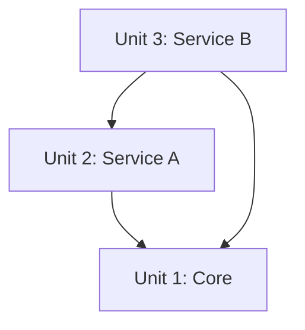

# Units Generation

**Purpose**: Decompose system into units of work for parallel development

**Execute IF**:
- System needs decomposition into multiple units of work
- Multiple services or modules required
- Complex system requiring structured breakdown
- Team wants to parallelize development

**Skip IF**:
- Single simple unit
- No decomposition needed
- Straightforward single-component implementation

## Prerequisites
- Requirements Analysis must be complete
- Application Design recommended (provides component structure)
- User Stories recommended (provides story-to-unit mapping)

## Step 1: Load Context

### 1.1 Load Prior Artifacts
- Load requirements.md
- Load application design artifacts (if available)
- Load stories.md (if available)
- Load sprint-backlog.md (if available)
- Load reverse engineering artifacts (if brownfield)

### 1.2 Identify Decomposition Criteria
- Service boundaries
- Team ownership
- Deployment independence
- Data ownership
- Technology boundaries

## Step 2: Unit Identification

Create `aicodepath-docs/inception/application-design/unit-of-work.md`:

```markdown
# Units of Work

## Decomposition Strategy
- **Approach**: [By service/By feature/By layer/Hybrid]
- **Rationale**: [Why this approach]

## Unit Inventory

| Unit ID | Unit Name | Type | Components | Priority |
|---------|-----------|------|------------|----------|
| U001 | [Name] | [Service/Module] | [Components] | [1-5] |
| U002 | [Name] | [Service/Module] | [Components] | [1-5] |

## Unit Descriptions

### U001: [Unit Name]
- **Purpose**: [What this unit does]
- **Type**: [Service/Module/Library]
- **Components Included**:
  - [Component 1]
  - [Component 2]
- **Responsibilities**:
  - [Responsibility 1]
  - [Responsibility 2]
- **Data Ownership**: [What data this unit owns]
- **APIs Exposed**: [APIs this unit provides]
- **APIs Consumed**: [APIs this unit uses]
- **Estimated Effort**: [Story points or time estimate]
- **Sprint Assignment**: [If sprint planning done]

### U002: [Unit Name]
[Repeat structure]
```

## Step 3: Unit Dependencies

Create `aicodepath-docs/inception/application-design/unit-of-work-dependency.md`:

```markdown
# Unit Dependencies

## Dependency Matrix

| Unit | Depends On | Depended By | Dependency Type |
|------|------------|-------------|-----------------|
| U001 | None | U002, U003 | - |
| U002 | U001 | U003 | API |
| U003 | U001, U002 | None | API, Data |

## Dependency Diagram



## Critical Path Analysis
- **Independent Units**: [Can be developed in parallel]
- **Dependent Units**: [Must be developed in sequence]
- **Critical Path**: [Unit sequence that determines minimum timeline]

## Development Sequence
1. **Phase 1 (Parallel)**: U001 (foundation)
2. **Phase 2 (Parallel)**: U002, U004 (depend only on U001)
3. **Phase 3**: U003 (depends on U001 and U002)
```

## Step 4: Unit-Story Mapping

Create `aicodepath-docs/inception/application-design/unit-of-work-story-map.md`:

```markdown
# Unit to Story Mapping

## Mapping Matrix

| Unit | Stories | Story Points | Sprint |
|------|---------|--------------|--------|
| U001 | S001, S002, S003 | 13 | Sprint 1 |
| U002 | S004, S005 | 8 | Sprint 1 |
| U003 | S006, S007, S008 | 15 | Sprint 2 |

## Detailed Mapping

### U001: [Unit Name]

| Story ID | Story Title | Points | Priority |
|----------|-------------|--------|----------|
| S001 | [Title] | 5 | High |
| S002 | [Title] | 3 | High |
| S003 | [Title] | 5 | Medium |

**Total Points**: 13
**Sprint Assignment**: Sprint 1

### U002: [Unit Name]
[Repeat structure]

## Coverage Analysis
- **Stories without Unit**: [List any unmapped stories]
- **Units without Stories**: [List any units without stories]
- **Gaps Identified**: [Any gaps in coverage]
```

## Step 5: Unit Design Requirements

For each unit, identify what design phases are needed:

```markdown
## Per-Unit Design Requirements

| Unit | Functional Design | NFR Design | Infra Design | DB Design | AI Design |
|------|-------------------|------------|--------------|-----------|-----------|
| U001 | Yes | Yes | Yes | Yes | No |
| U002 | Yes | No | No | Yes | Yes |
| U003 | Yes | Yes | No | No | No |

## Rationale

### U001
- **Functional Design**: Yes - Complex business logic
- **NFR Design**: Yes - Performance critical
- **Infrastructure Design**: Yes - New deployment needed
- **Database Design**: Yes - New schema required
- **AI Implementation**: No - No AI components

### U002
[Repeat for each unit]
```

## Step 6: Update State Tracking

Update `aicodepath-docs/aicodepath-state.md`

## Step 7: Present Completion Message

```markdown
# Units Generation Complete

System has been decomposed into [X] units of work:

| Unit | Purpose | Stories | Points | Sprint |
|------|---------|---------|--------|--------|
| U001 | [Purpose] | [X] | [X] | [Sprint] |
| U002 | [Purpose] | [X] | [X] | [Sprint] |

**Development Sequence**:
1. Phase 1: [Units that can be done in parallel]
2. Phase 2: [Units that depend on Phase 1]
3. Phase 3: [Units that depend on Phase 2]

**Total Effort**: [X] story points across [Y] sprints

> **REVIEW REQUIRED:**
> Please examine the units at: `aicodepath-docs/inception/application-design/unit-of-work.md`

> **WHAT'S NEXT?**
>
> **You may:**
>
> **Request Changes** - Ask for modifications to the unit decomposition
> **Approve & Continue** - Approve units and proceed to **Construction Phase**
```

## Step 8: Wait for Explicit Approval
- Do not proceed until user explicitly approves
- Log user's response in audit.md

---

# CRITICAL RULES

## Decomposition Rules
- **CLEAR BOUNDARIES**: Each unit must have clear responsibility
- **MINIMAL DEPENDENCIES**: Reduce cross-unit dependencies
- **DATA OWNERSHIP**: Each data entity owned by one unit
- **DEPLOYABLE**: Units should be independently deployable (if services)

## Mapping Rules
- **COMPLETE COVERAGE**: All stories must map to units
- **NO ORPHANS**: All units must have at least one story
- **SPRINT ALIGNMENT**: Unit work should fit within sprints

## Sequencing Rules
- **RESPECT DEPENDENCIES**: Don't schedule dependent units before dependencies
- **CRITICAL PATH**: Identify and communicate the critical path
- **PARALLEL OPPORTUNITIES**: Maximize parallel development where possible
