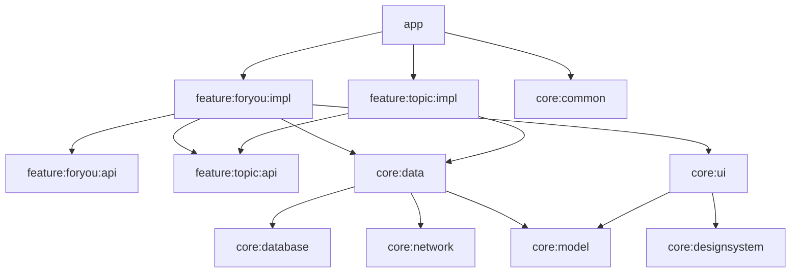

# Modularization Guide

Multi-module architecture based on NowInAndroid, enabling parallel builds,
strong encapsulation, and feature isolation.

## Benefits

- **Build speed**: Gradle only recompiles changed modules (Kotlin 2.x K2 + ABI stability)
- **Team scalability**: Feature teams work independently without merge conflicts
- **Encapsulation**: `internal` visibility enforced at module boundary
- **Reusability**: `core:*` modules shared across features and even apps
- **Testability**: Modules tested in isolation with minimal setup

---

## Module Types

### App module (`app/`)

Entry point — brings all features together. Owns `MainActivity`, top-level
`NavHost`, `NavigationSuiteScaffold`, and app-level DI setup.

**Depends on**: all `feature:*:impl` modules, required `core:*` modules

### Feature modules (`feature/<name>/api` + `feature/<name>/impl`)

Self-contained feature split into two submodules:

```
feature/
  └── topic/
      ├── api/   # Navigation route objects only — thin, public
      └── impl/  # Screen, ViewModel, DI, internal navigation setup
```

**api module** — public contract:
- `@Serializable` route data class
- `NavController.navigateTo<Feature>()` extension function
- Depends only on `core:model` + navigation serialization

**impl module** — internal implementation:
- Screen composable (internal visibility)
- ViewModel + UiState + Action
- Hilt module with `@Binds`
- `NavGraphBuilder.<feature>Screen()` extension
- Depends on own api, `core:data`, `core:ui`, `core:designsystem`

### Core modules (`core/<name>`)

| Module | Purpose | Key Classes |
|--------|---------|-------------|
| `core:model` | Domain models — **pure Kotlin, zero deps** | `Topic`, `NewsResource`, `UserData` |
| `core:data` | Repository interfaces + offline-first impls | `TopicsRepository`, `NewsRepository` |
| `core:database` | Room DB, DAOs, entities, migrations | `NiaDatabase`, `TopicDao`, `TopicEntity` |
| `core:network` | Retrofit/Ktor API, network models | `RetrofitNiaNetwork`, `NetworkTopic` |
| `core:datastore` | Proto DataStore user prefs | `NiaPreferencesDataSource` |
| `core:common` | Dispatchers, `Result<T>`, utils | `NiaDispatchers`, `AppResult` |
| `core:ui` | Reusable Compose components | `NewsFeed`, `NewsResourceCard` |
| `core:designsystem` | Theme, tokens, base components | `AppTheme`, `AppIcons`, `AppButton` |
| `core:testing` | Test doubles, `TestDispatcherRule`, factories | All test utilities |

### Infrastructure modules

| Module | Purpose |
|--------|---------|
| `sync/work` | WorkManager `SyncWorker` implementation |
| `benchmark/` | Macrobenchmark + `BaselineProfileGenerator` |

---

## Dependency Rules

```
app ──────────────────► feature:*:impl
                         feature:*:api
                         core:*

feature:*:impl ────────► feature:*:api (own api)
                         feature:*:api (other features — for deep-links)
                         core:data, core:ui, core:designsystem

feature:*:api ─────────► core:model ONLY
                         kotlinx-serialization, navigation-compose

core:data ─────────────► core:database
                         core:network
                         core:model
                         core:datastore
                         core:common

core:database ─────────► core:model

core:network ──────────► core:model

core:ui ───────────────► core:model
                         core:designsystem

core:designsystem ─────► (none)

core:model ────────────► (none — pure Kotlin)

core:testing ──────────► core:model + core:data (test doubles)
```

### Forbidden

- Feature impl → another feature's impl (only api allowed)
- Core → Feature (never)
- Core → App (never)
- `core:model` → anything (must stay pure)

---

## File Structure Per Feature

```
feature/settings/
├── api/
│   ├── build.gradle.kts
│   └── src/main/kotlin/com/example/feature/settings/api/
│       └── SettingsNavigation.kt        # @Serializable SettingsRoute, navigateToSettings()
└── impl/
    ├── build.gradle.kts
    └── src/main/kotlin/com/example/feature/settings/impl/
        ├── SettingsScreen.kt            # internal — Route + Screen composables
        ├── SettingsViewModel.kt         # @HiltViewModel
        ├── SettingsUiState.kt           # sealed interface UiState
        ├── SettingsNavigation.kt        # NavGraphBuilder.settingsScreen()
        └── di/
            └── SettingsModule.kt        # @Module @InstallIn(SingletonComponent)
```

---

## Creating a Feature Module

### 1. api/build.gradle.kts

```kotlin
plugins {
    alias(libs.plugins.app.android.library)
    alias(libs.plugins.kotlin.serialization)
}

android { namespace = "com.example.feature.settings.api" }

dependencies {
    api(projects.core.model)
    implementation(libs.kotlinx.serialization.json)
    implementation(libs.androidx.navigation.compose)
}
```

### 2. api/SettingsNavigation.kt

```kotlin
package com.example.feature.settings.api

import androidx.navigation.NavController
import androidx.navigation.NavOptions
import kotlinx.serialization.Serializable

@Serializable
data object SettingsRoute

fun NavController.navigateToSettings(navOptions: NavOptions? = null) {
    navigate(SettingsRoute, navOptions)
}
```

### 3. impl/build.gradle.kts

```kotlin
plugins {
    alias(libs.plugins.app.android.feature)   // pulls in compose, hilt, lifecycle deps
}

android { namespace = "com.example.feature.settings.impl" }

dependencies {
    api(projects.feature.settings.api)
    implementation(projects.core.data)
}
```

### 4. impl/SettingsNavigation.kt

```kotlin
fun NavGraphBuilder.settingsScreen(onBackClick: () -> Unit) {
    composable<SettingsRoute> {
        SettingsRoute(onBackClick = onBackClick)
    }
}
```

### 5. Register in settings.gradle.kts

```kotlin
include(":feature:settings:api")
include(":feature:settings:impl")
```

### 6. Wire in app/build.gradle.kts

```kotlin
implementation(projects.feature.settings.impl)
```

### 7. Add to NavHost

```kotlin
NavHost(/* ... */) {
    settingsScreen(onBackClick = navController::popBackStack)
}
```

---

## Core Module — Minimal Template

```kotlin
// core/analytics/build.gradle.kts
plugins {
    alias(libs.plugins.app.android.library)
    alias(libs.plugins.app.android.hilt)
}

android { namespace = "com.example.core.analytics" }

dependencies {
    implementation(projects.core.model)
    implementation(projects.core.common)
}
```

---

## Module Graph (abridged)



---

## Best Practices

1. **Start simple** — don't split prematurely; split when a module has >3 features
2. **`core:model` stays pure** — no Android deps, no Compose, just data classes
3. **Feature boundaries via navigation** — features call `navController.navigateTo<Other>()`, never `OtherFeatureScreen()` directly
4. **Convention plugins** — all common build logic in `build-logic/`; module `build.gradle.kts` files should be ≤15 lines
5. **`internal` by default** — everything in `impl` modules is `internal`; only `api` module classes are public
6. **Own your test doubles** — every core module provides `Test<InterfaceName>` in `core:testing`
