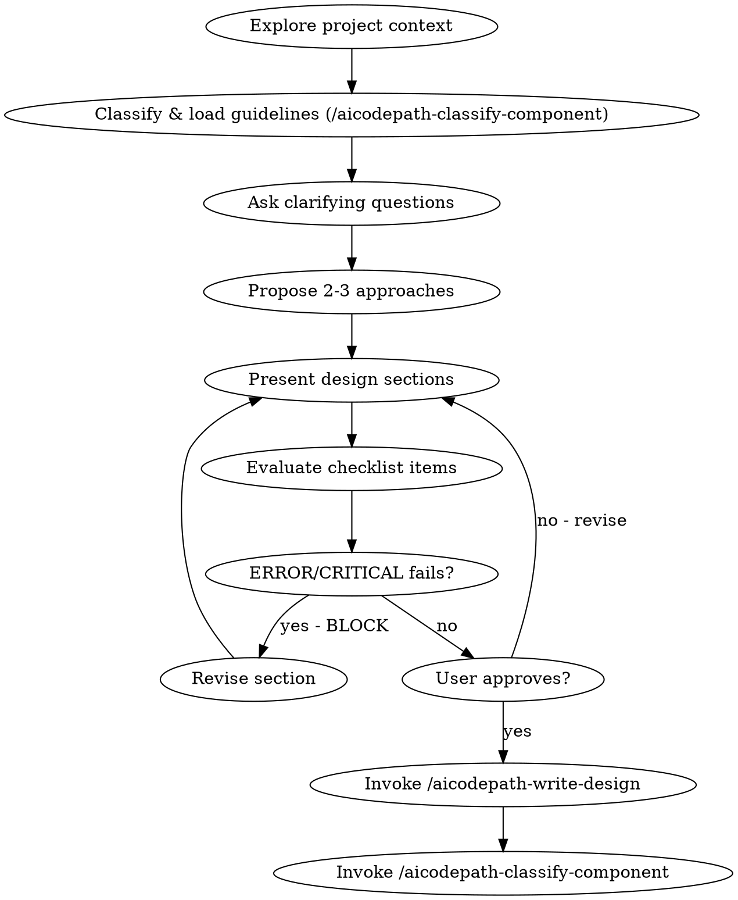

# AICodePath Brainstorming — Design Before Code

## Overview

Turn ideas into fully-formed designs through collaborative dialogue before any implementation.

Understand the project context, ask questions one at a time, propose approaches, get approval, then hand off to the implementation plan.

<HARD-GATE>
Do NOT write any code, scaffold files, or invoke any implementation skill until:
1. A design has been presented in sections
2. The user has explicitly approved the design
3. This applies to EVERY task regardless of perceived simplicity
</HARD-GATE>

## Anti-Pattern: "This Is Too Simple To Need A Design"

Every feature goes through this process. A simple config change, a single utility function, a small UI tweak — all of them. "Simple" tasks are where unexamined assumptions create the most rework. The design can be short (2–3 sentences for trivial tasks), but it MUST be presented and approved.

## Before You Start Brainstorming

Ask three questions before reading the first file:

1. **What's the actual problem?** Not what the user asked for — what breaks if this doesn't exist? For whom? Users who skip this step for a "simple cache layer" then spend a week unraveling invalidation complexity they didn't model.
2. **What constraints aren't stated yet?** Existing naming patterns, migration concerns, tech stack limits, team conventions — constraints that surface mid-implementation cost 3× what they cost at design time.
3. **What's the YAGNI floor?** The minimum that satisfies the stated success criteria, nothing more. Every scope increment at design time is 10× cheaper than at review time.

## Checklist

Create a TodoWrite task for each item and complete in order:

1. **Explore project context** — check CLAUDE.md, recent commits, related files
2. **Classify & load guidelines** — invoke `/aicodepath-classify-component` with the feature topic; keep the returned validation checklist active for all subsequent steps
3. **Ask clarifying questions** — one at a time, understand purpose/constraints/success criteria
4. **Propose 2–3 approaches** — with trade-offs and your recommendation
5. **Present design** — in sections, get approval after each; cover architecture, data flow, error handling, testing; evaluate checklist items against each section — BLOCK on ERROR/CRITICAL failures
6. **Write design doc** — seed the sprint `crNumber` (see "Seeding the CR Number" below), then invoke `/aicodepath-write-design` to synthesize the brainstorm conversation into a structured design document with 7 mandatory sections (Problem Statement, Exploration Findings, Constraints, Decision Log, Design Spec, Risks, Files Impact)
7. **Transition** — invoke `/aicodepath-classify-component` then `/aicodepath-write-plan` for the implementation plan

## Process Flow



**The terminal state is invoking `/aicodepath-write-design`.** After design doc synthesis, proceed to `/aicodepath-classify-component` then `/aicodepath-write-plan`.

## Process Details

### Exploring Context

When reading project context, look for:
- **PM product context** (greenfield only): check `aicodepath-docs/pm/hypothesis-personas.md` and `aicodepath-docs/pm/competitive-awareness.md` — if they exist, load and cite them at the right confidence level based on their `**Source:**` field:
  - `Source: Web Research` → cite as evidence: "Research shows that [persona] uses [tool] today"
  - `Source: User-Provided` → cite as stated context: "Based on your description, [persona] struggles with..."
  - `Source: AI Hypothesis` → cite as working assumption: "Working hypothesis (unvalidated): [persona] — confirm before architecture locks"
- **The constraint trail**: check `aicodepath-docs/knowledge.md` for GICL failure patterns in this feature area — prior sprints often contain implicit architectural decisions that aren't visible in CLAUDE.md
- **The prior attempt graveyard**: `git log --all --diff-filter=D -- '<feature-pattern>'` reveals files that were started and deleted; deletions are rejected prior designs
- Related files: read actual implementations, not just documentation — real code reveals naming patterns docs don't mention

### Asking Questions

- One question per message — no lists of questions
- For questions about **implementation mechanics** (e.g., "how should state be tracked?", "which storage approach?") — give your recommended answer directly with rationale, not options A/B/C. Multi-option proposals belong in `### Proposing Approaches` where trade-offs are genuinely open.
- Focus on: purpose, constraints, success criteria, what "done" looks like
- **Quality test for each question**: ask yourself "what design change would this answer drive?" — if you can't specify the change, the question is at the wrong level of abstraction; ask something more targeted

### Proposing Approaches

- Always 2–3 options, never just 1
- Lead with your recommendation and rationale
- Include trade-offs for each option
- YAGNI ruthlessly — remove unnecessary features
- Include "minimum viable" as one option when scope is ambiguous

### Presenting Design

- Sections scaled to complexity (2 sentences for trivial, up to 300 words for complex)
- Ask "does this look right?" after each section
- Cover: architecture, components, data flow, error handling, testing strategy
- Be ready to revise any section

## Design Self-Review (Before Committing)

Before writing the design doc, evaluate the design against 5 criteria:

| Criterion | Question |
|-----------|---------|
| **Clarity** | Are all tasks specific action verbs with exact file paths? No "implement X" vagueness? |
| **Feasibility** | Are all dependencies available? Does it match the approved tech stack? |
| **Dependencies** | Is the order correct? No circular dependencies? No missing deps? |
| **Acceptance** | Is every success criterion measurable and Yes/No decidable? No "looks good"? |
| **Value** | Does every task directly advance the stated goal? Any gold-plating to remove? |

Flag high-risk items as spike candidates before handing off to the plan:
> ⚠️ **SPIKE RECOMMENDED**: [task] — [reason: new technology / unknown API / uncertain effort]

For complex designs, invoke the `aicodepath-plan-critic` agent for a structured review.

## Seeding the CR Number (Step 6)

Before invoking `/aicodepath-write-design`, derive a sprint-wide Change Request identifier so every downstream artifact (design, plan, units) links back to the same sprint. Without this step, `ArtifactWriter` falls back to the `CR-LEGACY` sentinel and sprint grouping / `sprint-history.listSprints` cannot distinguish sprints.

**Format**: `CR-YYYY-MM-DD-<topic-slug>` (e.g. `CR-2026-04-18-opus-4-7-alignment`).

**Computation**:

```js
const ISO_DATE = new Date().toISOString().slice(0, 10);   // YYYY-MM-DD
const crNumber = "CR-" + ISO_DATE + "-" + slugify(topic); // kebab-case topic
```

Where `slugify(topic)` lowercases the approved topic, replaces whitespace + punctuation with `-`, and strips leading / trailing hyphens.

**Passing to downstream skills**: write the value into session-state via `session-state-manager` under the key `cr_number` so `/aicodepath-write-design`, `/aicodepath-write-plan`, and `lib/plan-loader.js` all read the same identifier:

```js
const { SessionStateManager } = require('./lib/session-state-manager');
new SessionStateManager().setState('cr_number', crNumber);
```

If the user did not approve a distinct topic (rare — see design DEC-4), leave the key unset and `ArtifactWriter` will default to `CR-LEGACY`.

## After Design Approval

1. Write design doc to `aicodepath-docs/design/YYYY-MM-DD-<topic>-design.md`
2. Commit: `git commit -m "docs: <topic> design"`
3. Announce: "Design complete — invoking /aicodepath-orchestrate for implementation plan"
4. Invoke the `/aicodepath-orchestrate` skill

## Key Principles

- **One question at a time** — multiple questions overwhelm and get incomplete answers
- **YAGNI** — if it's not in the success criteria, don't design it
- **2–3 approaches always** — one option is a decision, not a proposal
- **Incremental approval** — get sign-off on each section before moving on
- **Phase discipline** — brainstorming is complete only when design doc is committed

## NEVER

- **NEVER** skip brainstorming because "the same pattern was used last sprint" — every feature has hidden contextual differences; reusing prior implementation without a design session is the root cause of scope mismatch in most post-sprint rework
- **NEVER** accept user urgency ("just do it quickly") as permission to skip design — an hour of misaligned implementation costs more than two minutes of design confirmation; urgency is a pressure rationalization, not a requirement change
- **NEVER** skip writing the design doc because "it's in the conversation" — a conversation cannot be referenced from tasks, linked from commits, or restored at session start; the committed doc is the design, the conversation is not
- **NEVER** ask multiple clarifying questions in one message — multi-question messages produce partial answers; each unanswered question becomes a silent assumption that surfaces as a bug at implementation time
- **NEVER** skip the approach proposal step when the user says "I know what I want" — user certainty is not design approval; presenting 2–3 options surfaces constraints neither party has articulated yet

## When Stuck — Diagnostic Paths

| Situation | What's happening | Recovery |
|-----------|-----------------|----------|
| User rejects all 3 approaches | Unstated constraint not yet surfaced | Ask: "What would need to be true for the right approach to exist?" |
| Design approval stalls on one section | Section is too abstract | Break into 2 smaller sections; add one concrete example each |
| User says "just start implementing" | They equate design with formal documentation | Clarify: 2 sentences about what you'll build and why is sufficient — that IS the design |
| Clarifying questions keep generating new requirements | Scope is undiscovered, not just unclear | Pause and anchor: "What's the one thing this must do? Let's design just that first." |
| User approves everything with no pushback | They may not be reading carefully | Ask about the part most likely to need revision: "The tricky part is X — does that approach work for your constraints?" |

## Rationalization Red Flags

| Thought | Reality |
|---------|---------|
| "It's too simple to need a design" | Short design takes 2 minutes. Redesign after implementation takes 2 hours. |
| "I know exactly what to build" | User may not. Present design to confirm alignment. |
| "User just wants code now" | User wants correct code. Unvalidated assumptions → wrong code. |
| "We already discussed this" | Discussions change. Write it down. |
| "Skip to the plan" | Plan without design is guessing. Brainstorm first. |
