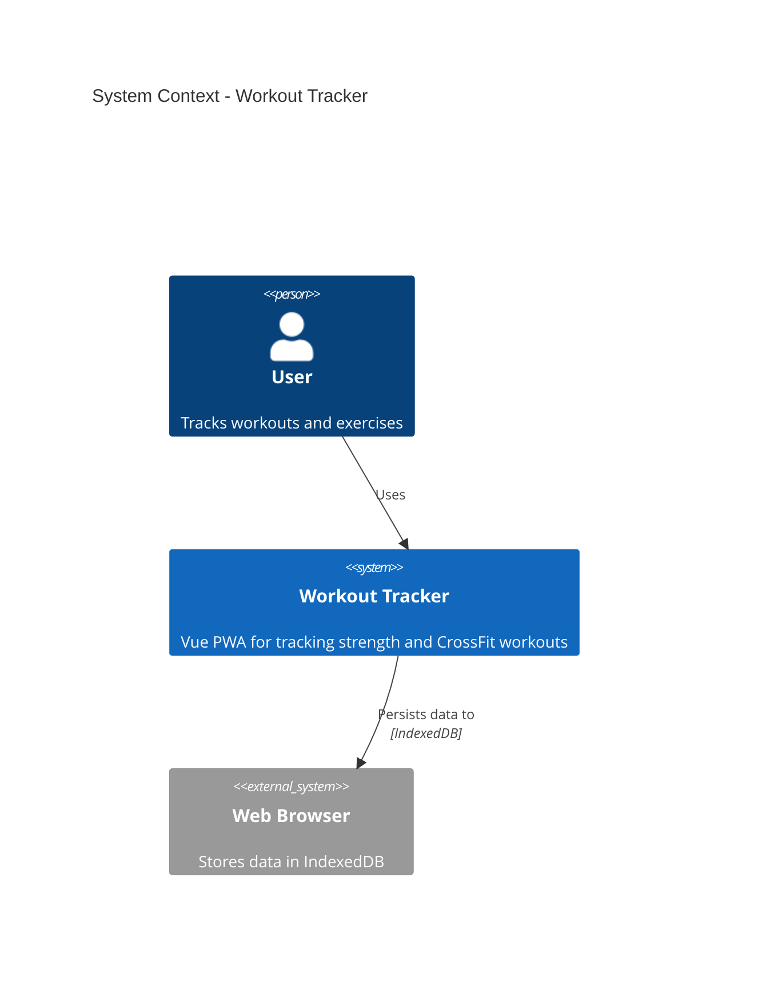
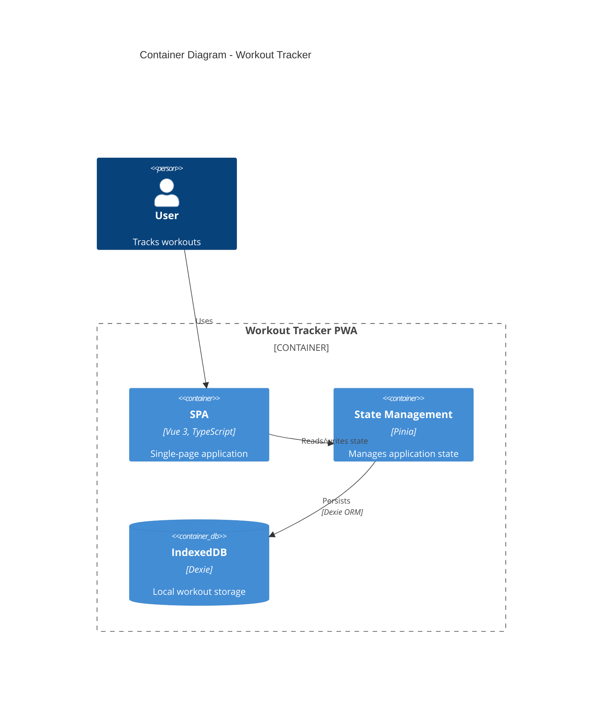
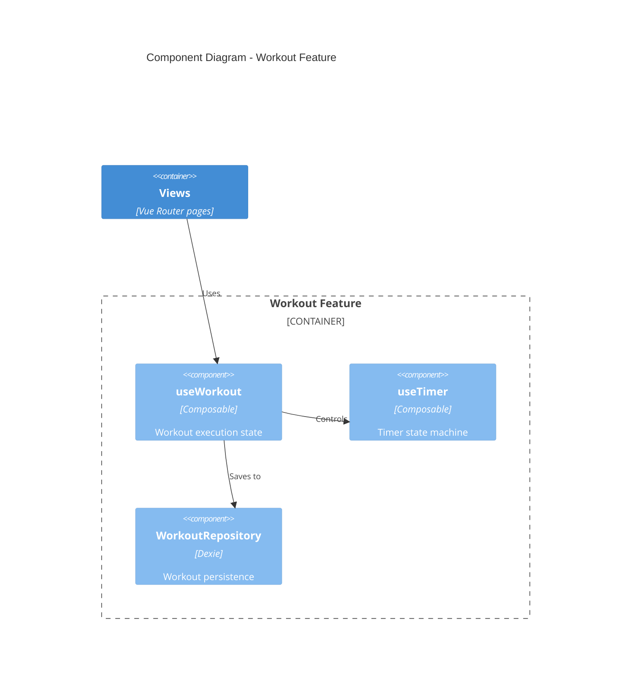
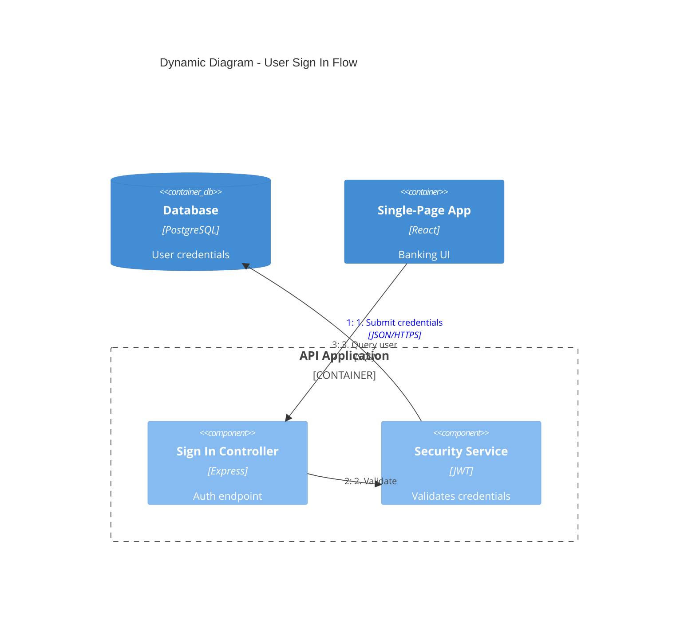
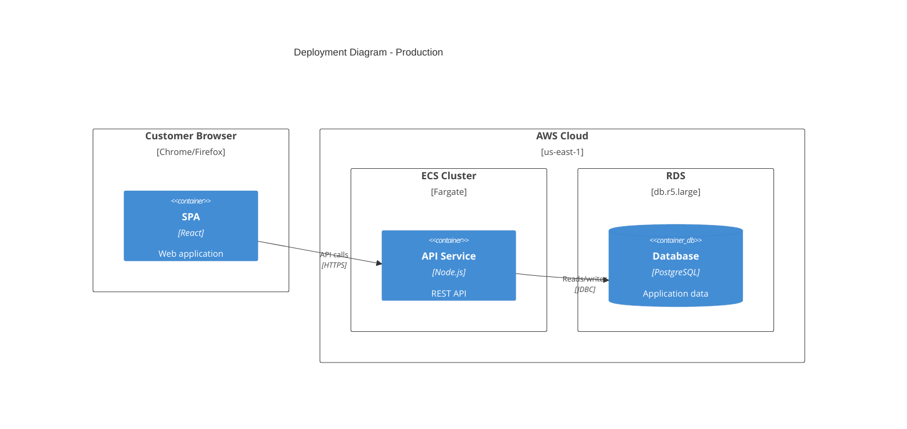

# C4 Architecture Documentation

Generate software architecture documentation using C4 model diagrams in Mermaid syntax. This skill integrates with the AICodePath CONSTRUCTION phase to create comprehensive architecture documentation for your units.

## Quick Start

```
create c4 diagrams for user-authentication
document architecture for payment-service
```

The skill generates appropriate C4 diagrams and saves them to your unit's architecture-design folder.

---

## Triggers

| Trigger | Example |
|---------|---------|
| Create architecture diagram | "create architecture diagram", "document architecture" |
| Generate C4 diagram | "create c4 diagram", "generate c4 context diagram" |
| Document system architecture | "document system architecture for user-auth" |
| Visualize architecture | "visualize architecture", "show system structure" |
| Create deployment diagram | "create deployment diagram for production" |

---

## C4 Diagram Levels

Select the appropriate level based on the documentation need:

| Level | Diagram Type | Audience | Shows | When to Create |
|-------|-------------|----------|-------|----------------|
| 1 | **C4Context** | Everyone | System + external actors | Always (required) |
| 2 | **C4Container** | Technical | Apps, databases, services | Always (required) |
| 3 | **C4Component** | Developers | Internal components | Only if adds value |
| 4 | **C4Deployment** | DevOps | Infrastructure nodes | For production systems |
| - | **C4Dynamic** | Technical | Request flows (numbered) | For complex workflows |

**Key Insight:** "Context + Container diagrams are sufficient for most software development teams." Only create Component/Code diagrams when they genuinely add value.

---

## Quick Reference Examples

### System Context (Level 1)


### Container Diagram (Level 2)


### Component Diagram (Level 3)


### Dynamic Diagram (Request Flow)


### Deployment Diagram


---

## Workflow Integration

This skill integrates with the AICodePath CONSTRUCTION phase:

```
User Request: "Create architecture diagrams for user-auth"
    │
    ▼
┌─────────────────────────────────────────────────────┐
│ Step 1: UNDERSTAND SCOPE                            │
│ • Determine which C4 level(s) are needed            │
│ • Identify target audience                          │
│ • Parse unit name from request                      │
├─────────────────────────────────────────────────────┤
│ Step 2: ANALYZE CODEBASE                            │
│ • Explore system to identify components             │
│ • Identify containers and relationships             │
│ • Map external dependencies                         │
│ MANDATORY: Load references/c4-syntax.md for         │
│ complete element syntax before generating.          │
│ Microservices/event-driven: also load               │
│ references/advanced-patterns.md                     │
├─────────────────────────────────────────────────────┤
│ Step 3: GENERATE DIAGRAMS                           │
│ • Create Context diagram (always)                   │
│ • Create Container diagram (always)                 │
│ • Create Component diagrams (if valuable)           │
│ • Create Deployment/Dynamic (if requested)          │
│ Anti-pattern concerns: load                         │
│ references/common-mistakes.md before finalizing     │
├─────────────────────────────────────────────────────┤
│ Step 4: SAVE TO UNIT STRUCTURE                      │
│ • Create unit directory if needed                   │
│ • Write to architecture-design folder               │
│ • Follow naming conventions                         │
└─────────────────────────────────────────────────────┘
```

---

## Best Practices

### Essential Rules

1. **Every element must have**: Name, Type, Technology (where applicable), and Description
2. **Use unidirectional arrows only** - Bidirectional arrows create ambiguity
3. **Label arrows with action verbs** - "Sends email using", "Reads from", not just "uses"
4. **Include technology labels** - "JSON/HTTPS", "JDBC", "gRPC"
5. **Stay under 20 elements per diagram** - Split complex systems into multiple diagrams

### Clarity Guidelines

1. **Start at Level 1** - Context diagrams help frame the system scope
2. **One diagram per file** - Keep diagrams focused on a single abstraction level
3. **Meaningful aliases** - Use descriptive aliases (e.g., `orderService` not `s1`)
4. **Concise descriptions** - Keep descriptions under 50 characters when possible
5. **Always include a title** - "System Context diagram for [System Name]"

### What to Avoid

See [references/common-mistakes.md](references/common-mistakes.md) for detailed anti-patterns:
- Confusing containers (deployable) vs components (non-deployable)
- Modeling shared libraries as containers
- Showing message brokers as single containers instead of individual topics
- Adding undefined abstraction levels like "subcomponents"
- Removing type labels to "simplify" diagrams

---

## Output Location & Naming

**IMPORTANT**: All C4 architecture diagrams are stored in the visual memory system for automatic loading into context:

```
.aicodepath-docs/memory/global/c4/
```

### Naming Convention

- `c4-context.md` - System context diagram
- `c4-containers.md` - Container diagram
- `c4-components.md` - Component diagrams (can have multiple if needed)
- `c4-deployment.md` - Deployment diagram
- `c4-dynamic-{flow}.md` - Dynamic diagrams for specific flows

### Example Output Paths

For global C4 diagrams (most common):
```
.aicodepath-docs/memory/global/c4/c4-context.md
.aicodepath-docs/memory/global/c4/c4-containers.md
.aicodepath-docs/memory/global/c4/c4-components.md
.aicodepath-docs/memory/global/c4/c4-deployment.md
```

For unit-specific C4 component diagrams (if needed):
```
.aicodepath-docs/memory/units/{unit-name}/c4/c4-components-{feature}.md
```

**Rationale**: C4 diagrams are visual memory (architecture context), not construction artifacts. They are automatically loaded by visual-memory-loader into system prompt and stored in the visual_diagrams database table.

---

## Audience-Appropriate Detail

| Audience | Recommended Diagrams |
|----------|---------------------|
| Executives | System Context only |
| Product Managers | Context + Container |
| Architects | Context + Container + key Components |
| Developers | All levels as needed |
| DevOps | Container + Deployment |

---

## Reference Files

| File | Load when |
|------|-----------|
| `references/c4-syntax.md` | **MANDATORY** at Step 2 (Analyze Codebase) — complete element syntax, styling, layout config |
| `references/advanced-patterns.md` | Microservices, event-driven, or multi-team architecture |
| `references/common-mistakes.md` | Before finalizing any diagram — anti-patterns to avoid |

**Do NOT load** reference files during Step 1 (scope understanding) — wait until you've confirmed the diagram type needed.

---

## Example Invocation

```
# Generate full architecture documentation
create c4 diagrams for payment-processing

# Generate specific diagram type
create c4 context diagram for user-service
create c4 container diagram for api-gateway
create deployment diagram for production

# Document event-driven architecture
document event-driven architecture for order-system
create dynamic diagram for checkout flow
```

---

## NEVER

- **NEVER** model microservices owned by different teams as containers in the same C4 Container diagram — containers live inside one software system. A payment service owned by Team Gamma is its own software system at C4 Level 1, not a container inside the ordering system. Mixing ownership levels in one container diagram creates diagrams that are technically wrong and mislead architects about team boundaries.
- **NEVER** represent a message broker (Kafka, RabbitMQ, SQS) as a single container — "Kafka" is not a container; individual topics are. A diagram with one `ContainerQueue(kafka, "Kafka")` box hides which services produce vs consume which topics, making the diagram useless for understanding data flow. Model each topic as a separate `ContainerQueue`.
- **NEVER** create a C4 Level 3 Component diagram when a Level 2 Container diagram already shows sufficient detail — the right question is "does this add something Level 2 doesn't show?" If the answer requires careful thought, the answer is probably no. Component diagrams for simple services add overhead without insight.
- **NEVER** remove element type labels (`Container`, `ContainerDb`, `Person`) to "clean up" a diagram — these labels are the semantic core of C4 notation. A box without a type forces the reader to infer from the alias. The moment you remove types, you no longer have a C4 diagram; you have a box-and-arrow drawing with no formal meaning.
- **NEVER** generate a C4 diagram without reading the actual codebase or service definitions first — hallucinated architecture diagrams with plausible-sounding service names mislead teams into thinking the diagram represents reality. Always read `docker-compose.yml`, Kubernetes manifests, or service directories before drawing containers.

---

## Notes

- Always creates Context and Container diagrams (minimum viable architecture documentation)
- Component diagrams only when they add genuine value
- Deployment diagrams for production systems or when infrastructure is critical
- Dynamic diagrams for complex flows that need sequence documentation
- Follows C4 model best practices from Simon Brown
- Compatible with Mermaid rendering in GitHub, GitLab, and documentation tools
