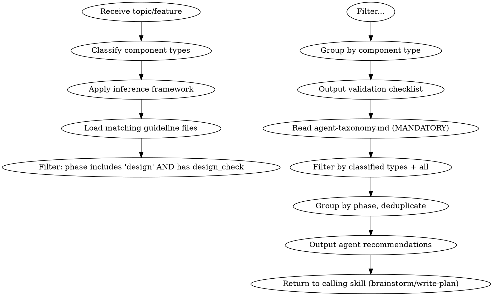

# AICodePath — Component Classifier & Design Validator

## Purpose

Determine which component types a feature touches, load the matching guideline files, filter for design-phase rules, and produce a checklist of `design_check` questions that MUST be evaluated before any design section is approved. Then output phase-aware agent recommendations for expertise allocation.

This skill is invoked at the **start of brainstorming and write-plan** — before proposing approaches or writing any plan content.

---

## Step 1 — Classify Component Types

Analyze the topic/feature description and identify ALL component types that apply. A single feature typically spans multiple types.

### Component Type Taxonomy

| Component Type | Matches When You See… |
|---|---|
| `database` | table, schema, column, migration, SQL, FK, index, query, repository, ORM, Kysely, Prisma, entity, database, relational, pool, pooling, connection, service account, db account, GRANT, pagination, batch, prepared statement, transaction, connection string |
| `api` | endpoint, route, REST, HTTP, controller, request, response, URL, path, resource, CORS, auth header, status code |
| `service` | service, business logic, domain, use case, workflow, state machine, event, queue, RabbitMQ, Redis, background job |
| `test` | test, spec, coverage, mock, unit test, integration test, e2e, TDD, testing strategy, assertion |
| `devops` | Docker, container, CI/CD, pipeline, deploy, Dockerfile, image, Kubernetes, Helm, GitHub Actions, secret injection |
| `ai` | LLM, AI, model, prompt, RAG, embedding, vector, Gemini, OpenAI, Anthropic, ML, inference, context window, token |
| `frontend` | component, page, UI, form, React, Next.js, frontend, screen, layout, web |
| `mobile` | mobile, iOS, Android, React Native, Flutter, Swift, Kotlin, offline, push notification |
| `observability` | logging, metrics, tracing, monitoring, alert, dashboard, PII in logs, telemetry, structured logging |
| `security` | auth, authentication, authorization, RBAC, permission, role, session, JWT, password, encrypt, hash, CORS, CSRF |
| `framework_asset` | SKILL.md, agent .md, hook .js — files inside `.aicodepath/skills/`, `.aicodepath/agents/`, `.aicodepath/hooks/`; creating or improving AICodePath framework components themselves |

### Inference Framework — Implied Component Types

Many component types are implied by context, not stated explicitly. Before finalizing classification, ask yourself:

- Does this feature touch user data, auth, or external APIs? → add `security`
- Does it store, retrieve, or migrate persistent data? → add `database`
- Does it expose or consume an HTTP endpoint? → add `api`
- Does it contain business logic, background jobs, or queue processing? → add `service`
- Does it retry, batch, or queue work? → also add `observability` (failure rates and queue depth need monitoring)
- Does it involve auth logging? → add `observability` (PII-in-logs risk) AND `security`
- Will tests be written for this feature? → always add `test` (TDD applies to every feature)
- Does it add a new service or microservice? → add `devops` (containerization) AND `observability`

**Rules:**
- A feature may match 3–5 types simultaneously (e.g., a new feature = database + api + service + test)
- When in doubt, include the type — false positives are safe, false negatives miss violations
- Always include `security` if the feature involves user data, authentication, or external APIs

**Output format:**
```
Classified component types: [database, api, service, security, test]
```

---

## Step 2 — Load Matching Guideline Files

Map each classified component type to its guideline file:

| Component Type | Guideline File |
|---|---|
| `database` | `.aicodepath/guidelines/data-modeling-rules.json`, `.aicodepath/guidelines/database-operations-rules.json` |
| `api` | `.aicodepath/guidelines/api-design-rules.json` |
| `service` | `.aicodepath/guidelines/architecture-rules.json`, `.aicodepath/guidelines/coding-standards.json` |
| `test` | `.aicodepath/guidelines/testing-standards.json` |
| `devops` | `.aicodepath/guidelines/devops-rules.json` |
| `ai` | `.aicodepath/guidelines/ai-implementation-rules.json` |
| `frontend` | `.aicodepath/guidelines/mobile-design-rules.json` |
| `mobile` | `.aicodepath/guidelines/mobile-design-rules.json` |
| `observability` | `.aicodepath/guidelines/observability-rules.json` |
| `security` | `.aicodepath/guidelines/security-rules.json` |
| `types` | `.aicodepath/guidelines/type-design-rules.json` |

Use the `Read` tool to load each matched guideline file. Do NOT load files for unmatched component types — keep the context focused.

---

## Step 3 — Filter Design-Phase Rules

From each loaded guideline file:

1. Traverse all `categories`
2. For each category where `"phase"` includes `"design"`:
   - Traverse its `rules`
   - For each rule where `"phase"` includes `"design"` AND `"design_check"` is present:
     - Collect the rule `id`, `severity`, and `design_check`
3. Also collect any category-level `design_check` if present

Group collected rules by their source guideline file / component type.

**Severity priority:** `error` → `warning` → `info`

---

## Step 4 — Output the Validation Checklist

Present the checklist grouped by component type. Format:

```
## Design Validation Checklist
### Component types detected: [database, api, service, security]

#### Database Rules (data-modeling-rules)
- [ ] [ERROR] lookup-table-naming: Do ALL lookup/reference tables use the lkp_ prefix?
- [ ] [ERROR] prefer-lookup-over-constraints: Does the design use lkp_* tables instead of CHECK constraints?
- [ ] [ERROR] no-enum-columns: Does the design avoid ENUM types, using lkp_* tables instead?
- [ ] [ERROR] primary-key-required: Does every proposed table have a primary key?
- [ ] [WARNING] no-array-columns: Does the design avoid array columns, using junction tables?
...

#### API Rules (api-design-rules)
- [ ] [WARNING] endpoint-kebab-case: Do all paths use kebab-case?
- [ ] [ERROR] no-200-for-errors: Are appropriate HTTP status codes used for errors?
...

#### Security Rules (security-rules)
- [ ] [CRITICAL] hash-passwords: Does the design specify bcrypt/argon2 hashing?
- [ ] [ERROR] no-trust-client-role: Are roles loaded from token/DB, not client input?
...
```

---

## Step 5 — Output Agent Recommendations

**MANDATORY**: Before filtering agents, read the taxonomy file using the `Read` tool:

```
.aicodepath/skills/aicodepath-classify-component/references/agent-taxonomy.md
```

This file maps component types → agents with phase labels. It is NOT optional — Step 5 cannot produce agent recommendations without reading it.

**Do NOT load** `references/example-output.md` during normal invocation — it is only needed when demonstrating or debugging the skill output format.

**If agent-taxonomy.md cannot be read**: note the failure, output the validation checklist (Steps 1–4 remain valid), and append: "⚠️ Agent recommendations unavailable — taxonomy file could not be loaded."

Filter rows where `Component Type` matches any classified component type OR `Component Type` is `all`.

Group filtered agents by `Phase` and deduplicate (same agent may appear from multiple component types).

Output format:

```
## Recommended Agents
### Component types: [database, api, service, security]

#### Design Phase
- ⟶ **aicodepath-database-architect** — Schema and migration decisions
- ⟶ **aicodepath-architect** — Component boundaries, system design
- ⟶ **aicodepath-security-engineer** — Threat modeling, auth design
- ⟶ **aicodepath-codebase-pattern-finder** — Brownfield pattern discovery

#### Plan Phase
- ⟶ **aicodepath-security-engineer** — Threat modeling, auth design
- ⟶ **aicodepath-plan-critic** — Plan quality gate — clarity, feasibility, value
- ⟶ **aicodepath-plan-analyst** — Effort estimation, risk, task sequencing
- ⟶ **aicodepath-test-engineer** — TDD strategy, coverage

#### Construction Phase
- ⟶ **aicodepath-performance-engineer** — Query optimization, indexing
- ⟶ **aicodepath-code-reviewer** — Code review before commit
- ⟶ **aicodepath-test-engineer** — TDD strategy, coverage
- ⟶ **aicodepath-qa** — Quality gates, coverage enforcement
```

When `framework_asset` component type is detected, append:

## Framework Asset Skills
> These skills are the primary workflow for framework asset work — use them instead of general agents.

| Trigger | Skill | When |
|---------|-------|------|
| `framework_asset` (skill file) | `/aicodepath-skill-audit <name>` | Run immediately after writing any SKILL.md — 8-dimension quality score |
| `framework_asset` (skill file, score < 90) | `/aicodepath-skill-improver <name>` | Run autonomous improvement loop if audit score is below Grade A |
| `framework_asset` (skill file, new) | `/aicodepath-skill-creator` | Use for full creation flow — eval loop, description optimization, wiring verification |
| `framework_asset` (skill file, testing) | `/aicodepath-skill-testing <name>` | Write behavioral tests for the skill using Red-Green-Refactor |
| `framework_asset` (agent file) | `/aicodepath-agent-audit <name>` | Run immediately after writing any agent .md — 6-dimension quality score |
| `framework_asset` (agent file, new) | `/aicodepath-agent-creator` | Use for full creation flow — interview, spec validation, DOMAIN_MAPPING wiring |
| `framework_asset` (hook file) | `/aicodepath-hook-audit <name>` | Run immediately after writing any hook .js — 6-dimension quality score |
| `framework_asset` (hook file, new) | `/aicodepath-hook-creator` | Use for full creation flow — event selection, tests, registration |
| `framework_asset` (any) | `/aicodepath-harness-eval` | After Grade A audit — validate which agentic primitives apply and score compliance |

When `api` or `security` component types are detected, or when Fluent UI signals are present in `frontend` or `mobile` component types, append:

## Recommended Skills
> These skills complement the agent recommendations above for this component type.

| Trigger | Skill | When |
|---------|-------|------|
| `api` or `security` detected | `/aicodepath-vapt` | Run before acceptance — OWASP Top 10 static scan on changed files |
| `frontend` with UI/design signals (landing page, dashboard, styling request, glassmorphism, neumorphism, neubrutalism, claymorphism, design system, "make it look better", color palette, typography, animation) | `/aicodepath-web-design-intelligence` | Load at design start — domain→style mapping, 160 palettes, 84 styles, motion patterns, anti-pattern warnings |
| `frontend` with Fluent UI signals (FluentProvider, makeStyles, Griffel, @fluentui/react-components, assertSlots, DataGrid, Field, Tabs, Tree, Dialog, Drawer) | `/aicodepath-fluent-design` | Load at construction start — provides 5-file pattern, HARD-GATEs, token rules, troubleshooting |
| `mobile` with fluentui-apple or fluentui-android signals | `/aicodepath-fluent-design` | Load at construction start — platform component inventory, iOS/Android gap check |

Return to the calling skill (brainstorm/write-plan) with both the checklist and agent recommendations active.

---

## Step 6 — Integration with Brainstorm and Write-Plan

### In `aicodepath-brainstorm`:
- Invoke this skill **immediately after "Explore project context"**, before asking clarifying questions
- The checklist produced here becomes the **design approval gate**
- When presenting each design section: evaluate relevant checklist items against the proposed design
- Any `ERROR`/`CRITICAL` checklist item that fails → **BLOCK design approval** for that section
- Resolved items may be checked off as sections are approved

### In `aicodepath-write-plan`:
- Invoke this skill **before drafting the task list**
- Use the checklist to validate architectural decisions in the plan
- Any `ERROR`/`CRITICAL` item that fails in the plan → revise the plan before presenting it to the user

---

## Process Flow



---

## Default Component Types When Uncertain

If the feature is vague or cross-cutting, always include:
- `security` — every feature with users, data, or external calls
- `service` — every feature with business logic
- `test` — every feature (TDD is always applicable)

---

## Hard Rules for This Skill

<HARD-GATE>
- NEVER skip this skill because a feature "seems simple" — simple features carry the same risks; the taxonomy table takes 30 seconds to apply but a missing security check can cause an auth bypass that takes days to remediate
- NEVER produce an empty checklist — at minimum, security + test rules always apply; an empty checklist means invocation failed, not that the feature is clean
- NEVER approve a design that has unresolved ERROR/CRITICAL checklist items — ERROR items represent failure patterns that have caused production incidents; skipping them means knowingly shipping known-bad patterns
- NEVER skip Step 5 (agent recommendations) — agent suggestions are the primary output consumed by write-plan for expertise allocation; omitting them defeats the purpose of the skill
- If a guideline file cannot be read, note it and continue with remaining files — partial coverage is better than silent failure
</HARD-GATE>

---

## Example Output

For a full worked example of classifying "Vehicle Market Evaluator — new feature to compare vehicle prices", see:

```
.aicodepath/skills/aicodepath-classify-component/references/example-output.md
```

This reference shows the complete expected output including checklist and agent recommendations for a database + api + service + security + test feature.
