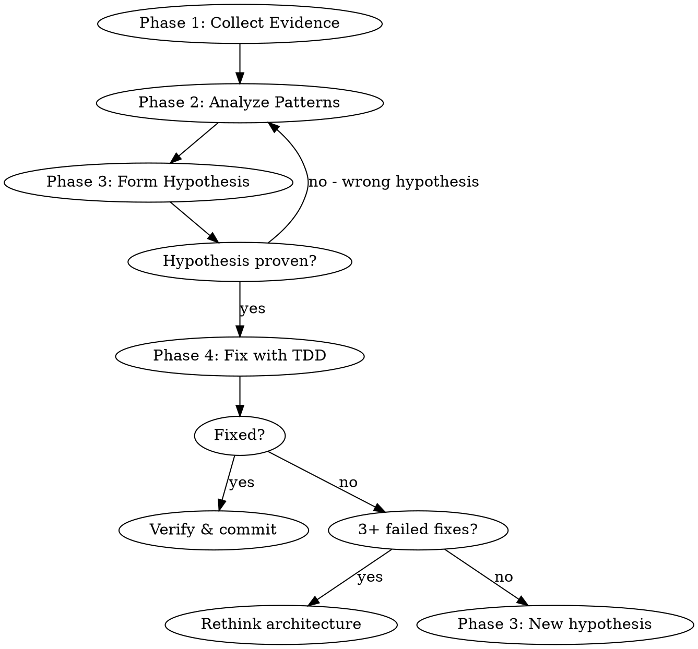

# AICodePath Systematic Debugging

## Overview

Find the root cause before writing any fix. Debug through evidence, not intuition.

**Core principle:** Understanding why something breaks is more important than quickly patching it.

## The Iron Law

```
NO FIX ATTEMPTS WITHOUT ROOT CAUSE INVESTIGATION FIRST
```

3+ failed fix attempts = stop and investigate architecture. Don't keep trying random patches.

## When to Use

- Any bug report, error message, or unexpected behavior
- Tests failing without clear reason
- Performance degradation
- Integration failures
- "It worked before" situations

## Process Flow



## Step 0: Check Reflexion Memory

Before spending time on investigation, check if this error pattern has been seen before.

Run this to query past failures matching the current error type:
```bash
node -e "
const Database = require('better-sqlite3');
const ReflexionLearner = require('.aicodepath/lib/reflexion-learner');
const pathResolver = require('.aicodepath/lib/path-resolver');
const dbPath = pathResolver.getDbPath();
try {
  const db = new Database(dbPath, { readonly: true });
  const rl = new ReflexionLearner(db, pathResolver.findProjectRoot(process.cwd()));
  const hints = rl.findSimilar({ errorType: 'guideline_violation', description: '<PASTE ERROR HERE>' });
  console.log(rl.formatHints(hints) || 'No past patterns found.');
  db.close();
} catch(e) { console.log('No reflexion DB yet:', e.message); }
"
```

**If hints are found**: Try the suggested solutions first before investigating from scratch. This avoids repeating the same investigation paths across sessions.

**If no hints**: Proceed to Phase 1. After fixing, consider recording the pattern for future sessions.

## Phase 1: Collect Evidence

**Do NOT form theories yet. Just observe.**

Gather:
- Exact error message (full stack trace, not summary)
- Exact reproduction steps (minimal steps to trigger)
- What ACTUALLY happens vs what SHOULD happen
- When it started (recent commits, env changes)
- What changed recently (`git log --oneline -20`, `git diff`)

Commands to run:
```bash
# Get recent history
git log --oneline -20

# Check for recent changes to related files
git log --oneline --all -- <relevant-file>

# Reproduce the bug
<exact reproduction command>

# Capture full error output
<command> 2>&1 | tee /tmp/debug-output.txt
```

**Stop here.** Do not jump to Phase 2 until you have all evidence gathered.

## Phase 2: Analyze Patterns

Look for patterns in the evidence:

- Which component is failing? (narrow scope)
- Is it deterministic? (same inputs → same failure?)
- Environmental? (works in test but not prod?)
- Data-specific? (fails for some inputs, not others?)
- Regression? (used to work, now broken?)

Narrow with targeted experiments:
```bash
# Bisect if regression
git bisect start
git bisect bad HEAD
git bisect good <known-good-commit>
# (git will guide you)

# Isolate component
# Temporarily add debug logging to narrow which code path runs
```

## Phase 3: Form Hypothesis

State your hypothesis precisely:

```
"I believe the bug is in <specific function/line> because <evidence>.
It triggers when <specific condition>.
The fix is likely <proposed change> because <reasoning>."
```

Prove the hypothesis BEFORE writing the fix:
- Can you reproduce the bug reliably?
- Does the bug disappear when you remove the hypothesized cause?
- Do the logs/stack trace point to this location?

If you can't prove the hypothesis → go back to Phase 2.

## Phase 4: Fix with TDD

Once root cause is proven:

1. **Write a failing test** that reproduces the exact bug
   ```bash
   # Verify test fails (reproduces the bug)
   npm test path/to/test
   ```

2. **Verify the test fails for the right reason**
   - Failure message should describe the actual bug symptom
   - Not a typo or syntax error

3. **Write the minimal fix**
   - Change only what's needed to fix the root cause
   - Do NOT refactor while fixing
   - Do NOT "improve" surrounding code

4. **Verify test passes + no regressions**
   ```bash
   npm test  # full suite
   ```

5. **Commit**
   ```bash
   git commit -m "fix: <describe root cause and fix>"
   ```

## Stop Rules

**Escalate to user if:**
- 3+ fix attempts failed to resolve the bug
- Root cause is in a third-party dependency
- Bug requires architectural changes beyond the current task
- Reproduction is intermittent (flaky — need different strategy)

When escalating:
```
"After N attempts, I cannot resolve this. Root cause appears to be in <X>.
Evidence: <summary>
Possible solutions: <list>
Recommended: <recommendation>"
```

## Common Investigation Mistakes

| Mistake | Better Approach |
|---------|----------------|
| "Let me try changing X" | Investigate WHY X might be wrong first |
| Reading code without running it | Run the code, collect actual output |
| Assuming the error message is accurate | Verify with reproduction |
| Fixing symptoms | Find what causes the symptom |
| Multiple changes in one commit | One change at a time, verify each |
| Not checking recent git history | `git log` often reveals what changed |

## Debugging Tools by Error Type

| Error Type | Investigation Approach |
|-----------|----------------------|
| TypeError/null reference | Check what's undefined, trace where it's created |
| Test failure | Run single test, compare actual vs expected output |
| Performance | Profile, identify hot paths, measure before and after |
| Integration error | Check API contracts, request/response logs |
| Regression | `git bisect` to find breaking commit |
| Flaky test | Run 10+ times, identify source of non-determinism |

## After Fixing

1. Verify fix works with reproduction steps
2. Run full test suite
3. Run `/aicodepath-verify` before claiming done
4. If significant: run `/aicodepath-gicl-start` for quality check
5. Commit with descriptive message explaining root cause
