# Diagram Templates Reference

Complete Mermaid templates for each supported diagram type.

## 1. Flowchart

**Best for**: Process flows, decision trees, algorithms, user journeys.

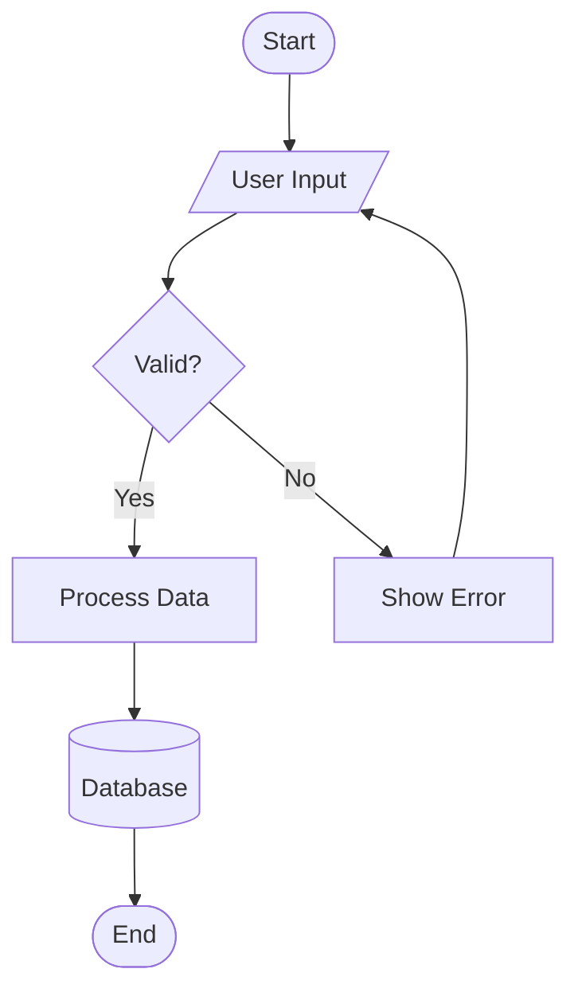

**Best Practices**:
- Use `([text])` for start/end (stadium shape)
- Use `{text}` for decisions (diamond)
- Use `[(text)]` for database (cylinder)
- Use `[/text/]` for input/output (parallelogram)
- Keep flows left-to-right or top-to-bottom
- Group related nodes with subgraphs
- Max 15-20 nodes for readability

**Anti-patterns**: Crossing lines (reorganize nodes), too many decision branches, mixing horizontal and vertical flows.

---

## 2. Sequence Diagram

**Best for**: API interactions, service communication, user workflows.

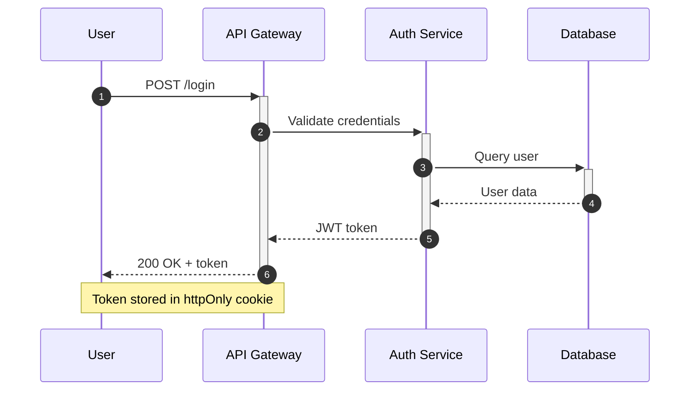

**Best Practices**:
- Use `autonumber` for step numbering
- Use `participant` aliases for long names
- `->>` for requests, `-->>` for responses
- `+/-` for activation/deactivation
- Add `Note over` for important context
- Keep to 5-7 participants max
- Show error paths with `alt/else`

Error path pattern:
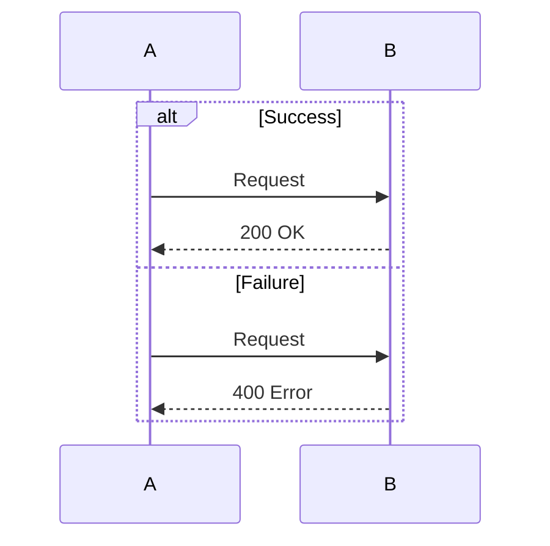

---

## 3. Class Diagram

**Best for**: Domain models, OOP design, type relationships.

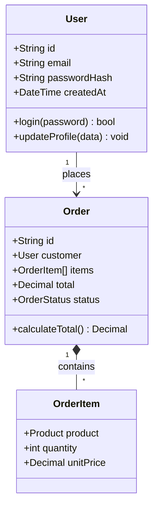

**Relationship notation**:
- `-->` association
- `--*` composition
- `--o` aggregation
- `--|>` inheritance
- `..|>` implementation
- Add cardinality: `"1"`, `"*"`, `"0..1"`

**Visibility**: `+` public, `-` private, `#` protected. Include key methods only, not all methods.

---

## 4. Entity Relationship Diagram (ERD)

**Best for**: Database schema, data modeling, table relationships.

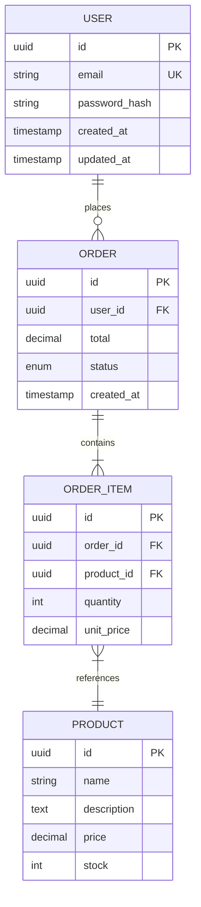

**Relationship notation**:
- `||--||` one-to-one
- `||--o{` one-to-many (optional)
- `||--|{` one-to-many (required)
- `}|--|{` many-to-many

**Best Practices**: Mark `PK`/`FK`/`UK`, include data types, show only important columns.

---

## 5. State Diagram

**Best for**: Finite state machines, order status, workflow states.

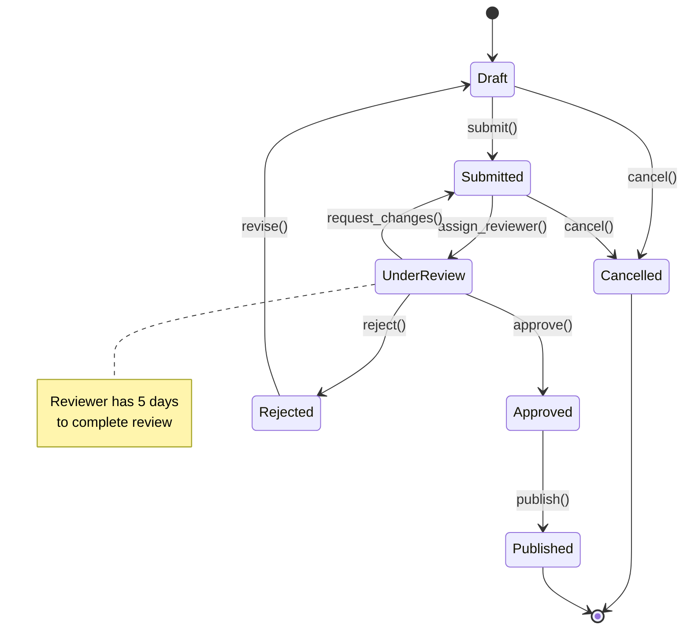

**Best Practices**: Use `[*]` for start/end states, label transitions with action names, add notes for business rules, keep to 7-10 states max, show all valid transitions.

---

## 6. C4 Context Diagram

**Best for**: System boundaries, external actors, high-level architecture.

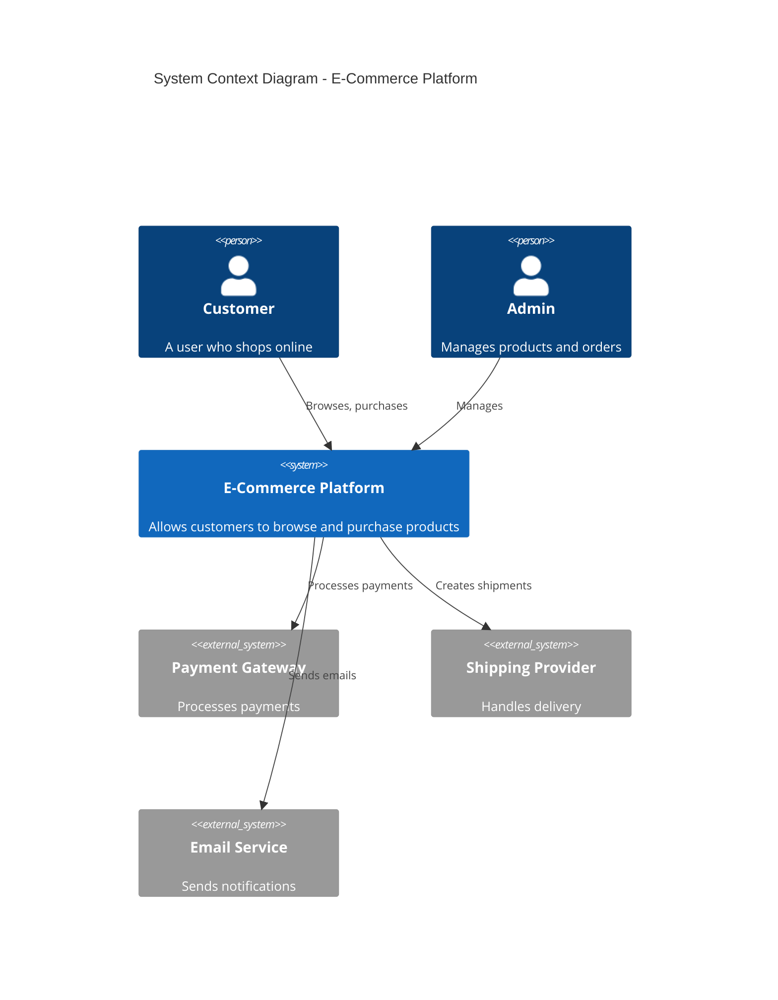

**Best Practices**: Focus on WHAT not HOW, show external systems and actors, use verb labels for relationships, limit to 5-10 elements.

---

## 7. C4 Container Diagram

**Best for**: Service architecture, deployment units, technology choices.

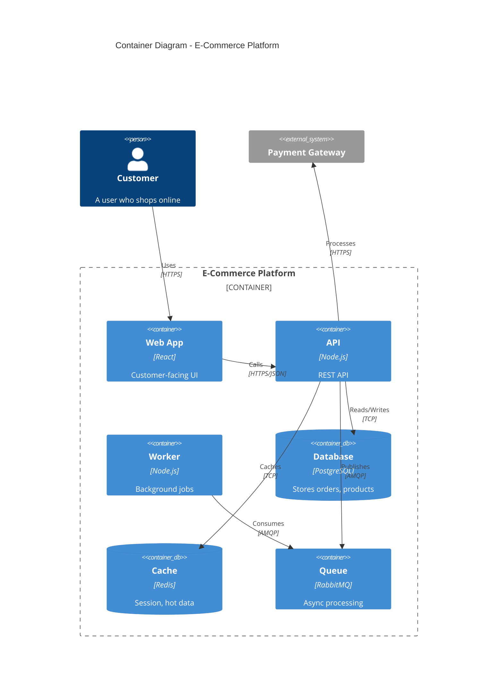

**Best Practices**: Show technology choices in descriptions, include data stores explicitly, label protocols on relationships, show async paths (queues, workers).

---

## 8. Git Graph

**Best for**: Branching strategy, release flow, merge history.

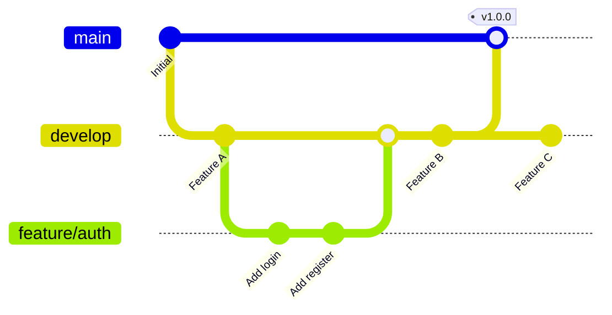

**Best Practices**: Show standard branches (main, develop, feature), use meaningful commit IDs, tag releases, keep history linear where possible.

---

## 9. Gantt Chart

**Best for**: Project timelines, sprint planning, milestones.

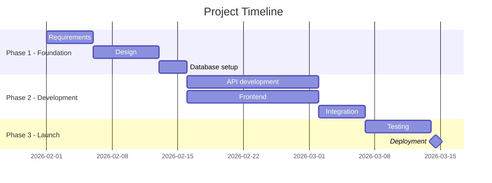

**Best Practices**: Use sections for phases, define dependencies with `after`, include milestones, keep to 2-4 week sprints for readability.

---

## 10. Pie Chart

**Best for**: Distribution, composition, percentages.

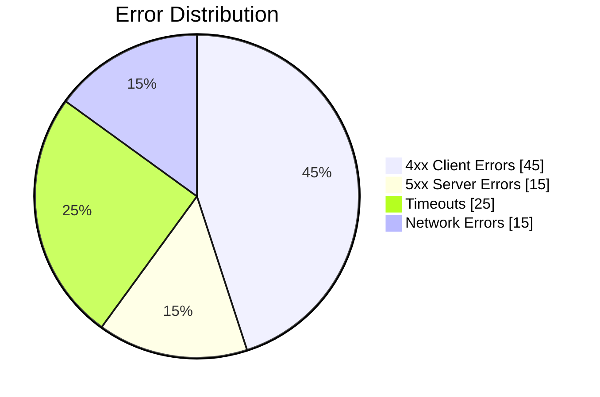

**Best Practices**: Use for 3-7 categories, order by size (largest first), use `showData` to display percentages, keep labels short.
