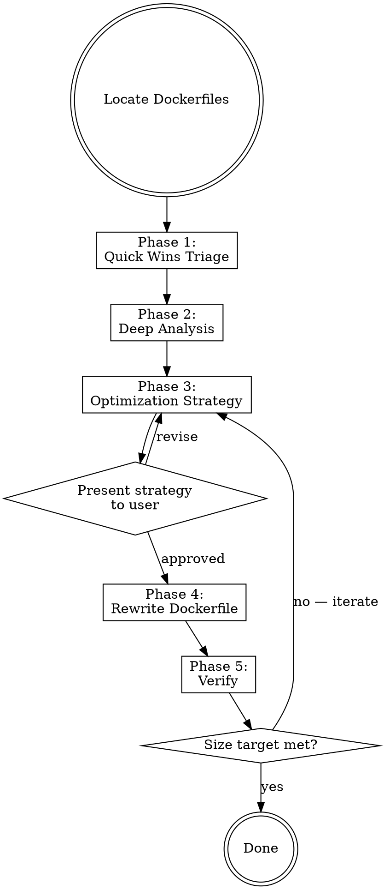

# Docker Image Slim

Systematically reduce Docker container image sizes without impacting functionality or performance. Every byte removed is an attack surface eliminated.

**Core principle**: Analyze before optimizing. Measure before and after. Verify nothing broke.

## Before You Start — Ask Yourself

1. **What is the current image size and what's the target?** Without a number, you can't measure success. Run `docker images` first.
2. **Is Docker CLI available in this environment?** Determines whether you can run live analysis (Phase 2a) or must rely on static Dockerfile analysis (Phase 2b).
3. **What language/framework does this Dockerfile target?** Each language has a SOTA optimization pattern — don't reinvent it. Check `resources/references/language-patterns.md`.
4. **What's the deployment target?** Kubernetes with liveness probes? ECS? Docker Compose? This affects base image choice (shell needed for debugging vs. minimal for security).

## HARD-GATE

<HARD-GATE>
Do NOT rewrite any Dockerfile before:
1. Phase 1 (Quick Wins Triage) identifies the top bloat sources
2. Phase 2 (Deep Analysis) quantifies layer sizes and wasted space
3. A size reduction strategy is presented and approved by the user
</HARD-GATE>

## Process Flow



## Phase 1: Quick Wins Triage

Check the three things that cause 80% of image bloat. Takes under 2 minutes.

1. **Wrong base image?**
   - Using `python:3.13` (1 GB) instead of `python:3.13-slim` (130 MB)?
   - Using `node:22` (1.1 GB) instead of `node:22-slim` (200 MB)?
   - Read `resources/references/base-image-matrix.md` for the full decision matrix

2. **Missing multi-stage build?**
   - Single `FROM` with build tools in the final image?
   - Compiler, SDK, dev headers present at runtime?

3. **Dev dependencies in production?**
   - `npm install` instead of `npm ci --omit=dev`?
   - `pip install -r requirements.txt` including test/dev packages?
   - No `.dockerignore` or a weak one?

Report quick wins immediately — these often deliver 50-80% size reduction alone.

## Phase 2: Deep Analysis

Quantify exactly where the bloat lives. Use available tools in priority order.

### If Docker CLI is available

```bash
# Layer-by-layer size breakdown
docker history --no-trunc --format "{{.Size}}\t{{.CreatedBy}}" IMAGE_NAME

# Interactive layer analysis (if dive is installed)
dive IMAGE_NAME --ci --highestWastedBytes 50MB --lowestEfficiency 0.9

# Docker Scout recommendations for smaller bases
docker scout recommendations IMAGE_NAME

# SBOM to identify unnecessary packages
docker sbom IMAGE_NAME --format spdx-json | jq '.packages | length'
```

### If Docker CLI is NOT available (static analysis)

Read the Dockerfile and analyze:
- Count `RUN` commands (each creates a layer)
- Identify packages installed but never used at runtime
- Check for missing cleanup (`rm -rf /var/lib/apt/lists/*`, `apk --no-cache`)
- Check `.dockerignore` coverage
- Identify files copied but unused in the final stage

Read `resources/references/analysis-commands.md` for complete tool reference.

### Output: Analysis Report

Present findings as a table:

```
| Layer / Source        | Size    | Verdict         |
|-----------------------|---------|-----------------|
| Base image            | XXX MB  | Oversized / OK  |
| Package install       | XXX MB  | Has dev deps    |
| Source copy            | XXX MB  | Missing ignore  |
| Build artifacts       | XXX MB  | Not multi-stage |
| Total                 | XXX MB  |                 |
| Estimated after slim  | XXX MB  | -XX% reduction  |
```

## Phase 3: Optimization Strategy

Build a ranked recommendation list. Order by size impact (highest first).

### Technique Priority (apply in this order)

| Priority | Technique | Typical Impact | Effort |
|----------|-----------|----------------|--------|
| 1 | Switch base image (slim/alpine/distroless/chainguard) | 40-90% | Low |
| 2 | Add multi-stage build | 50-80% | Medium |
| 3 | Remove dev dependencies | 20-50% | Low |
| 4 | Consolidate RUN layers + cleanup in same layer | 10-30% | Low |
| 5 | Optimize .dockerignore | 5-20% | Low |
| 6 | Language-specific patterns (uv, jlink, standalone, static binary) | 20-60% | Medium |
| 7 | Strip debug symbols / compress binaries (ldflags, UPX) | 10-30% | Low |
| 8 | Use BuildKit cache mounts (--mount=type=cache) | Build speed + no cache in layers | Low |
| 9 | DockerSlim/slim sensor-based minification | 80-97% | High |

### Language-Specific Guidance

Read `resources/references/language-patterns.md` for SOTA patterns per language:
- **Python**: uv + multi-stage + venv copy + Chainguard base → 50-60 MB
- **Node.js**: npm ci --omit=dev + standalone output + distroless → 80-130 MB
- **Go**: CGO_ENABLED=0 + ldflags -s -w + scratch → 6-15 MB
- **Rust**: cargo-chef + musl static + strip + scratch → 3-12 MB
- **Java**: jlink custom JRE or GraalVM native-image + distroless → 50-150 MB
- **.NET**: PublishTrimmed + AOT + Ubuntu Chiseled → 15-50 MB

### Base Image Decision

Read `resources/references/base-image-matrix.md` for the full matrix. Quick rules:
- **Go/Rust static binaries** → `scratch` (0 KB base)
- **Need zero CVEs + glibc** → Chainguard (`cgr.dev/chainguard/*`)
- **Need zero CVEs + small** → Google distroless (`gcr.io/distroless/*`)
- **Need shell + small** → Alpine 3.21 (~3.5 MB) — watch for musl issues
- **Need shell + glibc** → Debian slim (~27 MB) or Wolfi base (~6 MB)
- **.NET specifically** → Ubuntu Chiseled (~13 MB)

### Present Strategy

Before rewriting, present:
1. Current size and target size (with percentage reduction)
2. Ranked techniques to apply
3. Recommended base image with rationale
4. Any trade-offs (musl compatibility, no shell for debugging, build time)

Wait for user approval before Phase 4.

## Phase 4: Rewrite Dockerfile

Apply approved optimizations. Follow these principles:

### Multi-Stage Build Structure
```
Stage 1 (builder): Full SDK/tools → compile, build, install
Stage 2 (deps):    Production dependencies only (optional)
Stage 3 (runtime): Minimal base → copy only artifacts needed
```

### Layer Optimization Rules
- Combine related `RUN` commands with `&&` or heredoc syntax
- Clean package manager caches in the SAME `RUN` layer as install
- Order layers from least-changing (base, deps) to most-changing (source code)
- Use `--mount=type=cache` for package managers (pip, npm, cargo, gradle)
- Use `--mount=type=secret` for private registry credentials

### Security Baseline (free size wins)
- `USER nonroot` — non-root execution; without it, an attacker exploiting an app vulnerability lands as UID 0 with access to `/proc/1/environ` (all runtime secrets)
- `HEALTHCHECK` — without it, orchestrators consider the container healthy as long as PID 1 runs; a deadlocked app serves zero requests but never restarts
- No secrets in layers — use `--mount=type=secret`; even a subsequent `RUN rm .env` leaves the secret in the earlier layer, extractable via `docker save`

### .dockerignore Thinking Framework

Instead of copying a generic template, audit your specific build context:

1. Run `du -sh * .git` in your project root — find the largest offenders
2. For each entry in the build context, ask: "Is this file referenced by any COPY instruction in the final stage?"
3. If no — add it to `.dockerignore`
4. **Critical entries that must always be ignored**: `.git/` (often 100+ MB), `.env*` (secrets leak into layers), `node_modules/` (platform mismatch + dev deps)
5. Verify: `docker build` should show "Sending build context" at < 10 MB for most projects

## Phase 5: Verify

Every optimization must be verified. No "should work" — evidence only.

### Size Comparison
```bash
# Before
docker images --format "{{.Repository}}:{{.Tag}} {{.Size}}" | grep IMAGE_NAME

# Build optimized
docker build -t IMAGE_NAME:slim .

# After
docker images --format "{{.Repository}}:{{.Tag}} {{.Size}}" | grep IMAGE_NAME

# Layer analysis of result
docker history IMAGE_NAME:slim
```

### Functionality Smoke Test
```bash
# Start container
docker run -d --name slim-test IMAGE_NAME:slim

# Health check (adjust for your app)
docker exec slim-test curl -sf http://localhost:PORT/health || echo "HEALTH CHECK FAILED"

# Check logs for errors
docker logs slim-test 2>&1 | grep -i "error\|exception\|fatal"

# Cleanup
docker stop slim-test && docker rm slim-test
```

### No-Regression Checklist

- [ ] Container starts without errors
- [ ] Health endpoint responds (if applicable)
- [ ] No error/exception in startup logs
- [ ] Application serves requests correctly
- [ ] Build time is acceptable (< 2x increase is OK for large size savings)
- [ ] All existing CI tests pass against the new image

### Final Report

```
## Docker Slim Results

| Metric          | Before     | After      | Delta      |
|-----------------|------------|------------|------------|
| Image size      | XXX MB     | XXX MB     | -XX% ✅    |
| Layer count     | XX         | XX         | -XX        |
| CVE count       | XX         | XX         | -XX ✅     |
| Build time      | XXs        | XXs        | +/-XXs     |
| Startup time    | XXs        | XXs        | +/-XXs     |

### Changes Applied
1. ...
2. ...

### Verification
- [x] Container starts: PASS
- [x] Health check: PASS
- [x] No errors in logs: PASS
- [x] Tests pass: PASS
```

## Size Targets (SOTA 2025)

| Language/Framework | Achievable Target | Approach |
|--------------------|-------------------|----------|
| Go HTTP service | 6-15 MB | scratch + ldflags -s -w |
| Rust HTTP service | 5-12 MB | musl static + scratch + strip |
| .NET API (AOT) | 15-30 MB | Native AOT + Ubuntu Chiseled |
| Java Spring Boot | 50-80 MB | GraalVM native + distroless |
| Python FastAPI | 50-70 MB | uv + Chainguard python |
| Node.js API | 80-130 MB | npm ci --omit=dev + distroless |
| Next.js | 100-160 MB | standalone output + Alpine |
| Static frontend | 5-15 MB | nginx-alpine + build artifacts only |

## When Stuck

| Problem | Action |
|---------|--------|
| Image barely shrinks after multi-stage | Run `dive` — hidden layers or large COPY |
| musl compatibility breaks Python packages | Switch Alpine → Chainguard (glibc-based, still small) |
| App crashes on distroless (no shell) | Use `:debug` variant to diagnose, then fix imports/paths |
| Build time exploded | Add `--mount=type=cache` for package managers |
| Can't identify what's large | `docker history --no-trunc` + sort by size |
| User needs shell access | Alpine or Wolfi instead of scratch/distroless |

## NEVER

- **NEVER** rewrite a Dockerfile without first analyzing the current image — blind rewrites miss the actual bloat sources and often produce images that are larger than targeted because the real offender (e.g., a baked-in ML model or build cache) was never identified
- **NEVER** claim a size reduction without running `docker images` to show before/after evidence — "should be smaller" is not evidence; unverified claims ship broken containers to production
- **NEVER** optimize for size at the cost of broken functionality — a 50 MB image that crashes on startup costs more than a 200 MB image that works; always run the smoke test before declaring success
- **NEVER** recommend `scratch` for interpreted languages (Python, Node.js, Ruby) — scratch contains no runtime, no libc, no dynamic linker; the container will exit immediately with "exec format error" or "not found"
- **NEVER** clean package manager caches in a separate `RUN` layer — Docker layers are additive and immutable; `RUN rm -rf /var/lib/apt/lists/*` in a new layer hides the files from the filesystem view but the bytes remain in the previous layer, adding to total image size
- **NEVER** separate `apt-get update` from `apt-get install` into different layers — Docker caches by command string, so a cached `update` layer may contain month-old package indexes pointing to versions that no longer exist on mirrors, causing intermittent 404 build failures or silently installing CVE-vulnerable packages
- **NEVER** place frequently-changing `ARG` declarations (like `GIT_COMMIT`) before expensive `RUN` layers — ARG value changes invalidate cache from the declaration point onward, not from first usage; a changed commit hash will force a full `apt-get install` rebuild every build
- **NEVER** `COPY . /app` before installing dependencies — any file change (even a README edit) invalidates the COPY cache checksum, cascading into a full dependency reinstall; always COPY dependency manifests first (`package.json`, `requirements.txt`, `go.mod`), install, then COPY source
- **NEVER** use `FROM image:latest` in production Dockerfiles — `latest` is a mutable tag that silently shifts between major versions; a Monday build may use Node 20 while Wednesday's uses Node 22, causing untraceable behavioral changes with no diff in the Dockerfile
- **NEVER** extract compressed archives inside the image without removing the archive in the same layer — both the `.tar.gz` and the extracted files persist in separate layers, doubling the space; use `COPY --from` a builder stage or `ADD` (which auto-extracts) instead

## Reference Files

| File (~lines) | Load when | Do NOT load when |
|---------------|-----------|-----------------|
| `resources/references/language-patterns.md` (~360) | Dockerfile targets a specific language (Python, Node, Go, Rust, Java, .NET) | Language is not covered or optimization is base-image-only |
| `resources/references/base-image-matrix.md` (~85) | Choosing a runtime base image; comparing size/CVE/shell trade-offs | Base image is already decided and approved by user |
| `resources/references/analysis-commands.md` (~255) | Running Phase 2 deep analysis; need tool commands and interpretation | Docker CLI is confirmed unavailable AND doing static analysis only |
