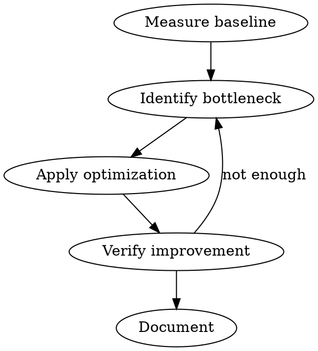

# AICodePath DX Optimizer — Make Development Fast

## Overview

Reduce friction in the developer feedback loop. Measure baselines, identify bottlenecks, apply targeted optimizations, and verify improvements.

The goal is fast iteration: short builds, instant HMR, fast tests, responsive IDE.

## Targets

| Metric | Target | Critical |
|--------|--------|----------|
| Cold build time | < 30s | < 60s |
| Incremental rebuild | < 5s | < 10s |
| HMR latency | < 100ms | < 300ms |
| Test suite (unit) | < 2 min | < 5 min |
| IDE indexing time | < 30s | < 60s |
| CI pipeline | < 10 min | < 20 min |

## Process



### Step 1: Measure Baseline

Before changing anything, measure current state:

```bash
# Build time
time npm run build

# Test time
time npm test

# Bundle size
npm run build -- --stats > stats.json && du -sh dist/

# Cold start vs warm
rm -rf node_modules/.cache && time npm run build  # cold
time npm run build  # warm
```

Record baseline numbers in `aicodepath-docs/dx-baseline.md` for comparison.

### Step 2: Identify Bottleneck

Common bottlenecks by area:

**Builds**:
- No incremental compilation
- Missing build cache
- Unused dependencies inflating bundles
- TypeScript `noEmit` slow due to large project graph
- Webpack/Vite plugins running synchronously

**HMR**:
- Full page reload instead of module replacement
- HMR boundaries too coarse (wrapping too much code)
- Source maps causing slow updates
- Watch ignoring not configured

**Tests**:
- Sequential test execution (no parallelization)
- Expensive setup/teardown per test (use fixtures)
- Database operations in unit tests (mock at boundary)
- Snapshot tests with massive snapshots

**IDE**:
- TypeScript project too large (split into project references)
- ESLint running on save with slow rules
- Indexing entire `node_modules` (configure exclusions)
- Too many open editor extensions

**Monorepo**:
- No task caching (use Nx, Turbo, or pnpm workspace cache)
- Missing affected detection (running all tests on every change)
- No remote cache for CI

### Step 3: Apply Optimization

Match optimization to bottleneck. Examples:

**Build optimization**:
```bash
# Vite: enable build cache
# vite.config.ts → build.target, esbuild minification

# Webpack: enable persistent cache
# webpack.config.js → cache: { type: 'filesystem' }

# TypeScript: incremental + project references
# tsconfig.json → "incremental": true, "composite": true

# Swap slow loaders for native (e.g., babel → swc)
```

**HMR optimization**:
```bash
# Reduce HMR scope: smaller modules = faster updates
# Configure HMR boundaries via export const config / acceptedCallback
# Disable source maps in dev for faster updates
```

**Test optimization**:
```bash
# Vitest: enable parallel execution (default)
# vitest.config.ts → test.pool: 'threads', test.poolOptions.threads.minThreads

# Jest: enable parallel + cache
# jest.config.js → maxWorkers, cache: true

# Use fixture sharing (vitest test.extend)
# Mock heavy modules at module boundary, not function level
```

**IDE optimization**:
```bash
# tsconfig.json: split into project references
# Add .vscode/settings.json: typescript.tsserver.maxTsServerMemory: 4096
# Configure files.watcherExclude for node_modules
```

**Monorepo optimization**:
```bash
# Add Turborepo or Nx for task caching
# turbo.json → pipeline with cache outputs
# Enable remote cache in CI (turborepo cloud / nx cloud)
```

### Step 4: Verify Improvement

Re-run the same measurements from Step 1. Calculate delta:

```
Cold build:    62s → 18s    (-71%)  ✓ TARGET MET
Incremental:    4s →  2s    (-50%)  ✓ TARGET MET
HMR:          800ms → 80ms  (-90%)  ✓ TARGET MET
```

If target not met, return to Step 2 with new bottleneck identification.

### Step 5: Document

Add findings to `aicodepath-docs/dx-improvements.md`:
- What was slow (with measurements)
- Root cause (which dependency / config / pattern)
- Fix applied (with config diff)
- Result (delta from baseline)

This builds a knowledge base for future optimization sessions.

## Common Wins (Quick Reference)

| Pain | Quick Win |
|------|-----------|
| Slow Webpack builds | Migrate to Vite or Rspack |
| Slow Babel transforms | Switch to SWC or esbuild |
| Slow TypeScript checking | Enable `incremental: true` + project references |
| Slow Jest tests | Enable parallel + reduce setup overhead + cache |
| Slow ESLint | Use `--cache` flag and exclude `node_modules` |
| Slow CI | Add Turborepo/Nx with remote cache |
| Slow HMR | Reduce HMR boundary scope, disable source maps in dev |
| Slow IDE | Split tsconfig into project references, exclude `node_modules` from watcher |

## Anti-Patterns

- **"Just upgrade to the latest version"** — measure first, version bumps can regress
- **"Add more parallelism"** — diminishing returns, often I/O bound not CPU bound
- **"Disable type checking"** — solves the symptom but creates worse problems
- **"Add more caching layers"** — cache invalidation bugs are harder than slow builds

## Quality Checklist
- Baseline measurements recorded before changes
- Bottleneck identified with specific evidence (profile, log, metric)
- Optimization targets exact bottleneck (not speculative)
- Improvement verified with same measurement methodology
- Findings documented for future reference

## Integration with AICodePath

- **`aicodepath-benchmark`**: Use for before/after measurement of specific changes
- **`aicodepath-performance-engineer`**: For runtime performance (vs build/test performance)
- **`aicodepath-ci-fixer`**: When pipeline failures correlate with slowness
- **`aicodepath-cost-optimizer`**: When CI compute costs are also a concern
