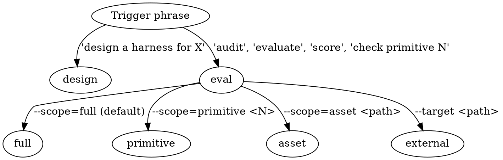

# AICodePath Harness Evaluator

Two modes (Design / Evaluate), four evaluation scopes, backed by a verified source map from Claude Code v2.1.88. This skill exists because eyeballing a framework against a 12-point checklist produces drift; running the same deterministic checks against the same rubric produces verdicts you can trust across versions and contributors.

**Framework attribution**: the 12 primitives are from Nate B. Jones' public Prompt Kit at `promptkit.natebjones.com/20260331_6yc_promptkit_1` (companion to YouTube video `FtCdYhspm7w`). Primitive names, tier assignments, and Claude Code anchors are all verified — see `references/primitives.md` for the full spec sheet.

---

## Reference files — load on demand

| File | When to load |
|---|---|
| `references/primitives.md` | Always load first in Evaluate Mode (the 12 primitives × bar × search hints × CC anchors) |
| `references/cc-source-map.md` | When you need the specific Claude Code file/symbol for a primitive |
| `references/eval-rubric.md` | When assigning PASS / PARTIAL / MISSING / EXCEEDS verdicts — now includes `rubricVersion` frontmatter field that gates fixture re-pinning |
| `references/design-templates.md` | Only in Design Mode — 5 product-type templates (A–E) with sequencing rationale |
| `references/golden-verdicts/<target>.json` | Loaded automatically by `scripts/render-report.js` during Evaluate Mode (full scope) — the pinned baseline for drift analysis. Do not load directly; the renderer handles it. |

**Do not read all four files at start**. Load `primitives.md` first, then pull others as needed. Progressive disclosure keeps the context budget honest.

---

## Mode selection



- **Design Mode**: user wants a new harness plan. Output: markdown design doc at `aicodepath-docs/harness-design/<product-type>.md`.
- **Evaluate Mode**: user wants verdicts on an existing harness. Output: markdown report at `<target>/aicodepath-docs/harness-eval/<timestamp>-<mode>.md`, or at the home `aicodepath-tool/aicodepath-docs/harness-eval/` if the target has no such directory.

---

## Design Mode

### Step 1 — Identify the product type
Ask the user what they are building. Map their answer to one of the 5 templates in `references/design-templates.md`:

| Template | Product type |
|---|---|
| A | Coding agent (writes/edits files) |
| B | Conversational assistant (chat only) |
| C | Autonomous research agent (long-running, multi-step) |
| D | Scheduled task runner (cron, unattended) |
| E | Multi-agent swarm (parallel workers + coordinator) |

If the answer doesn't fit any template cleanly, compose from multiple. Never invent new primitives — stick to Nate's 12 and sequence them.

### Step 2 — Read the matching template
Load `references/design-templates.md` and find the template section. Use its Day One / Week One / Month One breakdown as the spine of your plan.

### Step 3 — Adapt rationale to the specific product
For each primitive in the template, write the "Why for this product" column specific to what the user described. Don't copy-paste the template's generic rationale — the value is in the adaptation.

### Step 4 — Cite Claude Code anchors
For every primitive proposed, cite the CC source file from `references/cc-source-map.md`. The user must be able to read the canonical implementation. A design without references is speculation.

### Step 5 — Write the design doc
Output to `aicodepath-docs/harness-design/<product-type-slug>.md` using the structure documented in `references/design-templates.md`. Include risks-if-you-skip for each tier.

### Step 6 — Sequence explicitly
Never propose all 12 as Day One. Sequencing IS the plan. The universal minimum is 5 primitives (#1 + #3 + #5 + #6 + #7). The product type decides which of the other 7 are Day One vs Week One vs Month One.

---

## Evaluate Mode — shared flow

All four evaluate scopes share this flow. The scope only changes which checks run and how results are rendered.

### Step E1 — Determine target and scope
Parse flags from the invocation:
- `--scope=full` (default) → whole-framework audit
- `--scope=primitive <id>` → single primitive deep-dive across the target
- `--scope=asset <file-path>` → single file, only applicable primitives
- `--target <dir>` → evaluate an external directory instead of `aicodepath-tool` itself (can combine with any scope)

If no `--target` is given, default to the current working directory.

### Step E2 — Load `references/primitives.md`
Read it in full at the start of every evaluate run. The file is the authoritative spec sheet — don't paraphrase the primitives from memory.

### Step E3 — Run the deterministic checks
The `scripts/check-primitives.js` file collects evidence for each primitive (files matching known patterns, grep hits for key symbols, counts of agent/skill files). It does NOT assign verdicts. Run it like:

```bash
node .aicodepath/skills/aicodepath-harness-eval/scripts/check-primitives.js <target> --json > /tmp/harness-evidence.json
```

For primitive scope:
```bash
node .aicodepath/skills/aicodepath-harness-eval/scripts/check-primitives.js <target> --primitive 11 --json
```

For asset scope, first run the applicability matcher:
```bash
node .aicodepath/skills/aicodepath-harness-eval/scripts/check-asset.js <file-path> --json
```
The matcher returns the subset of primitive IDs that apply to that file. Then run `check-primitives.js` only for those IDs.

### Step E4 — Apply the rubric
For each primitive in the evidence JSON:
1. Read the `bar for PASS` row in `references/primitives.md`
2. Compare the collected evidence against the bar
3. Assign `PASS`, `PARTIAL`, `MISSING`, or `EXCEEDS` per the decision tree in `references/eval-rubric.md`
4. Write a 1–2 sentence verdict reasoning note

**Critical**: if a primitive has no evidence in the JSON, do NOT immediately verdict MISSING. Re-check synonyms first (see `eval-rubric.md` § Anti-patterns). The first-pass analysis of aicodepath-tool marked #11 as FAIL because the audit table was named `permission_audit` not `permission_ledger`. A literal grep misses functional equivalents.

### Step E5 — Identify gaps and tier remediation
For each PARTIAL or MISSING verdict, propose a remediation ranked by tier:
- **Tier 1**: missing entirely, highest leverage. Build first.
- **Tier 2**: weak version exists, needs strengthening.
- **Tier 3**: adequate via delegation to the host runtime; document it so new contributors don't reimplement.

For each remediation, write a 2–3 sentence implementation sketch that cites the CC anchor as the pattern to copy.

### Step E6 — Render the report
Build the verdict JSON structure documented at the top of `scripts/render-report.js`. Then pipe it through the renderer:

```bash
echo '<verdict-json>' | node .aicodepath/skills/aicodepath-harness-eval/scripts/render-report.js --verdict-stdin -o <out-path>
```

Output path rules:
- `--target` absent → `aicodepath-docs/harness-eval/<ISO-timestamp>-<mode>.md` in the home project
- `--target` present and target has `aicodepath-docs/` → `<target>/aicodepath-docs/harness-eval/<ISO-timestamp>-<mode>.md`
- `--target` present and target has no `aicodepath-docs/` → fall back to home project output path

### Step E7 — Drift Analysis Against Golden Fixture

When the renderer runs (any scope), it automatically loads the golden fixture at `references/golden-verdicts/<target>.json` (if present) and produces a **Drift Analysis** section at the bottom of the report. No manual comparison against hardcoded numbers — the fixture is the single source of truth for the pinned baseline and the invariants that must hold.

The fixture records four things the drift analysis uses:
1. **Codebase signature** — git SHA + branch + aicodepath version at pin time
2. **Rubric version** — which version of `eval-rubric.md` the fixture was pinned against
3. **Expected verdicts** — one entry per primitive with rationale
4. **Invariants** — stricter-than-counts assertions (e.g., primitive 11 must remain EXCEEDS even if counts match)

The drift analysis classifies the run into one of four cases and recommends an action for each:

| Drift case | Meaning | Action |
|---|---|---|
| ✅ **Clean** | Rubric version, gitSha, and all verdicts match the fixture | Baseline confirmed. No action. |
| 📐 **Rubric Evolved** | Rubric version on disk differs from pinned rubric version | Legitimate policy change. Review `eval-rubric.md` changelog, then re-pin via `--pin-baseline` if the new verdicts are correct under the new rubric. |
| 🔄 **Codebase Changed** | gitSha differs but rubric version matches | Review per-primitive diff. Progress (PARTIAL → PASS) is good; regression (PASS → PARTIAL, or anything → MISSING) needs investigation before re-pinning. |
| ⚠ **Check Script Regression** | Rubric and gitSha both match but verdicts differ | BUG. Investigate `check-primitives.js` or rubric-application logic. Do NOT re-pin — fix the bug first. |

**Invariants** are the second line of defense. They catch regressions that a count-based check misses. Example: if primitive 11 silently drops from EXCEEDS to PASS, the strong/partial/missing counts don't change, but `inv-11-exceeds` fires and flags the downgrade. The four standard invariants in every fresh fixture are:
- `inv-11-exceeds` — primitive 11 must stay EXCEEDS (the persistent SQL audit ledger is the canonical proof of exceeding Claude Code)
- `inv-no-missing` — zero primitives may verdict MISSING
- `inv-day-one-all-passing` — primitives 1-8 may never verdict MISSING
- `inv-total-is-12` — the rubric must cover exactly 12 primitives

#### Re-pinning the fixture

Use `--pin-baseline` when the current verdict should become the new baseline:

```bash
node .aicodepath/skills/aicodepath-harness-eval/scripts/render-report.js --pin-baseline <verdict.json>
```

This is an atomic operation that:
1. Reads the current verdict JSON
2. Computes a fresh codebase signature (git SHA + branch + version)
3. Preserves existing invariants from the previous fixture (if any) — only updates verdicts, summary, and signature
4. Writes the new fixture atomically (temp file + rename) to `references/golden-verdicts/<target>.json`
5. Prints a diff of what changed so the re-pin is reviewable

**When re-pinning is appropriate**:
- After a legitimate rubric version bump (bump `eval-rubric.md` frontmatter first, THEN re-pin)
- After intentional codebase changes that shifted a verdict in the right direction
- Never as a quick way to silence a failing drift check — that defeats the entire architecture

**When re-pinning is wrong**:
- Check Script Regression case: fix the bug, don't rewrite the fixture around it
- Invariant failure: never re-pin until the invariant is understood and either fixed or deliberately relaxed (with rubric version bump)
- Any case you don't understand yet: investigate first

---

## Asset Mode — when to auto-invoke

The asset scope exists for authoring discipline: use it to verify a newly created hook/agent/skill satisfies the primitives applicable to it before commit.

**Proactive triggers**: after `/aicodepath-hook-creator`, `/aicodepath-agent-creator`, or `/aicodepath-skill-creator` creates or modifies a file, invoke this skill with `evaluate --scope=asset <new-file>`. Do not wait for the user to ask.

**Asset mode flow**:
1. Run `check-asset.js <file>` to get the subset of applicable primitive IDs
2. For each applicable ID, run `check-primitives.js <project-root> --primitive <id>` against the whole project (a new permission hook interacts with existing permission tables, so we still need project-wide evidence — not just evidence in the single file)
3. Apply the rubric per Step E4
4. Render a short asset report (no full verdict table — only the applicable rows)

---

## External Mode — when to use

Use `--target <path>` to evaluate another framework with the same rubric. Examples:
- `evaluate --target ~/workspace/claude-code-source-code/` → compare aicodepath-tool's ancestor against itself (reality check on the CC reference anchors)
- `evaluate --target ~/workspace/some-user-project/` → audit a user's codebase
- `evaluate --target ~/workspace/competing-framework/` → benchmark a competitor

When running external mode, the check scripts search the target's own directory tree. The rubric is still derived from Claude Code. A target written in Python (e.g., smolagents) will need `byExt` in `check-primitives.js` extended with `.py` — flag this to the user if you see no evidence at all in a non-Node codebase, rather than falsely verdicting MISSING across the board.

---

## Hard rules

- **Never** assign MISSING without running the Anti-patterns re-check in `references/eval-rubric.md`. The literal-grep failure mode is real and produced a completely wrong verdict table in the first draft analysis.
- **Never** cite a Claude Code anchor you haven't seen before in `references/cc-source-map.md`. If the map doesn't have it, either add it with a file:symbol verified by reading the source, or say "no reference available" in the verdict note.
- **Never** declare a full-scope verdict without reading `references/primitives.md` and `references/eval-rubric.md` in the same run. The rubric exists because the bars are easy to get wrong; trust it over memory.
- **Never** propose Month One items before Day One is verdicted PASS or above. Month One is explicitly not part of the 12.
- **Never** invent new primitives. If a target does something interesting that none of the 12 cover, that's a finding for the user to discuss — not a reason to extend the list.
- **Never** modify files in the target while in Evaluate Mode. This skill is read-only against its target. Remediations are suggestions written to the report, not applied automatically.
- **Never** skip the drift analysis step when running full scope. Drift detection matters more than a clean report.
- **Never** accept a failing drift check by silently re-pinning the baseline. The whole architecture exists to make drift visible and deliberate. If drift is detected, investigate the cause BEFORE re-pinning.
- **Never** re-pin a baseline without first investigating which drift case fired. Rubric-evolved = legitimate after review. Codebase-changed = review per-primitive diff. Check-script-regression = bug, fix the script not the fixture.
- **Never** bump `rubricVersion` in `eval-rubric.md` without re-running the full eval against aicodepath-tool and updating the golden fixture via `--pin-baseline`. The rubric and the fixture are coupled by version number.

---

## Output format summary

| Mode | Output path |
|---|---|
| Design | `aicodepath-docs/harness-design/<product-slug>.md` |
| Evaluate (full) | `<target>/aicodepath-docs/harness-eval/<timestamp>-full.md` |
| Evaluate (primitive N) | `<target>/aicodepath-docs/harness-eval/<timestamp>-primitive-<N>.md` |
| Evaluate (asset) | `<target>/aicodepath-docs/harness-eval/<timestamp>-asset-<filename>.md` |
| Evaluate (external) | `<target>/aicodepath-docs/harness-eval/<timestamp>-full.md` (falls back to home if target has no aicodepath-docs/) |

All report files end with a `## Drift Analysis` section classifying the run into one of four cases (Clean / Rubric Evolved / Codebase Changed / Check Script Regression) and running the fixture's invariants. All report files cite CC anchors from `references/cc-source-map.md` for every verdict.

---

## See also

- `references/primitives.md` — the 12-primitive spec sheet
- `references/cc-source-map.md` — Claude Code v2.1.88 anchors
- `references/eval-rubric.md` — verdict decision tree + anti-patterns
- `references/design-templates.md` — 5 product-type templates
- `scripts/check-primitives.js` — evidence collector (no verdicts)
- `scripts/check-asset.js` — asset-mode applicability matcher
- `scripts/render-report.js` — markdown report renderer with fixture-driven drift analysis and `--pin-baseline` CLI
- `references/golden-verdicts/aicodepath-tool.json` — pinned baseline fixture for the self-audit smoke test
- `/aicodepath-classify-component` — upstream skill that identifies which specialist agents apply to a feature (useful in Design Mode Step 3)
- `/aicodepath-verify` — downstream skill that verifies an implementation before "done" (complementary to primitive #8)
