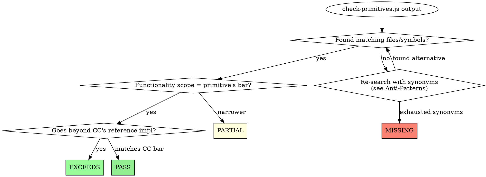

<!--
RUBRIC VERSIONING POLICY

Any edit to the verdict bar in this file MUST bump rubricVersion.

Bump rules:
- MAJOR (2.0.0): breaking change — a primitive's bar is fundamentally redefined, existing fixtures become invalid
- MINOR (1.1.0): additive — a new acceptable form added to an existing bar (e.g., accepting "unique constraint" as valid idempotency), OR a new anti-pattern added, OR a new per-primitive row added
- PATCH (1.0.1): wording clarification that does not change which implementations pass

After bumping:
1. Update lastBarChange and changedBy fields above
2. Re-run full-scope eval against aicodepath-tool to generate a new verdict
3. If verdicts change, update references/golden-verdicts/aicodepath-tool.json:
   - Set rubricVersion to the new version
   - Update pinnedAt timestamp
   - Update pinnedBy with the reason for re-pinning
   - Update any expectedVerdicts that changed
4. Document the change in aicodepath-docs/harness-eval/CHANGELOG.md (create if missing)

Silent edits that do not bump the version are prohibited — they cause the kind of hidden drift this architecture exists to prevent.
-->

# Verdict Rubric

How to assign PASS / PARTIAL / MISSING / EXCEEDS to each primitive when running Evaluation Mode.

## Verdict definitions

| Verdict | Meaning |
|---|---|
| **EXCEEDS** | Target implements the primitive AND adds capabilities Claude Code's reference implementation does not have. Example: aicodepath-tool's `permission-manager.js` has a persistent SQL audit table; Claude Code's `denialTracking.ts` is in-memory only. |
| **PASS** | Target has a functional equivalent of the primitive. Does not need to match Claude Code's filenames or APIs — only the same behavior. |
| **PARTIAL** | Target has some functionality but it is scoped narrower than the primitive demands, OR matches Claude Code's pattern only because Claude Code itself implements the primitive narrowly. |
| **MISSING** | No functional equivalent found anywhere in the target. Be careful with this verdict — re-search with synonyms before declaring MISSING (see Anti-Patterns below). |

## Decision tree

## Per-primitive bar

Use these as the minimum bar for PASS. Anything narrower is PARTIAL; anything broader is EXCEEDS.

| # | Primitive | Bar for PASS |
|---|---|---|
| 1 | Tool Registry Metadata-First | Tools/skills/agents discoverable via static metadata (frontmatter, static array, manifest file) without running the LLM |
| 2 | Permission Trust Tiers | At least 3 distinct decision tiers (e.g., allow/deny/ask) AND at least one classifier or rule engine that maps tools to tiers |
| 3 | Session Persistence | Session state survives process exit (file or DB), can be resumed after crash |
| 4 | Workflow State + Idempotency | Workflow state separated from chat state AND a guard preventing duplicate side effects in retry/resume paths (terminal-state guard, unique constraint, OR idempotency key) |
| 5 | Token Budget | Token consumption tracked per turn AND a continuation/stop decision based on a configured threshold |
| 6 | Structured Streaming Events | Typed events (not raw strings) emitted on state transitions AND consumable by something other than the chat UI |
| 7 | System Event Logger | Structured logger separate from chat transcript that records "what the harness did" (tool use, hook fires, decisions) |
| 8 | Basic Verification Harness | Runtime checks on model output against expected shape OR a separate verify/eval skill that can be invoked before declaring done |
| 9 | Tool Pool Assembly | Not all tools shown on every prompt — at least one mechanism (lazy loading, classification, MCP on-demand) for selecting subsets |
| 10 | Transcript Compaction | Either own compactor OR explicit integration with the host's compaction (e.g., PreCompact hook with checkpoint+preserve logic) |
| 11 | Permission Audit Trail | Some record of permission decisions that survives the current turn (in-memory counter is the CC bar; persistent ledger is EXCEEDS) |
| 12a | Doctor | Diagnostic command/skill/screen the user can run to check harness health |
| 12b | Staged Boot | Boot proceeds through ordered stages with the ability to fail-fast and report which stage broke |
| 12c | Stop Reason Taxonomy | Stop/halt events carry a reason field, even if free-text (CC bar). Enum-constrained reasons EXCEEDS. |
| 12d | Provenance-Aware Context | Memory entries carry origin metadata (timestamp, source, confidence, etc.) AND the harness uses that metadata to warn about staleness or weight relevance |

## Anti-patterns to avoid

These produced false MISSING verdicts in the first-pass analysis of aicodepath-tool. Reading this list before assigning MISSING saves wasted recommendations.

1. **Literal-name grep**: searching for `permission_ledger` returns nothing in aicodepath-tool, but `permission_audit` exists at `hooks/lib/permission-manager.js:91`. Always search with synonyms: `*_ledger`, `*_audit`, `*_log`, `*_trail`, `*_history`.

2. **Skipping `lib/` subdirs**: `hooks/lib/permission-manager.js` is the audit trail, not `hooks/permission-manager.js`. Always check `*/lib/` subdirectories.

3. **Skipping skill body files**: some primitives are implemented as instructional content in `SKILL.md` files (e.g., `aicodepath-learn` defines an 11-field provenance schema in markdown, not code). Read SKILL.md bodies for relevant primitives.

4. **Skipping migration files**: SQL tables are often defined in `db/migrations/*.sql`, not `db/schema.sql`. Always grep both.

5. **Skipping separate DBs**: aicodepath-tool's permission audit is in `aicodepath-docs/permissions.db`, NOT the main DB. Look for any `new Database(...)` instantiations with non-default paths.

6. **Confusing "matches CC's narrow pattern" with "PARTIAL"**: if Claude Code itself only implements a primitive narrowly, the bar IS narrow. Don't downgrade a target to PARTIAL just because the primitive name sounds bigger than CC's actual implementation. Read CC's source first.

7. **Trusting MEMORY.md counts**: MEMORY.md may be weeks old. Always re-count via `awk` or `grep -c` against current files when reporting numbers.

## Evidence requirements

Every verdict in the report must cite at least one of:
- A file path with line number (e.g., `hooks/lib/permission-manager.js:91`)
- A type/function/class name with file (e.g., `BudgetTracker in query/tokenBudget.ts`)
- A SQL table or column name with the file that creates it
- A skill body section with file path

A verdict without evidence is speculation. Re-research before reporting.

## Smoke test target

Running Eval Mode against `aicodepath-tool` itself should produce **10 STRONG / 2 PARTIAL / 0 MISSING** out of 12. The two PARTIALs should be:
- #4 Workflow Idempotency (matches CC pattern, no idempotency keys)
- #12 Compound (12a PASS + 12d PASS but 12b PARTIAL + 12c PARTIAL → compound averages to PARTIAL)

If your run produces a different result, either:
- The skill's primitive checks have drifted from the rubric → fix the checks
- The rubric is wrong → discuss with the user before changing
- aicodepath-tool's state has actually changed since 2026-04-08 → update this rubric file with the new baseline

Never silently accept a different score. Reproducing the smoke test verdict is the skill's first integration test.
