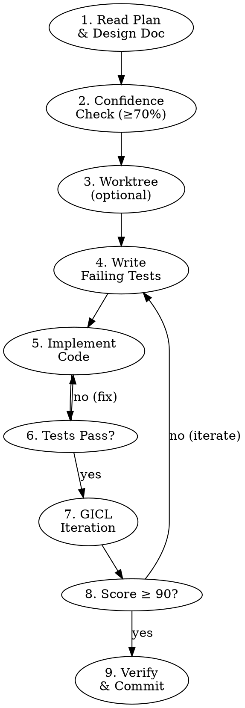

# AICodePath Implement

<HARD-GATE>
Do NOT start implementation without:
1. An approved design from /aicodepath-brainstorm
2. A written plan from /aicodepath-write-plan
3. Confidence score ≥ 70 from /aicodepath-confidence-check

Implementing without these = building the wrong thing well.
</HARD-GATE>

## When to Activate

- Approved design doc exists and plan is written
- User says "implement", "build", "code this up", "let's build it"
- CONSTRUCTION phase with a defined unit to work on

## The Implementation Sequence



### Step 1 — Read Plan & Design Doc
```
Read: aicodepath-docs/plan/<feature>-design.md
Also check: aicodepath-docs/design/<feature>-design.md
Read: aicodepath-docs/plan/<feature>-plan.md
TaskCreate: key constraints, interface contracts, acceptance criteria
```

### Step 2 — Confidence Check
Run `/aicodepath-confidence-check` before writing any code.
Score ≥ 70: proceed. Score < 70: research more.

### Step 3 — Worktree (for significant work)
For changes touching 3+ files: `/aicodepath-worktree <branch-name>`
Keeps main clean while implementing.

### Step 4 — Write Failing Tests First
Per `/aicodepath-tdd` Iron Law:
```
NO PRODUCTION CODE WITHOUT A FAILING TEST FIRST
```
Write tests, confirm they fail (RED), then implement.

### Step 5 — Implement in Waves
Use Orchestration Mode for parallel work:
- Wave 1: Read all files needed (parallel)
- Wave 2: Write/edit all independent files (parallel)
- Wave 3: Test

### Step 6 — Quality Gate
After implementation:
- Run tests → all pass?
- Run linter → 0 errors?
- Check GICL score ≥ 90?

### Step 7 — Verify Before Claiming Done
Run `/aicodepath-verify` with evidence before any "done" claim.

## Parallel vs Sequential Rules

| Situation | Rule |
|-----------|------|
| Reading files | Always parallel (one message) |
| Writing independent modules | Parallel |
| Writing dependent modules (B imports A) | Sequential |
| Tests | After all production code |
| DB migrations | Before code that uses new schema |

## Common Mistakes

| Mistake | Prevention |
|---------|------------|
| Writing code before tests | `/aicodepath-tdd` Iron Law |
| Not reading the design doc | Step 1 is mandatory |
| Implementing more than planned | YAGNI — only what's in the plan |
| Skipping confidence check | Step 2 gate |
| Claiming done without running tests | `/aicodepath-verify` required |

## Integration

```
/aicodepath-write-plan → /aicodepath-implement → /aicodepath-verify → /aicodepath-checkpoint
```

For complex plans with many units: use `/aicodepath-subagent-dev` instead (delegates
each unit to a fresh agent with full isolation).
