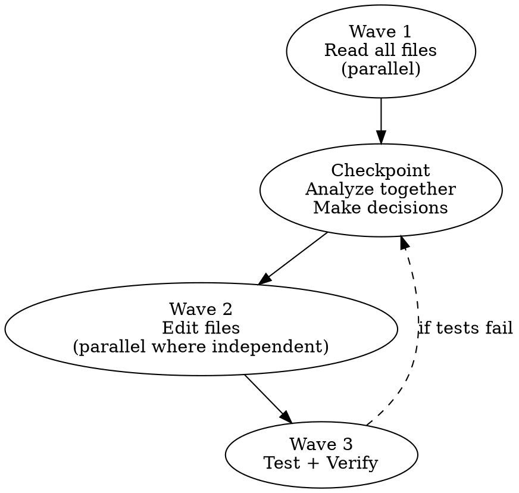

# AICodePath Orchestration Mode

## When to Activate

- More than 3 files need to be read before making decisions
- Multiple independent workstreams exist (can be done in any order)
- Multi-agent coordination via `/aicodepath-subagent-dev`
- INCEPTION: building the implementation plan
- CONSTRUCTION: executing units with dependencies

## Tool Selection Matrix

| Situation | Preferred Tool | Reason |
|-----------|---------------|--------|
| Read 5+ files | Task(Explore agent) | Parallel reads, preserves main context |
| Search codebase for pattern | Grep → Read | Targeted first, read only what matches |
| Edit + test cycle | Sequential | Edit depends on read, test depends on edit |
| Edit 3+ independent files | Parallel tool calls | 3x speedup, no dependency conflicts |
| Complex search + analysis | Task(Explore) | Agents can sub-search in parallel |
| DB / API calls | Sequential | State-dependent, order matters |

## The Wave → Checkpoint → Wave Pattern



### Wave 1 — Parallel Reads
In a **single message**, issue multiple Read/Glob/Grep tool calls simultaneously.
Do NOT read one file, analyze, then read the next. Read ALL needed files first.

```
# One message — all independent reads:
Read(file-a.js)
Read(file-b.js)
Grep("functionName", "*.js")
Read(.aicodepath/config.json)
```

### Checkpoint — Analyze Together
Now with all data in hand, make architectural decisions:
- What pattern is used throughout the codebase?
- Which files need to change?
- What are the dependencies between changes?
- What can be done in parallel in Wave 2?

Save decisions to tasks (via TaskCreate) to avoid re-analysis.

### Wave 2 — Parallel Edits
Group edits by dependency:
- **Independent** (different modules, no shared state): send in single message
- **Dependent** (B reads output of A): sequential

```
# One message — independent edits:
Edit(lib/feature-a.js, ...)
Edit(lib/feature-b.js, ...)
Write(tests/feature-a.test.js, ...)
```

### Wave 3 — Test and Verify
Run full test suite. If failures: return to Checkpoint with new data.

## Parallel Execution Rules

| Type | Rule |
|------|------|
| Independent reads | ALWAYS parallel (single message) |
| Independent writes | ALWAYS parallel (single message) |
| Dependent writes (B needs A's output) | Sequential |
| Tests | ALWAYS after all writes complete |
| DB migrations | Sequential (order matters) |

## Resource Awareness

Track what you've already done to avoid redundant work:

```
TaskCreate: "Read: lib/feature-flags.js — exports isEnabled(feature)"
TaskCreate: "Read: api/server.js — uses getWebSocketServer() not getInstance()"
```

Reference task notes (via TaskGet/TaskList) instead of re-reading files.

## Red Flags — Inefficient Patterns

- Reading files one at a time when they're independent
- Analyzing each file before reading the next
- Re-reading a file you already read in this session
- Making decisions before all relevant files are read
- Editing one file, running tests, editing another (for independent changes)

## Integration

```
/aicodepath-write-plan → /aicodepath-orchestration-mode → /aicodepath-subagent-dev
```

Use Orchestration Mode when executing the plan from write-plan.
For very large plans (15+ files): delegate via subagent-dev instead.

## NEVER

- **NEVER** mix dependent and independent edits in the same parallel wave — if Edit B reads the output of Edit A, sending them in one message means B operates on A's pre-edit content. The edits appear to succeed but B produces wrong output. Always check dependency before parallelizing writes.
- **NEVER** start Wave 2 (edits) before all Wave 1 reads are complete — making edit decisions before reading all relevant files means you're guessing at what other files contain. This produces changes that are internally inconsistent. Read everything needed in Wave 1, analyze together at checkpoint, then edit.
- **NEVER** use Task(Explore agent) for a single targeted lookup — Explore agents require full agent initialization overhead (context, tool access, startup). For a single file or pattern, Grep → Read is 5x faster. Reserve Task(Explore) for searches that require sub-searching or synthesizing across 5+ files.
- **NEVER** log "will read X in the next message" in TaskCreate — if X is needed for a Wave 2 decision, it belongs in Wave 1. Deferred reads break the wave pattern by forcing a third wave for what should have been two. The cost of reading one more file in Wave 1 is always less than the cost of an extra round-trip.
