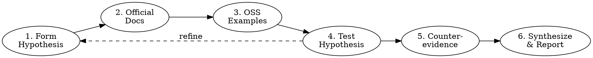

# AICodePath Research Mode

## Iron Law

```
NO CONCLUSIONS WITHOUT A MULTI-HOP EVIDENCE CHAIN
```

Stating a conclusion you haven't verified is speculation, not research.
Every claim must trace back to a source you actually read in this session.

## When to Activate

- PRE-FLIGHT: researching requirements, user context, or competitive landscape
- OPERATIONS: debugging unknown errors, tracing unexpected behavior
- Any time you're about to say "I know how X works" — verify first
- User asks "why", "how does X work", "what causes Y"

## The Six-Step Research Process



### Step 1 — Form Hypothesis
State what you believe the answer is BEFORE researching.
This prevents anchoring bias and makes gaps visible.
> "I think X works by Y because Z"

### Step 2 — Official Docs First
```
Context7 MCP: resolve-library-id → query-docs
WebSearch: site:docs.example.com <query>
WebFetch: read specific doc page
```
Read the source, not a blog post about the source.

### Step 3 — OSS Examples
Find production code doing the same thing.
GitHub, official examples, reference implementations.
Verify the version matches your stack.

### Step 4 — Test Hypothesis
Does the evidence confirm or refute the hypothesis?
If refuted: update hypothesis and re-research.
If confirmed: move to counter-evidence.

### Step 5 — Seek Counter-Evidence
What would break this conclusion?
Search for known issues, edge cases, version differences.
A conclusion that survives counter-evidence is stronger.

### Step 6 — Synthesize
Present findings in the Evidence Table format below.
State confidence. State gaps. State what you did NOT verify.

## Evidence Table Format

```
## Research Findings: [topic]

| Source | Finding | Confidence |
|--------|---------|-----------|
| [URL or file:line] | [what it says] | HIGH / MED / LOW |
| [URL or file:line] | [what it says] | HIGH / MED / LOW |

**Conclusion**: [state it precisely]
**Gaps**: [what was not verified]
**Confidence**: HIGH / MEDIUM / LOW
```

## Adaptive Depth

| Question Type | Hops | Strategy |
|--------------|------|---------|
| Simple (known API behavior) | 1 | Read official docs, cite, done |
| Complex (architectural decision) | 3+ | Docs → OSS → counter-evidence |
| Unknown behavior (bug) | Test first | Reproduce → trace → research |
| Security-sensitive | Max depth | Always find counter-evidence |

## Red Flags — STOP

- Concluding from the first result found
- "I know this" without citing a source read in this session
- Blog posts as primary source instead of official docs
- Skipping counter-evidence because "seems right"
- Copy-pasting without understanding

## Integration

Research Mode feeds into the confidence check:
```
Research Mode → /aicodepath-confidence-check → /aicodepath-tdd
```

High-quality research raises your confidence score before implementation.
Low-quality research = LOW confidence = don't implement yet.
