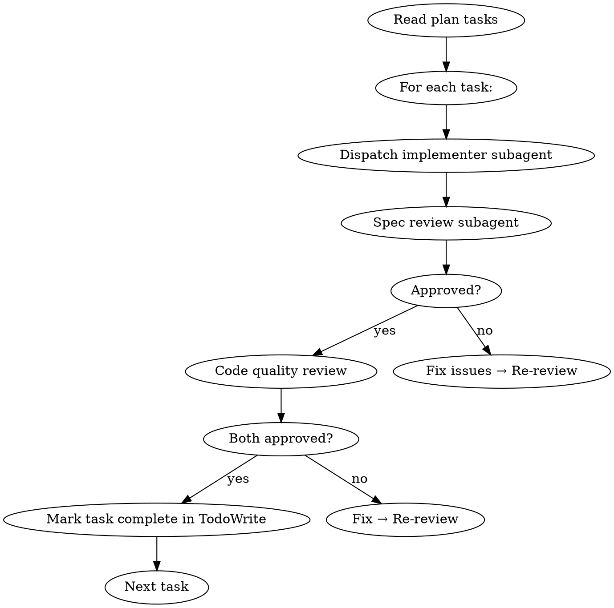

# AICodePath Subagent-Driven Development

## Overview

Execute an implementation plan by dispatching each task to a fresh subagent with clean context, followed by two-stage review.

Fresh context per task = no context pollution between tasks. Review loops ensure quality before marking complete.

<HARD-GATE>
Do NOT dispatch tasks without:
1. An approved implementation plan (from `/aicodepath-write-plan`)
2. A clean test baseline (`npm test` passes with 0 failures)
3. Each task having a failing-test step before implementation
</HARD-GATE>

## Pre-Dispatch Checklist

- [ ] Plan file exists and has been reviewed
- [ ] `npm test` (or equivalent) passes — clean baseline
- [ ] Git working tree clean before starting
- [ ] Each task has test-first steps

## Dispatch Flow



## Step 1: Prepare Task List

Read the plan and extract all tasks. Create a TodoWrite entry for each task.

```javascript
// For each task in the plan:
TodoWrite: {
  text: "Task N: <task name>",
  status: "pending"
}
```

## Step 2: Dispatch Implementer Subagent

### Agent Field Extraction (MANDATORY before dispatch)

Before invoking the Task tool for any task:

**Agent resolution order** (apply in sequence, stop at first match):
1. Read `Agent` column from the 7-column table row for this task — use this value (primary source)
2. If the table row has no `Agent` column or the value is blank (old 6-column plan format) → scan the expanded task block for `**Agent**: <value>` (fallback)
3. If neither source has a value → dispatch generic `Task` without `subagent_type` + emit warning: "Task N missing Agent field — consider re-running /aicodepath-write-plan"

After resolving the agent value, determine dispatch mode:
- Full agent name (e.g., `aicodepath-backend-architect`) → `Task(subagent_type: "aicodepath-backend-architect", ...)`
- `—` (pure doc/config/infrastructure task) → generic `Task` without `subagent_type`

Also check for `**Reviewer**: <value>` in the expanded task block — if present, that agent runs Step 3 Spec Review instead of a generic reviewer.

**NEVER** dispatch all tasks as generic subagents when `Agent:` is populated. The specialist subagent applies domain-specific judgment the generic agent lacks.

For each task, launch a Task tool subagent with this prompt template:

```
[If Agent is named]: You are <agent-name>, a specialist invoked for this task.
Apply your full domain expertise — do not defer to general patterns when your
specialization applies.

You are implementing Task N from an AICodePath implementation plan.

## Your Context
Project root: <project_root>
Task: <full task text from plan including all steps>

## Requirements
1. Follow EXACTLY the steps in the task
2. Start with the failing test — write it, verify it fails
3. Then write minimal implementation to make it pass
4. Then verify ALL tests pass (not just the new test)
5. Then commit with the specified message

## Constraints
- Do NOT write code before the failing test exists
- Do NOT skip the "verify fails" step
- Do NOT add features beyond what the test requires
- Do NOT modify other tasks' files unless the task explicitly says to

## Done When
<exact done condition from task>

When complete, report:
- Test written: <path>
- Implementation written: <path>
- Test output: <paste actual test output>
- Commit: <commit hash>
```

## Step 3: Spec Compliance Review

After implementer returns, determine the reviewer to dispatch:
- If task has `**Reviewer**: <agent-name>` → invoke `Task(<reviewer-agent-name>)` for domain coverage
- Otherwise → dispatch a generic spec reviewer

```
[If Reviewer is named]: You are <reviewer-agent-name>. Review this implementation
from your domain expertise — flag issues a general reviewer would miss.

You are reviewing an implementation for spec compliance.

## Task Spec
<full task text>

## Implementation Result
<implementer's report>

## Review Questions
1. Did the implementer write the failing test FIRST?
2. Did the implementation match the task spec exactly?
3. Are all file paths correct?
4. Does the commit message follow conventional commit format?
5. Were any files modified that weren't in the task spec?

## Output Format
APPROVED: <brief reason>
or
ISSUES: <list of specific violations that must be fixed>
```

## Step 4: Code Quality Review

If spec review approved, dispatch a code quality reviewer:

```
You are reviewing implementation code quality.

## Files Changed
<list of files from implementer report>

## Review Criteria
1. No obvious bugs or logic errors
2. Error handling for failure cases
3. No hardcoded values that should be configurable
4. No duplicated code (check for existing helpers)
5. Clear variable/function names

## Output Format
APPROVED: <brief reason>
or
ISSUES: <specific actionable fixes required>
```

## Step 5: Fix Loops

If either review returns ISSUES:
1. Show issues to user (do NOT auto-fix — user decides)
2. If user approves fixes: dispatch implementer with fix instructions
3. Re-run review after fixes
4. Repeat until both reviews APPROVED

## Step 6: Mark Complete

When both reviews APPROVED:
```
TodoWrite: mark task N as complete
Announce: "Task N complete — <summary of what was implemented>"
```

Then proceed to next task.

## Step 7: Integration Verification

After ALL tasks complete:
1. Run full test suite: `npm test`
2. Run GICL: `/aicodepath-gicl-start`
3. If GICL >= 90: invoke `/aicodepath-verify`
4. If GICL < 90: iterate on failing tasks

## Parallel vs Sequential

**Use parallel dispatch** when tasks are truly independent (no shared files, no order dependency):
- Launch multiple Task tool subagents simultaneously
- Each works on a different task file
- Wait for all to complete, then run reviews

**Use sequential dispatch** when tasks have dependencies:
- Complete Task N, get both reviews APPROVED
- Then dispatch Task N+1

The plan ordering indicates dependencies. If unclear, sequential is safer.

### Dispatch Mode Selection Table

| Condition | Dispatch Path |
|-----------|--------------|
| Single task, `Agent: —` | Generic `Task` |
| Single task, named `Agent:` | `Task(agent-name)` directly |
| Multiple tasks, all `Agent: —` | Parallel generic Tasks |
| Multiple tasks, named `Agent:` fields, sequential | `Task(agent-name)` per task in order |
| Multiple tasks, named `Agent:` fields, **parallel** | Invoke `aicodepath-swarm-lead` as batch dispatcher |

**When to invoke swarm-lead as dispatcher** (parallel + named agents):

This does NOT require `CLAUDE_CODE_EXPERIMENTAL_AGENT_TEAMS` — swarm-lead uses the Task tool's `subagent_type` routing which works in all modes.

```
Task(aicodepath-swarm-lead):
  prompt: "You are the dispatch coordinator for this plan batch.
  Plan file: <path>
  Tasks to execute this batch: [T1: Agent=X, T2: Agent=Y, T3: Agent=Z]

  For each task:
  1. Read its Agent field
  2. Invoke Task(<agent-name>) with the full task spec from the plan
  3. Run DoD verification command after each task completes
  4. Update tasks.md: WIP when delegated, DONE [hash] when DoD passes
  5. Report completion per task when all are done

  File boundaries:
  - <agent-X> owns: <files from task 1>
  - <agent-Y> owns: <files from task 2>
  Do NOT allow agents to modify each other's files."
```

## Common Failures

| Failure | Recovery |
|---------|----------|
| Subagent skipped failing test | Re-dispatch with explicit instruction to delete implementation and start with test |
| Test passes immediately | Test is testing existing behavior — subagent must rewrite test |
| Commit message wrong format | Ask subagent to amend: `git commit --amend -m "<correct format>"` |
| Wrong files modified | Revert changes, re-dispatch with stricter constraints |
| Review loop > 3 cycles | Escalate to user — task may need redesign |
