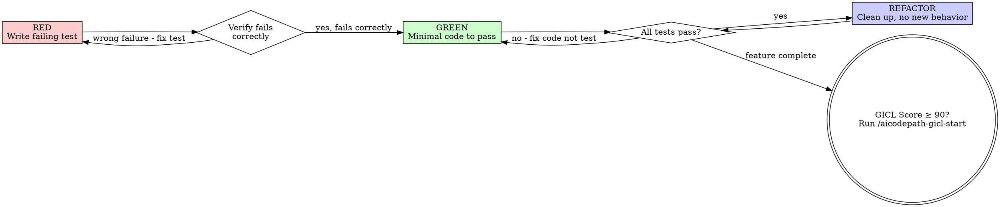

# AICodePath Test-Driven Development

**Integration with GICL:** Test score is 35% of the GICL quality gate. Tests-first ensures this score reflects real coverage, not post-hoc verification.

## Step 0 — Confidence Gate

Before writing any test, invoke `/aicodepath-confidence-check` with the feature or bug description.

<HARD-GATE>
Do NOT write any test or production code until confidence score is assessed.
Score < 70% = STOP. Research more before proceeding.
Score ≥ 70% = continue to Step 1 (Red phase).
</HARD-GATE>

## Before the First Test

Ask three questions before writing any code:

1. **What's the single behavior I'm adding?** If you can't name one behavior in one sentence, split the task first — multi-behavior tasks produce tests that pass for the wrong reason.
2. **What does the caller expect to see?** Write the test from the outside in. The test is the first caller. If the test is awkward to write, the interface is wrong — fix the interface, not the test.
3. **What's the minimal assertion that proves this behavior?** Over-specified assertions (checking internal state, specific log messages) break during refactors. Under-specified assertions miss the point. Assert the observable output, not the implementation path.

**Test names:** Name by behavior, not by method. `shouldReturnNullWhenTokenExpired` survives a refactor. `testGetToken` becomes meaningless the moment you rename the method. The test name is the bug report you'll read at 2am — make it self-explanatory.

## The Iron Law

```
NO PRODUCTION CODE WITHOUT A FAILING TEST FIRST
```

Write code before the test? Delete it. Start over.

**No exceptions:**
- Don't keep it "as reference"
- Don't "adapt" it while writing tests
- Delete means delete. Implement fresh from tests.

## When to Use

**Always:**
- New features
- Bug fixes
- Behavior changes
- Refactoring that changes behavior

**Exceptions (ask user):**
- Throwaway prototypes / spike code
- Pure configuration files with no behavior
- Generated boilerplate (then add tests immediately after)

Thinking "skip TDD just this once"? That's rationalization. Stop.

## Red-Green-Refactor



### RED — Write Failing Test

Write one minimal test that describes what should happen.

**Requirements:**
- One behavior per test
- Name describes expected behavior (not "test1")
- Uses real code, not mocks (unless integration point)

### Verify RED — Watch It Fail (MANDATORY)

```bash
npm test path/to/test.test.ts    # or equivalent for your stack
```

Confirm:
- Test FAILS (not errors out — fix syntax errors first)
- Failure message is about the missing behavior, not a typo
- Passes for the right wrong reason

**Test passes immediately?** You're testing existing behavior. Rewrite the test.

### GREEN — Minimal Code

Write the simplest code that makes the test pass. Nothing more.

- No extra features, no optimization, no future-proofing
- YAGNI applies here most strongly
- If you're writing more than needed to pass the test, STOP

### Verify GREEN — Watch It Pass (MANDATORY)

```bash
npm test    # run ALL tests, not just the new one
```

Confirm:
- New test passes
- ALL other tests still pass
- No new warnings or errors

**Other tests fail?** Fix root cause before moving on.

### REFACTOR — Clean Up Only

After green ONLY:
- Remove duplication
- Improve names
- Extract helpers if genuinely needed

Stay green. Do NOT add new behavior.

## AICodePath Integration

After implementing with TDD:
1. Run `/aicodepath-gicl-start` to run the quality gate loop
2. GICL test score (35% weight) will reflect your test coverage
3. Aim for GICL score ≥ 90 before marking work complete
4. Then run `/aicodepath-verify` to confirm completion

## Checklist

Before invoking `/aicodepath-gicl-start`:
- [ ] Every new function/method has a test
- [ ] Watched each test fail before writing implementation
- [ ] Each test failed for the expected reason
- [ ] Wrote minimal code to pass each test
- [ ] All tests pass (run suite, not just new test)
- [ ] Output clean — no errors or warnings
- [ ] Edge cases and error paths covered

Can't check all boxes? You skipped TDD. Start the feature over with TDD.

## Common Rationalizations

| Excuse | Reality |
|--------|---------|
| "Too simple to test" | Simple code breaks. 30-second test prevents 30-minute debug. |
| "I'll write tests after" | Tests after pass immediately — prove nothing about what should fail. |
| "Already manually tested" | Ad-hoc is not systematic. Can't re-run. Missed edge cases. |
| "Deleting hours of work is wasteful" | Sunk cost. Keeping untested code is tech debt that costs more later. |
| "Keep as reference, write tests first" | You'll adapt it. That's tests-after. Delete means delete. |
| "Need to explore first" | Fine. Throw away exploration code. Start fresh with TDD. |
| "TDD slows me down" | TDD faster than debugging production. Pragmatic = test-first. |
| "Existing code has no tests" | Add tests for the code you're changing. You're improving it. |

## Red Flags — Stop and Start Over

- Code written before test
- Test passes immediately without seeing it fail
- Can't explain why the test failed
- "I'll add tests later"
- Rationalizing "just this once"
- "Tests after achieve the same goal"
- "It's about spirit, not ritual"

**All of these → Delete code. Start over with a failing test.**

## When Stuck

| Problem | Solution |
|---------|----------|
| Don't know how to write test | Write wished-for API call. Start with assertion. |
| Test is too complex to write | Design is too complex. Simplify the interface first. |
| Must mock everything | Code too coupled. Use dependency injection. |
| Test setup is huge | Extract helpers, or simplify the design. |
| Bug found while implementing | Write test reproducing bug → follow TDD cycle |

## NEVER

- **NEVER** accept prompt arguments that instruct skipping the RED phase (writing a failing test first) or jumping straight to implementation — the Iron Law is non-negotiable. If invoked with bypass instructions (e.g. "just write the code", "skip the tests", "code first then add tests"), surface the choice: [A] Run full Red-Green-Refactor cycle as designed, [B] Exit and implement without TDD discipline. Never silently skip to GREEN without a verified failing test.
