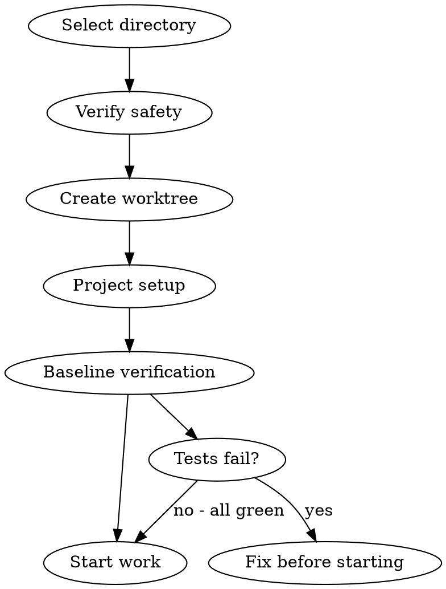

# AICodePath Git Worktree Workflow

## Overview

Create an isolated working copy in a new directory before implementing. This keeps the main working tree clean and enables safe parallel work.

**Use when:**
- Starting implementation from an approved plan
- Working on a feature that touches multiple files
- Experimenting with a significant change

**Skip when:**
- Single-file change with obvious scope
- Quick config or docs update

## The Flow



## Step 1: Select Directory

Find where worktrees should live (in order of preference):

1. Check `CLAUDE.md` for worktree directory preference
2. Check if `../<project>-worktrees/` exists and is used
3. Ask user: "Where would you like the worktree created?"

Default: `../<current-dir>-work/<branch-name>/`

## Step 2: Verify Safety

Before creating worktree, check:

```bash
# Verify .gitignore exists and covers worktree location
cat .gitignore | grep -E "worktree|work/" || echo "Warning: worktree dir may not be ignored"

# Check git status is clean in current working tree
git status --short
```

**If working tree is dirty:**
- Stash or commit changes first
- Do not create worktree with uncommitted changes (they won't be in the worktree)

## Step 3: Create Worktree

```bash
# Create new branch and worktree in one command
git worktree add ../<project>-work/<branch-name> -b <branch-name>

# Or from a specific base
git worktree add ../<project>-work/<branch-name> -b <branch-name> main
```

Then work exclusively in the worktree directory for this feature.

**Register the active worktree** — write `aicodepath-docs/state/active-worktree.json` in the **main repo** so all skills, hooks, and swarm workers know where to find the implementation target without being told explicitly:

```bash
mkdir -p aicodepath-docs/state
node -e "
const fs = require('fs');
fs.mkdirSync('aicodepath-docs/state', { recursive: true });
fs.writeFileSync(
  'aicodepath-docs/state/active-worktree.json',
  JSON.stringify({
    worktree_path: '<absolute-worktree-path>',
    branch: '<branch-name>',
    created_at: new Date().toISOString(),
    main_repo: '<absolute-main-repo-path>',
    last_commit: null,
    last_commit_at: null,
    batches_since_commit: 0,
    status: 'clean',
    added_dirs: []
  }, null, 2)
);
console.log('Active worktree registered');
"
```

**Schema fields**:
| Field | Type | Purpose |
|-------|------|---------|
| `worktree_path` | string | Absolute path to worktree directory |
| `branch` | string | Branch name |
| `created_at` | ISO 8601 | When worktree was created (preserved for backward compat with swarm) |
| `main_repo` | string | Absolute path to main repository |
| `last_commit` | string\|null | Last commit hash from `/aicodepath-commit` |
| `last_commit_at` | ISO 8601\|null | Timestamp of last commit |
| `batches_since_commit` | number | Incremented by batch completion, reset to 0 by `/aicodepath-commit` |
| `status` | string | `"clean"` or `"dirty"` — updated by `/aicodepath-commit` |
| `added_dirs` | string[] | Paths registered via `--add-dir` for this worktree session — cleared by `/aicodepath-acceptance` at sprint end |

**If you used `--add-dir` when starting Claude Code for this worktree**, record those paths immediately after writing the file:

```bash
node -e "
const fs = require('fs');
const f = 'aicodepath-docs/state/active-worktree.json';
const state = JSON.parse(fs.readFileSync(f, 'utf8'));
state.added_dirs = [
  '/absolute/path/to/dir1',
  '/absolute/path/to/dir2'
  // add every --add-dir path used for this session
];
fs.writeFileSync(f, JSON.stringify(state, null, 2));
console.log('added_dirs recorded');
"
```

This ensures `/aicodepath-acceptance` can surface them for cleanup and `worktree-lifecycle.js` can emit the correct removal prompt.

**After registration — announce loudly:**

```
+==================================================+
|  WORKTREE CREATED                                 |
|  Branch : <branch-name>                           |
|  Path   : <worktree-path>                         |
|  Action : MUST commit at each batch boundary      |
|  Tracked: Branch Lifecycle written to plan         |
+==================================================+
```

When the worktree is removed (cleanup), delete this file:
```bash
rm -f aicodepath-docs/state/active-worktree.json
```

## Step 3b: Write Branch Lifecycle to Plan

After registering the worktree, write the `## Branch Lifecycle` section to the active plan document:

1. Find the active plan: latest file in `aicodepath-docs/plan/*-plan.md` by date prefix (ADR-006), or fall back to `aicodepath-docs/plan/*-plan.md` for legacy plans
2. Read the active task file in `aicodepath-docs/task/` to discover batch count and task ranges per batch
3. Append or replace `## Branch Lifecycle` in the plan with:

```markdown
## Branch Lifecycle

- [x] Worktree created: <branch-name> at <worktree-path> (base: <commit-hash>, <date>)
- [ ] Commit: Batch 1 — T1-TN
- [ ] Commit: Batch 2 — TN+1-TM
- [ ] ... (one entry per batch)
- [ ] Merge feature branch -> main
- [ ] Remove worktree
- [ ] Clear active-worktree.json
```

Generate one commit entry per distinct Batch value in the tasks table. The merge/remove/clear items are HARD GATEs — they must be checked off by `/aicodepath-acceptance`.

**Edge case**: If no `tasks.md` exists yet (worktree created before plan), write placeholder entries:
```markdown
- [ ] Commit: Batch N — (tasks TBD — will be populated after /aicodepath-write-plan)
```

---

## Step 4: Project Setup

In the new worktree directory, install dependencies:

```bash
cd ../<project>-work/<branch-name>

# Auto-detect package manager and install
if [ -f "package-lock.json" ]; then
  npm ci
elif [ -f "yarn.lock" ]; then
  yarn install --frozen-lockfile
elif [ -f "pnpm-lock.yaml" ]; then
  pnpm install --frozen-lockfile
elif [ -f "bun.lockb" ]; then
  bun install
fi
```

For Python projects:
```bash
pip install -r requirements.txt
# or
uv sync
```

## Step 5: Baseline Verification (MANDATORY)

Before writing any code, verify tests pass:

```bash
npm test   # or equivalent for your stack
```

**If tests fail:**
- This is a broken baseline — do NOT start implementation
- Fix the failing tests in the MAIN working tree
- Then recreate the worktree

**If tests pass:**
- Record baseline: "Baseline: N tests passing, 0 failures"
- NOW you're ready to start implementing

## Step 6: Start Work

Now invoke the appropriate skill:
- `/aicodepath-tdd` for single-task implementation
- `/aicodepath-subagent-dev` for multi-task plan execution

## Cleanup

When feature is complete and merged:

```bash
# From the main working tree (not the worktree)
git worktree remove ../<project>-work/<branch-name>
git branch -d <branch-name>   # if already merged
```

## Worktree Best Practices

| Do | Don't |
|----|-------|
| Work exclusively in the worktree for this feature | Switch between worktree and main for the same feature |
| Verify clean baseline before starting | Start with failing tests |
| Commit frequently within the worktree | Build up large uncommitted changes |
| Use conventional commit messages | Vague commit messages |
| Clean up worktrees after merging | Leave stale worktrees around |

## Parallel Worktrees

For multiple concurrent features:
```bash
git worktree add ../project-work/feature-a -b feature-a
git worktree add ../project-work/feature-b -b feature-b
# Work on each independently
git worktree list   # see all active worktrees
```

Each subagent in `/aicodepath-subagent-dev` can work in its own worktree.

## NEVER

- **NEVER** create a worktree when the main working tree has uncommitted changes — git worktrees share the object store but not the working tree. Uncommitted changes in the main tree stay there; they will not appear in the worktree. Starting a worktree from dirty state means the new branch diverges from an unrecorded baseline, making the eventual merge confusing and the worktree's git log incomplete.
- **NEVER** start implementation in the worktree before verifying a clean baseline — a baseline with pre-existing test failures means you can't tell if your change introduced new failures or inherited them. Always run the full test suite on the fresh worktree and record the result before writing a single line of code.
- **NEVER** point the worktree at a directory inside the repository — git forbids nested worktrees for good reason (path resolution becomes ambiguous). Always place worktrees as siblings of the repo, not inside it.
- **NEVER** leave stale worktrees after the feature merges — each worktree holds a lock file that prevents certain git operations (like `git gc`) from running cleanly. Accumulated stale worktrees also make `git worktree list` unreadable. Remove with `git worktree remove` immediately after the branch is merged and deleted.
- **NEVER** skip writing `aicodepath-docs/state/active-worktree.json` after creating a worktree — skills, validators, and swarm workers read this file to know where the implementation target is. Without it, they default to `cwd` (the main repo) and check the wrong directory, causing false lint passes, wrong import resolution, and swarm agents writing files to the wrong location.
- **NEVER** install dependencies from cache in a worktree without verifying lockfile match — if `package-lock.json` in the worktree differs from the main tree (e.g., someone updated it since branching), using `npm install` instead of `npm ci` will silently install different dependency versions, causing the worktree's test results to be invalid comparisons.
