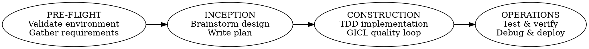
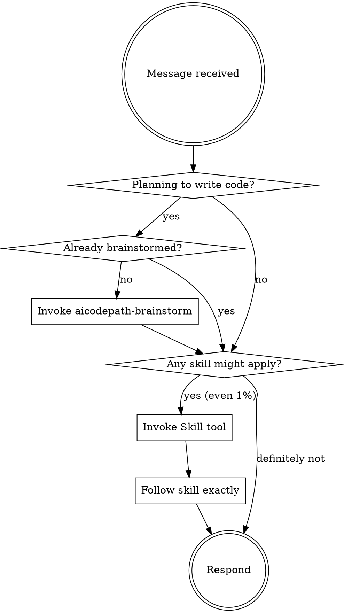

<EXTREMELY-IMPORTANT>
You are using AICodePath — an AI-Driven Development Life Cycle (AIDLC) framework.

Before ANY response or action, check if a skill applies. Even a 1% chance means you MUST invoke the skill.

IF A SKILL APPLIES, YOU DO NOT HAVE A CHOICE. YOU MUST USE IT.

This is not negotiable. This is not optional. You cannot rationalize your way out of this.
</EXTREMELY-IMPORTANT>

## AIDLC Workflow

Every task flows through phases. Do NOT skip phases.



**Skill chain (follow this order):**
1. `/aicodepath-knowledge` → Read planning/tasks/knowledge at session start
2. **[Session Startup Gate]** → Check workspace detection result (see below) — may redirect to INCEPTION
2.5. **[CONDITIONAL]** PM Discovery Gate → Greenfield new-product only: ask binary user/problem question; route to [A] Research it now (`/aicodepath-research-mode`) / [B] You describe it (3 structured questions) / [C] Quick AI hypotheses; write `aicodepath-docs/pm/` artifacts; skip if brownfield, feature-level, or user has defined users
3. **[CONDITIONAL]** `/aicodepath-requirements` → Only if requirements are vague, missing, or this is a first-time feature — gate before brainstorm
4. `/aicodepath-brainstorm` → Design before any code; interactive conversation
5. `/aicodepath-write-design` → Synthesize brainstorm into structured design document
6. **[CONDITIONAL]** `/aicodepath-classify-component` → After design — classifies component types (DB, API, security, frontend, etc.) and surfaces specialist agents; skip only for trivial single-file changes
7. `/aicodepath-write-plan` → Detailed implementation plan; update tasks.md
8. `/aicodepath-review plan --depth strict` → Validate plan (3 lenses: critic, analyst, structural)
9. `/aicodepath-confidence-check` → Verify confidence ≥ 70 before coding
10. **[CONDITIONAL]** `/aicodepath-worktree` → Before coding — creates isolated git worktree; skip only for hotfixes or single-line changes
─── per batch ───────────────────────────
11. `/aicodepath-tdd` → Test-driven implementation
12. `/aicodepath-gicl-start` → Quality gate loop; write lessons to knowledge.md
13. **[CONDITIONAL]** `/aicodepath-review` → Structured 4-perspective review (correctness, security, style, performance) — skip only for trivial hotfixes
14. `/aicodepath-verify` → Verify before claiming done
15. `/aicodepath-commit` → Batch boundary commit — updates plan Branch Lifecycle + active-worktree.json
16. **[CONDITIONAL]** `/aicodepath-learn` → Extract durable lessons before checkpoint; skip if nothing novel was learned this session
17. `/aicodepath-checkpoint` → Save progress; update tasks.md (blocked until commit passes)
─────────────────────────────────────────
18. **[SPRINT-END]** `/aicodepath-acceptance` → After ALL batches in the sprint are complete — final acceptance gate
    → Verify Branch Lifecycle tasks (all commits, merge, cleanup)
    → Merge feature branch → main
    → `git worktree remove` + clear active-worktree.json

## Batch vs Sprint Cadence

| Boundary | Gates | Skills |
|----------|-------|--------|
| **Batch end** | Commit + checkpoint | `/aicodepath-commit` → `/aicodepath-checkpoint` |
| **Sprint end** | Acceptance + merge + cleanup | `/aicodepath-acceptance` → merge → worktree remove |

`/aicodepath-commit` and `/aicodepath-checkpoint` run at EVERY batch end.
`/aicodepath-acceptance` runs at SPRINT END only — never at batch end.
Do not conflate them.

## Session Startup Gate

After `/aicodepath-knowledge`, check the injected `## Workspace Detection Result` in the session context.

| Condition | Required Action |
|-----------|----------------|
| `<MANDATORY-INCEPTION>` present in context | Run `/aicodepath-preflight`, then execute INCEPTION (Workspace Detection → Reverse Engineering) per `.aicodepath/rules/core/inception.md` |
| Brownfield + RE artifacts exist + no state | Read existing RE artifacts first, then proceed to `/aicodepath-brainstorm` |
| Greenfield OR state file found | Continue normally with skill chain |

<HARD-GATE>
If the session context contains `<MANDATORY-INCEPTION>`, you MUST complete the full INCEPTION phase before responding to ANY feature or implementation request.

Rationalization traps to reject:
- "The user wants to start coding" → brownfield without RE means working without understanding the system
- "I can infer the architecture" → inference ≠ verified. RE produces evidence.
- "The project looks simple enough" → complexity is discovered during RE, not before it
</HARD-GATE>

<HARD-GATE>
If `aicodepath-docs/state/active-worktree.json` exists, ALL implementation file writes must happen in the worktree path specified there — never in the main repo. Read the file at session start to get the exact path. A missing or unreadable file means no active worktree; proceed normally.
</HARD-GATE>

## Skill Directory

**Use the `Skill` tool to invoke skills. Never use `Read` on skill files.**

### Planning & Design (PRE-FLIGHT / INCEPTION)
| Trigger | Skill |
|---------|-------|
| New feature, "build X", "add X", design request | `/aicodepath-brainstorm` |
| Synthesize design doc from brainstorm, "write design doc", "document the design" | `/aicodepath-write-design` |
| Need implementation plan, "write a plan", "plan this" | `/aicodepath-write-plan` |
| Check environment, preflight, "are we ready" | `/aicodepath-preflight` |
| Gather/clarify requirements, vague brief, "what should it do" | `/aicodepath-requirements` |
| C4 architecture diagram needed | `/aicodepath-c4-architecture` |
| ER diagram, database design | `/aicodepath-diagrams` |
| "understand this", "explain code", brownfield audit, "what does X do", "how does X work" (existing codebase feature), "explain X workflow", "trace X flow", "walk me through X", "tell me how X works", "how does the X process work", "explain the X flow" | `/aicodepath-analyze` |
| Reverse engineer codebase, produce 11 structured docs, document existing system, brownfield INCEPTION | `/aicodepath-reverse-engineer` |
| Discover ecosystem, find related repos, map all services, platform audit, 10 signal types | `/aicodepath-discover` |
| Create feature specs, generate specifications, .specify/ structure, spec this feature | `/aicodepath-specify` |
| Gap analysis, compare specs to code, what's missing, find gaps, spec coverage | `/aicodepath-gap-analysis` |
| Research before coding, unfamiliar external library or framework, "how does this library work", "how do I use the X API", "explain this npm package", "how does framework X handle Y" | `/aicodepath-research-mode` |
| Classify component types, which agents apply to this feature | `/aicodepath-classify-component` |
| Understand unfamiliar codebase, first time in repo, stack detection, entry points | `/aicodepath-codebase-onboarding` |
| Autonomous loop pattern, which loop architecture, loop taxonomy, parallel wave, de-sloppify | `/aicodepath-autonomous-loops` |

### Implementation (CONSTRUCTION)
| Trigger | Skill |
|---------|-------|
| Writing code, implementing features | `/aicodepath-tdd` |
| Implement after design approved, "write the code", post-brainstorm coding | `/aicodepath-implement` |
| Start quality loop, "start GICL", iterative improvement | `/aicodepath-gicl-start` |
| Code review, 4-perspective review (A-D grading), before verify | `/aicodepath-review` |
| Error handling review, silent failure audit, logging completeness, missing error logging | `/aicodepath-review code` (auto-invokes silent-failure-hunter at standard+ depth on service/middleware files) |
| Test completeness, behavioral coverage gaps, dual-layer testing, untested race conditions | `/aicodepath-review code` (auto-invokes test-completeness-analyzer at standard+ depth when tests changed) |
| Simplify code, reduce nesting, improve readability, apply coding standards, code clarity pass | `aicodepath-code-simplifier` |
| Validate guidelines, check code quality | `/aicodepath-validate-guidelines` |
| Write tests, add test coverage, "test this module" | `/aicodepath-test` |
| AI-written code regression, blind spots, deterministic judges, sandbox testing | `/aicodepath-ai-regression-testing` |
| Fix bug, debug, "why is X broken" | `/aicodepath-debug` |
| Complex parallel work with hard DAG dependencies, shared schema/model changes, DB-tracked progress | `/aicodepath-orchestrate` |
| Complex parallel work, swarm execution, many units | `/aicodepath-swarm` |
| Run construction tasks, auto-detect solo/parallel/swarm mode | `/aicodepath-work` |
| Cruise control, unattended mode, auto-advance phases, supervised execution | `/aicodepath-cruise-control` |
| Batch process multiple repos, platform-wide audit, analyze all services | `/aicodepath-batch` |
| Full TDD→Implement→Review→Commit in one cycle | `/aicodepath-composite-worker` |
| Dispatch tasks to subagents, parallel plan execution | `/aicodepath-subagent-dev` |
| Parallel tool execution, multi-resource orchestration | `/aicodepath-orchestration-mode` |
| Reduce permission prompts, less confirmations, auto-allow patterns, "stop asking me" | `/less-permission-prompts` |
| Context window large, token budget, long session efficiency | `/aicodepath-efficiency-mode` |
| Audit context window usage, token budget, warning thresholds (60/80/90%) | `/aicodepath-context-budget` |
| Batch boundary commit, "commit this batch", after verify | `/aicodepath-commit` |
| Isolated git environment, before significant implementation | `/aicodepath-worktree` |
| Search before implementing, find existing patterns first, ranked search strategy | `/aicodepath-search-first` |
| Security audit, OWASP Top 10, VAPT, penetration test | `/aicodepath-vapt` |
| Brownfield AI-readiness audit, before first sprint, "is this codebase AI-ready" | `/aicodepath-brownfield-readiness` |
| Reduce Docker image size, slim Docker image, optimize Dockerfile, image bloat, distroless, Alpine migration, shrink container | `/aicodepath-docker-slim` |
| Naming issues, inconsistent names, "rename this" | `/aicodepath-naming-analyzer` |
| SOLID principles, God class, fat interface, hardcoded dependency | `/aicodepath-solid-principles` |
| Monorepo operations, workspace changes | `/aicodepath-git-monorepo-config` |
| Build, style, or design any web UI — landing pages, dashboards, SaaS products, portfolios, e-commerce, React components, HTML/CSS; explicit style mentions (glassmorphism, neumorphism, neubrutalism, claymorphism, skeuomorphism, bento grid, dark mode premium, cyberpunk, minimalism); casual requests like "make it look better", "style this page", "design a cool website", "I need a landing page" | `/aicodepath-web-design-intelligence` |
| Frontend design review | `/aicodepath-frontend-design-review` |
| Fluent UI v9, Fluent 2 design system, FluentProvider, Griffel, makeStyles, 5-file component, assertSlots, Field ARIA, motion tokens, fluentui-apple, fluentui-android | `/aicodepath-fluent-design` |
| Web quality audit, performance, CWV, a11y, SEO, best practices | `/aicodepath-web-quality` |
| Browser test, verify UI, playwright, click element, screenshot page, check console logs, test webapp, verify frontend behavior | `/aicodepath-webapp-testing` |
| PRD, user story, OKR, roadmap, sprint, persona, GTM, SWOT, competitor analysis, A/B test, product strategy | `/aicodepath-pm` |
| Android app, Kotlin, Jetpack Compose, mobile architecture | `/aicodepath-android` |
| ML training, autonomous experiment loop, model optimization | `/aicodepath-model-training` |
| PyTorch training code, device-agnostic code, mixed precision, DataLoader, CUDA | `/aicodepath-pytorch-patterns` |
| Slow queries, N+1, missing indexes, query optimization | `sql-query-optimization` |
| Celery workers, background tasks, task queues, retry strategies | `celery-worker` |
| Message queues, event-driven architecture, RabbitMQ, Kafka | `messaging` |
| MCP server, Model Context Protocol integration | `/aicodepath-mcp-builder` |
| LLM prompts, structured output, prompt engineering, broken schema | `/aicodepath-prompt-engg` |
| LLM cost management, model routing, token budget enforcement, cost tracking | `/aicodepath-cost-aware-llm` |

### Verification & Completion (OPERATIONS)
| Trigger | Skill |
|---------|-------|
| "Done", "complete", "it works", before committing | `/aicodepath-verify` |
| Claiming tests pass, build succeeds, task done | `/aicodepath-verify` |
| Sprint done, "is everything complete", verify acceptance criteria | `/aicodepath-acceptance` |
| Deploy, GCP deployment | `/aicodepath-gcp-monorepo-deploy` |
| Release, publish, bump version, generate CHANGELOG, GitHub tag | `/aicodepath-release` |
| Complex git ops, branch management, conflict resolution, history | `/aicodepath-git` |
| Write README, project documentation, runbook, API docs | `/aicodepath-readme-crafter` |
| Benchmark performance, measure page/API/build, before-after comparison | `/aicodepath-benchmark` |

### Learning & Memory
| Trigger | Skill |
|---------|-------|
| Session end, "save progress", "checkpoint" | `/aicodepath-checkpoint` |
| Resume session, "continue from" | `/aicodepath-resume` |
| Learn from mistakes, GICL learn phase, after verify, after commit | `/aicodepath-learn` |
| Check project status, what phase are we in | `/aicodepath-status` |
| Mental model, explain codebase | `/aicodepath-mental-model` |
| Find patterns in codebase | `/aicodepath-codebase-pattern-finder` |
| Build code graph, index codebase, who calls X, what calls X, impact of X, tests for X, visualize graph, code graph MCP, trace the call chain of X, show callers/callees of X, which functions does X invoke | `/aicodepath-code-graph` |
| Audit CLAUDE.md, improve CLAUDE.md, update CLAUDE.md, CLAUDE.md quality, capture session learnings into CLAUDE.md | `/aicodepath-claude-md-improver` |

### Authoring Lifecycle (Agents, Hooks & Skills)
| Trigger | Skill |
|---------|-------|
| Create agent, new agent, improve agent, add agent, agent quality | `/aicodepath-agent-creator` |
| Audit agent, review agent, score agent, grade agent, agent quality | `/aicodepath-agent-audit` |
| Benchmark agents, compare AI agents, YAML task definitions, metrics, 3+ trials | `/aicodepath-agent-eval` |
| Create hook, new hook, improve hook, add hook, hook quality | `/aicodepath-hook-creator` |
| Audit hook, review hook, score hook, grade hook, hook quality | `/aicodepath-hook-audit` |
| Audit skill, score skill, evaluate skill quality (8 dimensions) | `/aicodepath-skill-audit` |
| Create skill, new skill from scratch | `/aicodepath-skill-creator` |
| Test skill, TDD for skill development, validate skill behavior | `/aicodepath-skill-testing` |
| Define AI evaluation criteria, EDD, capability vs regression evals, pass@k | `/aicodepath-edd` |
| Create slash command, new AICodePath command | `/aicodepath-command-creator` |
| Audit any agentic harness against Nate B. Jones' 12 production primitives from the Claude Code leak, design a new harness from scratch with Day One / Week One / Month One sequencing, verify a single hook/agent/skill asset against applicable primitives, or compare aicodepath-tool to an external framework | `/aicodepath-harness-eval` |

### Utilities
| Trigger | Skill |
|---------|-------|
| Improve skill, optimize skill, skill scores too low, run skill improvement loop, boost skill quality, skill keeps failing audit | `/aicodepath-skill-improver` |
| Visual memory, remember diagrams | `/aicodepath-visual-memory` |
| Interconnection diagram, component map, framework diagram, visualize AICodePath, all hooks and skills | `/aicodepath-interconnection-diagram` |
| Naming issues, naming analysis | `/aicodepath-naming-analyzer` |
| SOLID principles, class design, SRP, OCP, LSP, ISP, DIP, God class, fat interface, hardcoded dependency | `/aicodepath-solid-principles` |
| Reduce complexity, entropy, tech debt | `/aicodepath-reducing-entropy` |
| Dependency updates | `/aicodepath-dependency-updater` |
| User preferences | `/aicodepath-preferences` |
| Pause session | `/aicodepath-pause` |
| Rewind to checkpoint | `/aicodepath-rewind` |
| Diagnose AICodePath issues | `/aicodepath-diagnostics` |
| Coding standards reference | `/aicodepath-coding-standards` |
| Codify patterns into guidelines, extract rules from GICL/knowledge/code review | `/aicodepath-rules-distill` |
| Configure terminal statusline, customize status bar | `/aicodepath-statusline` |
| Initialize AICodePath in a new or existing project | `/aicodepath-init` |
| AICodePath help, "how do I", "what skill should I use" | `/aicodepath-help` |

### Agents (Direct Invocation)
These agents have no skill wrapper — invoke them via the Agent tool or by describing the task:

| Trigger | Agent |
|---------|-------|
| PR description, email draft, Slack message, difficult conversation prep | `aicodepath-communication-coach` |
| Cloud cost optimization, AWS/GCP billing spike, rightsizing | `aicodepath-cost-optimizer` |
| GDPR, SOC 2, HIPAA, PCI-DSS compliance audit | `aicodepath-compliance-auditor` |
| SLO/SLI design, error budgets, on-call runbooks, chaos engineering | `aicodepath-sre-engineer` |
| ML model design, EDA, feature engineering, bias assessment | `aicodepath-data-scientist` |
| MLOps pipeline, model serving, feature stores, drift monitoring | `aicodepath-ml-engineer` |
| CI/CD failures, "fix CI", "pipeline is red", GitHub Actions logs | `aicodepath-ci-fixer` |
| Semantic error diagnosis, root cause after 3+ repeated failures | `aicodepath-error-recovery` |
| Writing Go code, goroutines, Go modules, concurrency, gRPC, Kubernetes operators | `aicodepath-golang-expert` |
| Business requirements, process mapping, stakeholder analysis, ROI analysis, gap analysis | `aicodepath-business-analyst` |
| Game development, Unity, Unreal Engine, Godot, ECS architecture, 60fps optimization, game physics | `aicodepath-game-developer` |
| Active incidents, service outages, security breaches, incident response, postmortem, war-room coordination | `aicodepath-incident-responder` |
| Writing Python code, type hints, PEP compliance, pytest, pyproject.toml, Django, FastAPI, Python 3.12+ | `aicodepath-python-expert` |
| Writing React components, JSX, hooks, Server Components, React 18+ concurrent features, RTL tests | `aicodepath-react-expert` |
| Writing TypeScript, strict typing, discriminated unions, tsconfig, TS 5.x patterns, branded types | `aicodepath-typescript-expert` |
| Writing Rust code, ownership, lifetimes, Cargo.toml, safe concurrency, tokio, clippy compliance | `aicodepath-rust-expert` |
| Java developer, Spring Boot, Maven, Gradle, JVM ecosystem, virtual threads, records | `aicodepath-java-expert` |
| Angular 15+, signals, standalone components, NgRx, RxJS | `aicodepath-angular-expert` |
| Security audit, auth code, OWASP Top 10, threat modeling, API security | `aicodepath-security-engineer` |
| Database schema design, SQL/NoSQL selection, index strategy, migration scripts, sharding | `aicodepath-database-architect` |
| Kotlin 2.x, coroutines, KMP, Jetpack Compose, Flow, sealed classes | `aicodepath-kotlin-expert` |
| Swift 5.9+, SwiftUI, async/await, actors, iOS/macOS development, SwiftData | `aicodepath-swift-expert` |
| CI/CD pipelines, Dockerfiles, Kubernetes manifests, IaC with Terraform/Pulumi, autoscaling, logging/alerting | `aicodepath-devops-architect` |
| React/Vue/Angular component hierarchy, state management, bundle audit, CSS architecture, TypeScript patterns | `aicodepath-frontend-architect` |
| Vue 3 Composition API, `<script setup>`, Pinia stores, Nuxt 3 SSR/SSG, Vue Router, composables | `aicodepath-vue-expert` |
| Elixir/OTP supervision trees, GenServer, Phoenix LiveView, Ecto schemas, "let it crash" fault tolerance | `aicodepath-elixir-expert` |
| PHP 8.3+ strict types, PSR-12 compliance, enums, readonly, PHPStan level 9, Composer | `aicodepath-php-expert` |
| C# 12+ records, primary constructors, nullable reference types, ASP.NET Core minimal APIs, EF Core | `aicodepath-csharp-expert` |
| Next.js App Router, Server Components, Server Actions, ISR/SSR/SSG caching, Core Web Vitals | `aicodepath-nextjs-expert` |
| Laravel 11+ Eloquent eager loading, FormRequest validation, Policies, Horizon queues, Livewire 3 | `aicodepath-laravel-expert` |
| Rails 8+ Active Record, Hotwire/Turbo, Solid Queue, service objects, Brakeman, Kamal deployment | `aicodepath-rails-expert` |
| Spring Boot 3+ constructor injection, WebFlux reactive, Spring Security 6, Resilience4j, Testcontainers | `aicodepath-spring-boot-expert` |
| Django 4+ async views, ORM (select_related/prefetch_related), DRF serializers, Celery, security hardening | `aicodepath-django-expert` |
| FastAPI async endpoints, Pydantic v2 models, dependency injection, SQLAlchemy 2.0 async, Alembic | `aicodepath-fastapi-expert` |
| .NET 8+ minimal APIs, EF Core compiled queries, native AOT, IHostedService, Aspire orchestration | `aicodepath-dotnet-core-expert` |
| Flutter 3+ null safety, Riverpod/BLoC state management, const constructors, Impeller, go_router | `aicodepath-flutter-expert` |
| Modern JavaScript ES2024+, async/await, ES modules, AbortController, Vitest, Bun runtime | `aicodepath-javascript-expert` |
| Expo SDK 51+, Expo Router v3, EAS Build/Update, React Native Reanimated 3, FlashList, Maestro E2E | `aicodepath-expo-rn-expert` |
| .NET Framework 4.8, WCF, MVC 5, EF6, strangler fig migration to .NET 8, characterization tests | `aicodepath-dotnet-framework-expert` |
| C++20/23 concepts, ranges, smart pointers, RAII, CMake, vcpkg, clang-tidy, sanitizers | `aicodepath-cpp-expert` |
| SQL CTEs/window functions, keyset pagination, execution plan analysis, index design, EXPLAIN ANALYZE | `aicodepath-sql-expert` |
| Kubernetes RBAC, network policies, Helm 3, HPA/KEDA, Pod Security Standards, GitOps ArgoCD/Flux | `aicodepath-kubernetes-expert` |
| Terraform modules, remote state, tfsec/Checkov, Infracost, Terragrunt, plan approval gates | `aicodepath-terraform-expert` |
| Symfony 7+ autowiring, Doctrine ORM PHP attributes, Messenger async, API Platform 3, Voters | `aicodepath-symfony-expert` |
| PostgreSQL query tuning, JSONB, GIN indexes, partitioning, pgvector, PgBouncer, replication | `aicodepath-postgres-expert` |
| Performance profiling, N+1 detection, caching strategy, k6 load testing, flame graphs, Core Web Vitals | `aicodepath-performance-engineer` |
| TDD Red-Green-Refactor, test pyramid, coverage gates, Stryker mutation testing, Testcontainers | `aicodepath-test-engineer` |
| SLO/SLI definition, error budgets, on-call runbooks, chaos engineering, post-mortem methodology | `aicodepath-sre-engineer` |
| Structured code review — security/performance/quality/a11y, A-D grading, APPROVE/REQUEST_CHANGES | `aicodepath-code-reviewer` |
| Refactoring, cyclomatic complexity reduction, code smells, dead code removal via knip/vulture | `aicodepath-refactoring-expert` |
| Legacy modernization, strangler fig migration, characterization tests, incremental migration | `aicodepath-legacy-modernizer` |
| Swarm orchestration, parallel agent delegation, multi-agent pipeline, DoD verification | `aicodepath-swarm-lead` |
| REST/GraphQL API design, OpenAPI 3.x specs, pagination, versioning, backward compatibility | `aicodepath-api-designer` |
| System architecture, ADRs, monolith vs microservices, component boundaries, resilience patterns | `aicodepath-architect` |
| Backend service design, API contracts, DB technology selection, auth flows, caching, queues | `aicodepath-backend-architect` |
| Chaos experiments, fault injection, game day exercises, blast radius control, resilience validation | `aicodepath-chaos-engineer` |
| CI/CD failure diagnosis, GitHub Actions log analysis, build error fixes, minimal-diff pipeline repair | `aicodepath-ci-fixer` |
| Code clarity pass — nesting reduction, readability, CLAUDE.md standards, post-TDD simplification | `aicodepath-code-simplifier` |
| Data pipelines, ETL/ELT, Airflow/Dagster, dbt, Spark, data warehouse, Medallion architecture | `aicodepath-data-engineer` |
| GDPR/SOC 2/HIPAA/PCI-DSS compliance audit, controls assessment, data retention, vendor risk | `aicodepath-compliance-auditor` |
| ML model design, EDA, feature engineering, bias/fairness assessment, experiment tracking | `aicodepath-data-scientist` |
| MLOps pipelines, model serving infrastructure, feature stores, drift monitoring, canary/shadow deployments | `aicodepath-ml-engineer` |
| RAG pipeline design, LLM serving (vLLM/TGI), fine-tuning, vector store selection, embedding strategy, quantization | `aicodepath-llm-architect` |
| Mobile app architecture, iOS/Android/cross-platform, offline-first sync, push notifications, cold start optimization | `aicodepath-mobile-architect` |
| Implementation plan review — clarity, feasibility, dependency ordering, measurable DoD, spike detection | `aicodepath-plan-critic` |
| Plan scope analysis — effort sizing, risk scoring, dependency map, critical path, execution sequence (solo/swarm) | `aicodepath-plan-analyst` |
| Validate a product or project idea — go/no-go, competitor teardown, demand verification, differentiation analysis | `aicodepath-idea-validator` |
| Cloud cost reduction — right-sizing, RI/SP recommendations, FinOps tagging, cost anomaly detection (AWS/Azure/GCP) | `aicodepath-cost-optimizer` |
| Visual design systems, design tokens, dark mode, WCAG-compliant component libraries, Fluent 2, developer handoff | `aicodepath-ui-designer` |
| UX research through wireframes — personas, journey maps, information architecture, WCAG accessibility audits | `aicodepath-ux-designer` |
| Technical documentation — README, OpenAPI 3.0, architecture diagrams, runbooks, CHANGELOGs, ADRs, codemap generation | `aicodepath-technical-writer` |
| Communication coaching — draft review, tone calibration, roleplay prep, SBI/What-Why-How framework, PR descriptions | `aicodepath-communication-coach` |
| E2E and unit test implementation — Jest, Vitest, Playwright page objects, coverage gaps, flaky test quarantine | `aicodepath-qa` |
| Brownfield pattern discovery — find similar code, usage patterns, test examples, convention catalogs (read-only) | `aicodepath-codebase-pattern-finder` |
| Semantic error diagnosis — root cause analysis, 3+ repeated errors, GICL regression, PyTorch/CUDA runtime errors | `aicodepath-error-recovery` |
| AI writing audit — detect and remove AI-isms from documentation and prose using 103-entry tiered vocabulary system | `aicodepath-writing-auditor` |
| Smart contracts and DApps — Solidity, gas optimization, ERC standards, security auditing (Slither, Mythril), DeFi protocols | `aicodepath-blockchain-developer` |
| AI integration, model selection, accuracy tuning, ethical guardrails, bias detection, explainability, drift monitoring | `aicodepath-ai-engineer` |
| NLP systems — NER, sentiment analysis, text classification, transformer fine-tuning, multilingual support | `aicodepath-nlp-engineer` |
| Reinforcement learning systems — environment design, reward shaping, PPO/SAC/DQN, sim-to-real transfer, safety constraints | `aicodepath-rl-engineer` |
| Quantitative trading strategies — backtesting, statistical arbitrage, derivatives pricing, risk metrics (VaR, Sharpe), HFT systems | `aicodepath-quant-analyst` |
| Financial systems — payment processing, banking APIs, PCI DSS compliance, double-entry ledger, KYC/AML, audit trails | `aicodepath-fintech-engineer` |
| Payment gateway integration — Stripe, PayPal, Adyen, Razorpay, webhook handling, subscription billing, fraud prevention, PCI compliance | `aicodepath-payment-integration` |
| IoT systems — device management, MQTT/CoAP protocols, edge computing, OTA firmware updates, cloud integration (AWS IoT, Azure IoT Hub) | `aicodepath-iot-engineer` |
| Accessibility compliance audit — WCAG 2.1/3.0, screen readers (NVDA, JAWS, VoiceOver), keyboard navigation, color contrast, ARIA | `aicodepath-accessibility-tester` |
| Organic search optimization — technical SEO, keyword research, Core Web Vitals, structured data (Schema.org), E-E-A-T | `aicodepath-seo-specialist` |
| Azure infrastructure — Bicep IaC, Entra ID, Conditional Access, Az PowerShell automation, and Azure landing zones | `aicodepath-azure-infra-expert` |
| Multi-cloud and cloud-native architecture — AWS/GCP/Azure landing zones, Well-Architected Framework, disaster recovery, cloud cost strategy | `aicodepath-cloud-architect` |
| Internal developer platforms — Backstage portals, golden paths, service catalogs, GitOps workflows, developer self-service | `aicodepath-platform-engineer` |
| Microsoft 365 administration — Exchange Online, Teams, SharePoint, Microsoft Graph API, PowerShell automation for M365 | `aicodepath-m365-admin` |
| Contract drafting, GDPR/CCPA compliance, IP protection, terms of service, open source license review, vendor risk | `aicodepath-legal-advisor` |

## Skill Invocation Rules



<HARD-GATE>
When the user asks "how does X work", "explain X workflow", "trace X flow", "tell me how X works",
or any variant asking to explain a feature, flow, or process in the current codebase:

ALWAYS invoke /aicodepath-analyze FIRST — even if CLAUDE.md documents the entry points.

Reason: /aicodepath-analyze + code graph produces a traceable, numbered call-chain with file:line
anchors. Direct Grep/Read produces ad-hoc output that cannot be navigated or referenced.
CLAUDE.md knowing the entry points is not a reason to skip the skill — it is input TO the skill.
</HARD-GATE>

## Hard Gates

<HARD-GATE>
Do NOT write any production code before:
1. `/aicodepath-brainstorm` has been completed and design approved
2. A failing test exists (from `/aicodepath-tdd`)
</HARD-GATE>

<HARD-GATE>
Do NOT claim "done", "complete", "fixed", "passing" before:
1. Running the verification command in THIS message
2. Showing the actual output as evidence
3. `/aicodepath-verify` checklist is complete
</HARD-GATE>

## Rationalization Red Flags

| Thought | Reality |
|---------|---------|
| "This is too simple to need a design" | Every feature goes through brainstorming. Design can be short. |
| "I'll write tests after" | Tests after are not TDD. Tests-first only. |
| "It should work now" | RUN the verification. Should ≠ evidence. |
| "Let me just quickly implement it" | Check for skills first. Quick = undisciplined. |
| "I already know what to do" | Knowing ≠ correct process. Use the skill. |
| "The user just wants code" | User wants working code. Skills produce that. |
| "This doesn't need a skill" | If in doubt, invoke. Overhead is minimal. |
| "I remember this skill" | Skills evolve. Read current version. |

## Skill Types

**Rigid** (brainstorm, TDD, verify): Follow exactly. Adapt away from discipline = violating the skill.

**Flexible** (patterns, coding-standards): Adapt principles to project context.

The skill itself tells you which type it is.

## Phase Transitions

When completing a phase, explicitly announce transition:
- "Design approved → invoking `/aicodepath-orchestrate` for implementation plan"
- "Plan ready → invoking `/aicodepath-tdd` to start implementation"
- "Implementation done → invoking `/aicodepath-verify` to confirm completion"

Never silently skip a phase transition.

## MCP Integration (B3.3)

Use MCP servers to enhance capabilities when available:

| Situation | MCP Tool | Command |
|-----------|----------|---------|
| Need official API/library docs | Context7 | `resolve-library-id` → `query-docs` |
| Complex multi-step reasoning | Sequential Thinking | Use before architectural decisions |
| Research during PRE-FLIGHT | Context7 + WebSearch | Docs first, then broader search |

**Context7 Pattern** (prevents hallucination on library APIs):
```
1. mcp__plugin_context7_context7__resolve-library-id (find library)
2. mcp__plugin_context7_context7__query-docs (get actual docs)
3. Implement using verified API surface — never assume method signatures
```

Use Context7 whenever you're about to use a library method you haven't explicitly verified.
This is mandatory when confidence score on "docs verified" dimension is 0.
