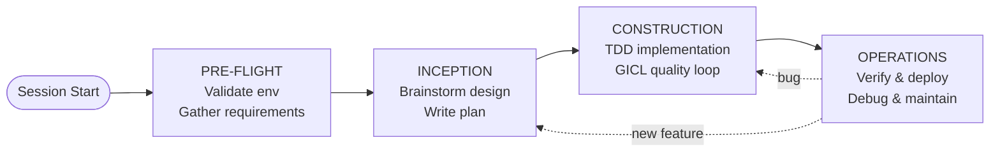
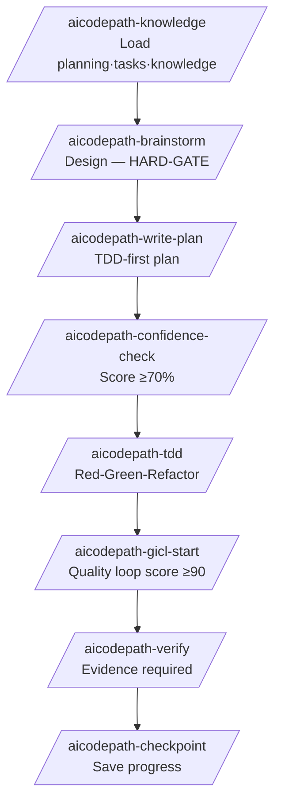
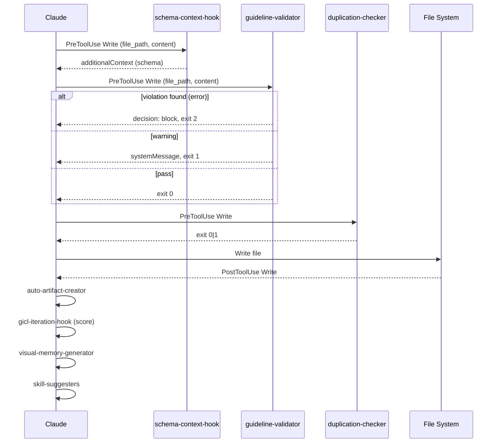
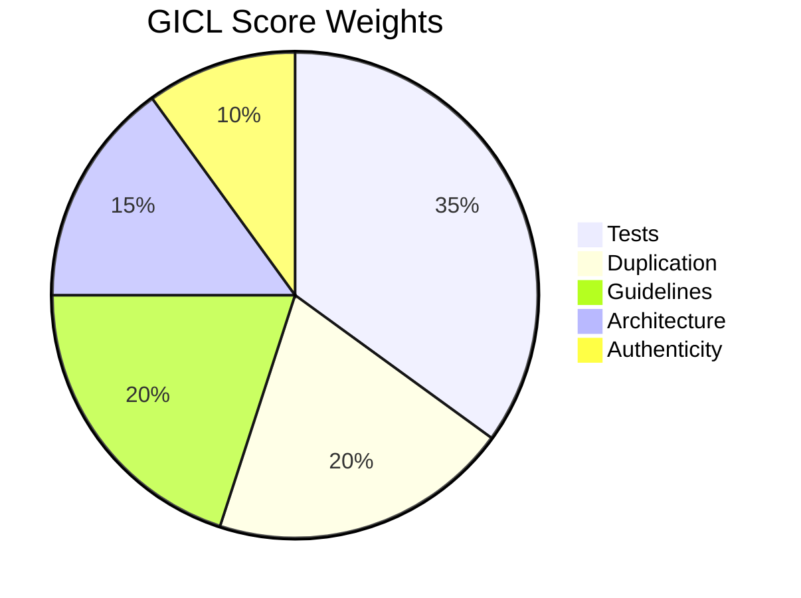
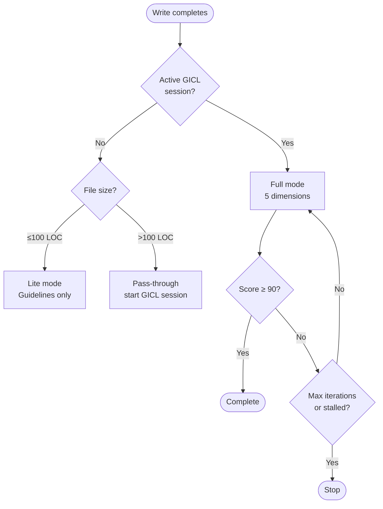
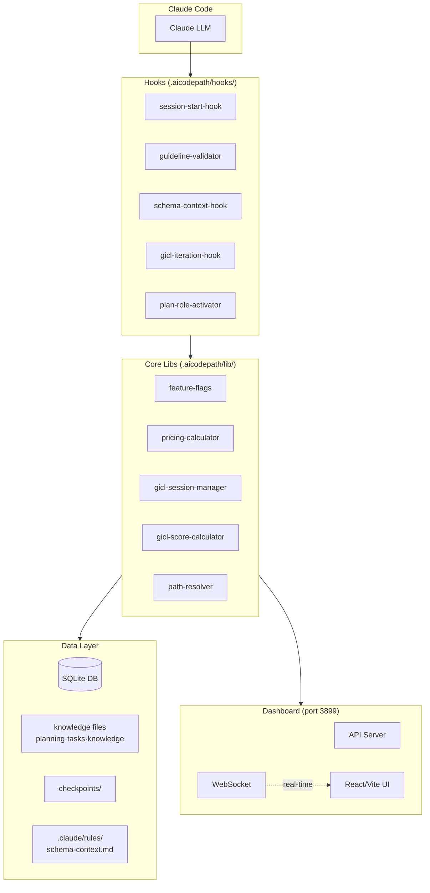
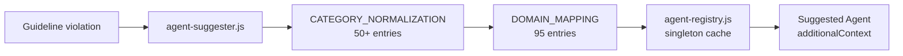
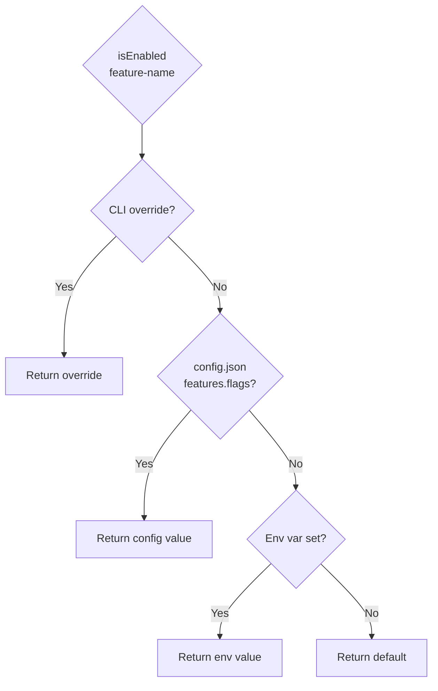
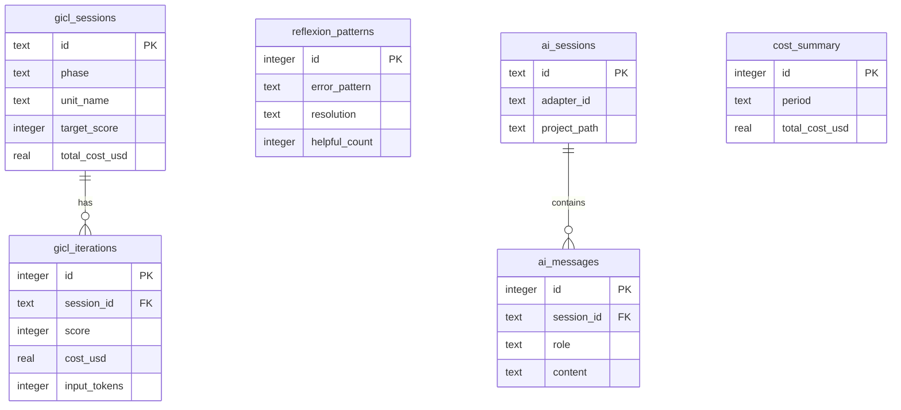
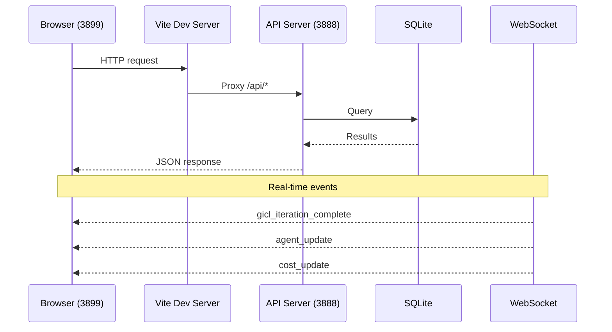

# AICodePath System Diagrams

**Version:** v2.5.1 (2026-02-27)

All diagrams use Mermaid syntax.

---

## 1. AIDLC Phase Flow

---

## 2. 8-Step Skill Chain

---

## 3. Hook Execution on Write

---

## 4. GICL Score Calculation

---

## 5. Component Architecture

---

## 6. Agent Activation Flow

---

## 7. Feature Flag Priority

---

## 8. DB Entity Overview

---

## 9. Dashboard Data Flow

